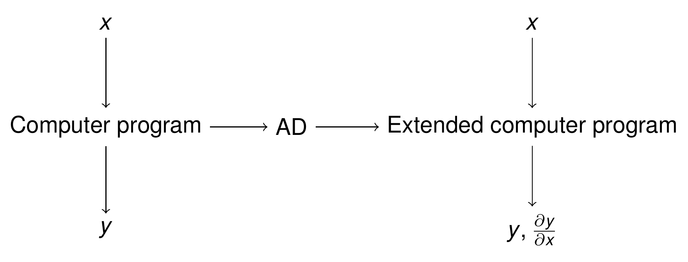
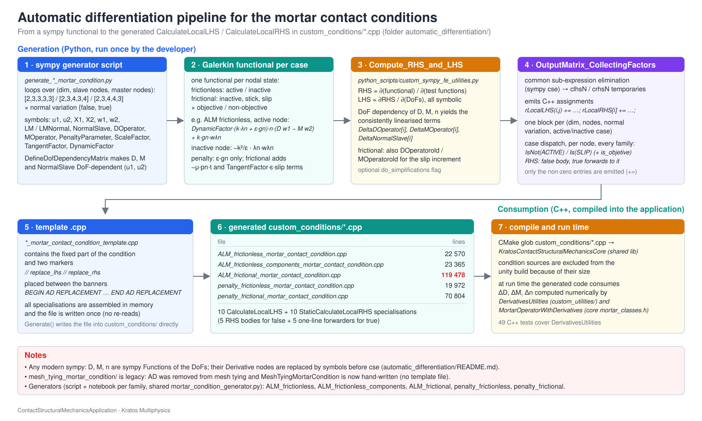

> **Sources.** Thesis Appendix C "Automatic differentiation" (pp. 305–310); code: [`automatic_differentiation/`](https://github.com/KratosMultiphysics/Kratos/tree/master/applications/ContactStructuralMechanicsApplication/automatic_differentiation) (shared generator module, generator scripts and notebooks, templates, theory notes), [`python_scripts/custom_sympy_fe_utilities.py`](https://github.com/KratosMultiphysics/Kratos/blob/master/applications/ContactStructuralMechanicsApplication/python_scripts/custom_sympy_fe_utilities.py) built on the core [`kratos/python_scripts/sympy_fe_utilities.py`](https://github.com/KratosMultiphysics/Kratos/blob/master/kratos/python_scripts/sympy_fe_utilities.py), the generated files `custom_conditions/*_mortar_contact_condition.cpp`, and [`custom_utilities/derivatives_utilities.h`](https://github.com/KratosMultiphysics/Kratos/blob/master/applications/ContactStructuralMechanicsApplication/custom_utilities/derivatives_utilities.h) for the externally computed derivatives.

## Why the tangent is generated

A mortar contact condition contributes to the residual a functional of the displacements of the slave and master nodes, of the Lagrange multipliers and — through the mortar operators $$\mathbf{D}$$, $$\mathbf{M}$$, the slave normals and the integration cells — of the *current geometry* of both surfaces. Quadratic convergence of the Newton–Raphson method (thesis eq. C.1–C.2) requires the exact tangent of that residual with respect to every degree of freedom, including the derivatives of $$\mathbf{D}$$ and $$\mathbf{M}$$ with respect to the nodal positions, which are algorithmic quantities (results of a projection and a polygon clipping). Deriving the ~$$10^2$$–$$10^3$$ entries of each local tangent by hand for five formulations × five geometry pairs × two normal-variation modes × all active/stick/slip states is not feasible, so the application generates the code for `CalculateLocalLHS` / `CalculateLocalRHS` symbolically. The thesis presents this in Appendix C; the concept is sketched in Fig. C.1.

<p align="center"></p>
<p align="center"><em>Figure: the AD concept — a program computing $$y$$ from $$x$$ is extended to a program computing $$y$$ and $$\partial y / \partial x$$ (thesis Fig. C.1).</em></p>

## Mathematical concepts (thesis C.2–C.3.1)

**Newton–Raphson and quadratic convergence.** For a residual $$\mathbf{R}(\mathbf{u}) = \mathbf{0}$$ the Newton iteration is (thesis eq. C.1)

<p align="center">$$
\mathbf{R}(\mathbf{u}_i + \Delta\mathbf{u}_i) \approx \mathbf{R}(\mathbf{u}_i) + \frac{\partial\mathbf{R}}{\partial\mathbf{u}}(\mathbf{u}_i)\,\Delta\mathbf{u}_i = \mathbf{0}
\;\Rightarrow\;
\Delta\mathbf{u}_i = -\left[\frac{\partial\mathbf{R}}{\partial\mathbf{u}}\right]^{-1} \mathbf{R}(\mathbf{u}_i), \qquad \mathbf{u}_{i+1} = \mathbf{u}_i + \Delta\mathbf{u}_i ,
$$</p>

and converges quadratically, $$\lim_{k\to\infty} \Vert \mathbf{x}_{k+1} - \mathbf{x}_{sol} \Vert / \Vert \mathbf{x}_k - \mathbf{x}_{sol} \Vert^2 = M$$ (thesis eq. C.2), only if the tangent is consistent. Fig. C.2 illustrates the single-DoF case.

<p align="center"></p>
<p align="center"><em>Figure: Newton–Raphson iterations for a single degree of freedom (thesis Fig. C.2).</em></p>

**Derivation modes.** Automatic differentiation evaluates elementary operations whose derivatives are known and chains them exactly. With the example of thesis eq. C.4a, $$f = b\,c$$, $$b = \sum_{i=1}^n a_i^2$$, $$c = \sin b$$: the *forward mode* accumulates the derivatives of the intermediate variables with respect to the independent ones ($$\nabla b_i = 2 a_i$$, $$\nabla c_i = \cos b \, \nabla b_i$$, $$\nabla f_i = \nabla b_i\, c + b\, \nabla c_i$$; eq. C.4b), whereas the *backward mode* propagates adjoints $$\bar{x} = \partial f / \partial x$$ from the output back to the inputs (eq. C.4c). The cost of the forward mode grows with the number of independent variables, that of the backward mode with the number of scalar outputs (work ratio, eq. C.5). The implementation used here is symbolic and works in forward mode: the whole functional is written as a sympy expression and differentiated with respect to every degree of freedom.

**AD exceptions.** When the residual depends on a quantity that is itself the result of an algorithm — $$\mathbf{R}(\mathbf{u}(a), a) = 0$$ in thesis eq. C.6 — the total derivative needs the implicit part $$\partial\mathbf{R}/\partial\mathbf{u} \cdot \partial\mathbf{u}/\partial a$$ (eq. C.6d). Instead of differentiating through the algorithm, an *AD exception* declares the derivative of that quantity as an external, independently computed object (local exceptions, valid for one call, or global ones; eqs. C.8a–C.8b). In the contact conditions the exceptions are the derivatives of the mortar operators, of the dual shape functions and of the normals: they are computed numerically by `DerivativesUtilities` (see [Linearisation and derivatives](Linearisation_And_Derivatives.html)) and only *referenced* by the symbolic code.

## The Kratos integration (thesis C.3.2)

Symbolic algebra systems alone are not enough for complex non-linear finite elements: the uncontrolled growth of the expressions and the redundant operations make the generated code inefficient, and the standard common-sub-expression search of a CAS is insufficient for highly non-linear formulations. The approach taken (simpler than the techniques of AceGen, but sufficient for the contact conditions) is:

1. write a **C++ template** of the condition that is complete except for two empty functions, `CalculateLocalLHS` and `CalculateLocalRHS`;
2. write a **Python generator** that builds the Galerkin functional of one contact state with sympy, declares the algorithmic quantities ($$\mathbf{D}$$, $$\mathbf{M}$$, normals) as *functions of the DoFs* (the AD exceptions), differentiates, and prints C++ code in which the derivatives of those quantities appear as symbols;
3. **replace** the symbols of the derivatives by the members that `DerivativesUtilities` fills at run time (`DeltaDOperator[i]`, `DeltaMOperator[i]`, `DeltaNormalSlave[i]`), and insert the code into the template.

<p align="center"></p>
<p align="center"><em>Figure: the AD workflow — the empty C++ template, the sympy generator that fills it from a Galerkin functional, and `DerivativesUtilities` providing the externally computed derivatives at run time (thesis Fig. C.3).</em></p>

<p align="center"></p>
<p align="center"><em>Figure: the code-generation pipeline as it exists in the repository, from the sympy script to the compiled application.</em></p>

## Anatomy of the generator

The generation is shared by the five families and lives in [`automatic_differentiation/mortar_condition_generator.py`](https://github.com/KratosMultiphysics/Kratos/blob/master/applications/ContactStructuralMechanicsApplication/automatic_differentiation/mortar_condition_generator.py); each family provides only its **functional** (the physics), in a thin command-line script `generate_<family>.py` and, with the full formulation as markdown cells, in the Jupyter notebook `<family>.ipynb` of the same folder (see the [table below](#generators-templates-and-generated-files)). The essential steps are:

**Loop over geometry pairs and normal-variation modes.** `Generate(spec, functional, ...)` iterates over the `(dim, nnodes, nnodes_master)` triplets `(2,2,2)`, `(3,3,3)`, `(3,4,4)`, `(3,3,4)`, `(3,4,3)` (Line2D2, Triangle3D3, Quadrilateral3D4, triangle–quadrilateral and quadrilateral–triangle pairs) and over `TNormalVariation = false / true`; the per-node active-set branching is generated inside each specialisation.

**Symbols (`SymbolSet`).** Displacements `u1`, `u2` and coordinates `X1`, `X2` of slave and master nodes, test functions `w1`, `w2`, the multiplier `LMNormal` (scalar ALM) or `LM` (vector formulations) with its test function `wLMNormal` / `wLM`, the slave normals `NormalSlave` and tangents `TangentSlave`, the mortar operators `DOperator`, `MOperator` (and `u1old`, `u2old`, `DOperatorold`, `MOperatorold` for the frictional slip increments), and the parameters `DynamicFactor`, `PenaltyParameter`, `ScaleFactor`, `TangentFactor`, `mu`. The current coordinates are `x1 = X1 + u1`, `x2 = X2 + u2`; the previous ones `x1old = X1 + u1old`, `x2old = X2 + u2old`. Derived quantities are built once: the weighted gap `NormalGap` (thesis eq. 4.31), the normal and tangential components of the multiplier, and the objective / non-objective slips (thesis eqs. 4.65–4.69).

**AD exceptions: DoF-dependent matrices.** `DefineDofDependencyMatrix` turns every entry of a matrix into a sympy *undefined function* of the listed DoFs (`sympy.Function("DOperator_0_1")(u1_0_0, ...)`), so that differentiating the functional produces symbolic derivatives such as `Derivative(DOperator_0_1(u1_0_0, ...), u1_0_0)` instead of zero:

```python
if normal_variation:
    NormalSlave = DefineDofDependencyMatrix(NormalSlave, u1_var)   # normals depend on the slave displacements only
DOperator = DefineDofDependencyMatrix(DOperator, u12_var)          # D and M depend on slave and master displacements
MOperator = DefineDofDependencyMatrix(MOperator, u12_var)
Dx1Mx2 = DOperator * x1 - MOperator * x2                           # weighted gap vector, thesis eq. 4.31
for node in range(nnodes):
    NormalGap[node] = - Dx1Mx2.row(node).dot(NormalSlave.row(node))
```

The dependency is injected **before** the multiplier components `LMNormal`, `LMTangent` and the slips are built from `NormalSlave`, so that, with the normal variation on, the tangent also contains the derivative of the normal through those projections (the historical frictionless-components generator built them before the injection and its normal-variation tangent lacked these terms; the residual was not affected).

**The Galerkin functional of one state.** The family scripts / notebooks define `functional(s, node, branch)`; for the frictionless ALM condition (thesis eqs. 4.13, 4.35), with the augmented pressure $$\bar\lambda_n = k\lambda_n + \varepsilon \tilde g_n$$:

```python
def frictionless_functional(s, node, branch):
    rv_galerkin = 0
    if branch == "active":               # contact term + weak gap constraint
        augmented_contact_pressure = (s.ScaleFactor * s.LMNormal[node] + s.PenaltyParameter[node] * s.NormalGap[node])
        rv_galerkin += s.DynamicFactor[node] * (augmented_contact_pressure * s.NormalSlave.row(node)).dot(s.Dw1Mw2.row(node))
        rv_galerkin += s.ScaleFactor * s.NormalGap[node] * s.wLMNormal[node]
    else:                                # inactive: regularisation of the multiplier, -k^2/eps * lambda * w_lambda
        rv_galerkin -= s.ScaleFactor**2 / s.PenaltyParameter[node] * s.LMNormal[node] * s.wLMNormal[node]
    return rv_galerkin
```

The vector (components) formulation adds the term that penalises the tangential multiplier, the penalty formulations drop every multiplier term, and the frictional formulation has, per node, five branches: `inactive`, `slip_objective`, `slip_non_objective`, `stick_objective` and `stick_non_objective`, built from `augmented_normal_contact_pressure`, `augmented_tangent_contact_pressure = -mu * p_n * TangentSlave` and the two slip measures `TangentSlipObjective` $$= [(\mathbf{D}-\mathbf{D}^{t})\mathbf{x}^{(1)} - (\mathbf{M}-\mathbf{M}^{t})\mathbf{x}^{(2)}]_\tau$$ and `TangentSlipNonObjective` $$= -[\mathbf{D}(\mathbf{x}^{(1)}-\mathbf{x}^{(1),t}) - \mathbf{M}(\mathbf{x}^{(2)}-\mathbf{x}^{(2),t})]_\tau$$ (thesis eqs. 4.65–4.69, see [Frictional contact](Frictional_Contact.html) for the sign conventions).

**Differentiation.** `Compute_RHS_and_LHS(functional, testfunc, dofs)` (delegating to the core `sympy_fe_utilities`) differentiates the functional with respect to the test functions to obtain the residual vector, and the residual with respect to the DoFs to obtain the tangent:

<p align="center">$$ \mathbf{r}_a = \frac{\partial \mathcal{W}}{\partial w_a}, \qquad \mathbf{K}_{ab} = -\frac{\partial \mathbf{r}_a}{\partial d_b} . $$</p>

The DoF ordering is `[master displacements, slave displacements, Lagrange multipliers]`, which fixes the block structure of the local matrices documented in [Conditions](../Implementation/Conditions.html).

**Replacement of the derivative nodes.** Before any printing, `BuildDependencyReplacement` / `ReplaceDependenciesBySymbols` replace, in a single `xreplace` pass, every DoF-dependent function and every one of its first derivatives by a plain symbol (and check that none survives), so that the C++ printer only sees ordinary symbols:

| symbolic node | plain symbol | C++ (after index rewriting) | computed by |
|---|---|---|---|
| `DOperator_i_j(u...)` | `DOperator_i_j` | `DOperator(i,j)` | `MortarOperator` |
| `Derivative(DOperator_i_j(u...), u_k)` | `DeltaDOperator_k_i_j` | `DeltaDOperator[k](i,j)` | `MortarOperatorWithDerivatives::CalculateDeltaMortarOperators` |
| `Derivative(MOperator_i_j(u...), u_k)` | `DeltaMOperator_k_i_j` | `DeltaMOperator[k](i,j)` | idem |
| `Derivative(NormalSlave_i_j(u...), u_k)` | `DeltaNormalSlave_k_i_j` | `DeltaNormalSlave[k](i,j)` (only `TNormalVariation = true`) | `DerivativesUtilities::CalculateDeltaNormalSlave` |

The index `k` is the position of the DoF in the dependency list (slave displacements first, then master), the ordering of `DeltaDOperator[k]` in `MortarOperatorWithDerivatives`.

**Code output.** `OutputMatrix_CollectingFactorsNonZero` / `OutputVector_CollectingFactorsNonZero` perform common-sub-expression elimination (sympy `cse`), print with `sympy.ccode` (`std::pow`, `std::sqrt`) and emit `const double clhs0 = ...;` followed by `rLocalLHS(i,j) += ...;` for the non-zero entries only (the local matrix is zeroed in the preamble). Underscore-indexed names are rewritten as accessors with anchored regular expressions: `F_k_i_j` → `F[k](i,j)`, `F_i_j` → `F(i,j)`, `v_i` → `v[i]`. The template placeholders `TDim`, `TNumNodes`, `TNumNodesMaster`, `TNormalVariation`, `MatrixSize`, `SIZEDERIVATIVES1/2` of the C++ preambles (`FamilySpec.preamble_*`) are replaced by the numbers of the current combination, producing one explicit template specialisation per combination.

**State dispatch.** Inside each specialisation the generated code branches **per slave node**: `if (r_geometry[i].IsNot(ACTIVE)) { ... } else { ... }` for the frictionless and penalty-frictionless families, `... else if (r_geometry[i].Is(SLIP)) { ... } else { ... }` for the penalty frictional one, and for the ALM frictional one the slip and stick branches are further split by `is_objetive`, a run-time flag that compares the Frobenius norms of $$\mathbf{M}-\mathbf{M}^{t}$$ and $$\mathbf{D}-\mathbf{D}^{t}$$ with `OPERATOR_THRESHOLD` and sets the condition flag `MODIFIED` when the non-objective slip is used. (The integer `rActiveInactive` of `GetActiveInactiveValue`, $$N = \sum_i a_i 2^i$$ or $$\sum_i s_i 3^i$$, is still passed to the functions but the generated code does not dispatch on it.)

**RHS sharing.** The residual does not depend on the derivatives of the normal, so the RHS body is generated only for `TNormalVariation = false`, as a public `static StaticCalculateLocalRHS(PairedCondition* pCondition, ...)` declared in the hand-written header; the `true` specialisation is a one-line forwarder to the `false` one, and the virtual `CalculateLocalRHS` of the template forwards to the static method with the members of the condition (`mPreviousMortarOperators`, `GetFrictionCoefficient()` for the frictional families). The LHS is generated for both values.

**Template filling.** All the specialisations are assembled in memory and inserted at once at the markers `// replace_lhs` and `// replace_rhs` of `*_template.cpp`, which sit between the banners `BEGIN AD REPLACEMENT` / `END AD REPLACEMENT`; the file is written once, so an interrupted run never leaves a half-written condition. The generated code is checked for leftovers (`Derivative(`, unreplaced placeholders) before writing.

## Generators, templates and generated files

| Folder in `automatic_differentiation/` | Generator (script · notebook) | Template | Generated file in `custom_conditions/` | Lines | Notes |
|---|---|---|---|---|---|
| `ALM_frictionless_mortar_condition/` | `generate_frictionless_mortar_condition.py` · [`ALM_frictionless_mortar_condition.ipynb`](https://github.com/KratosMultiphysics/Kratos/blob/master/applications/ContactStructuralMechanicsApplication/automatic_differentiation/ALM_frictionless_mortar_condition/ALM_frictionless_mortar_condition.ipynb) | `ALM_frictionless_mortar_contact_condition_template.cpp` | `ALM_frictionless_mortar_contact_condition.cpp` | 22 570 | scalar LM; theory note `alm_frictionless_mortar_contact_condition.tex` |
| `ALM_frictionless_components_mortar_condition/` | `generate_frictionless_components_mortar_condition.py` · [`ALM_frictionless_components_mortar_condition.ipynb`](https://github.com/KratosMultiphysics/Kratos/blob/master/applications/ContactStructuralMechanicsApplication/automatic_differentiation/ALM_frictionless_components_mortar_condition/ALM_frictionless_components_mortar_condition.ipynb) | `ALM_frictionless_components_mortar_contact_condition_template.cpp` | `ALM_frictionless_components_mortar_contact_condition.cpp` | 23 365 | vector LM, tangential part penalised; its `.tex` is byte-identical to the frictionless one |
| `ALM_frictional_mortar_condition/` | `generate_frictional_mortar_condition.py` · [`ALM_frictional_mortar_condition.ipynb`](https://github.com/KratosMultiphysics/Kratos/blob/master/applications/ContactStructuralMechanicsApplication/automatic_differentiation/ALM_frictional_mortar_condition/ALM_frictional_mortar_condition.ipynb) | `ALM_frictional_mortar_contact_condition_template.cpp` | `ALM_frictional_mortar_contact_condition.cpp` | 119 478 | 5 branches per node, objective/non-objective slip; the `.tex` is an unfilled stub |
| `penalty_frictionless_mortar_condition/` | `generate_penalty_frictionless_mortar_condition.py` · [`penalty_frictionless_mortar_condition.ipynb`](https://github.com/KratosMultiphysics/Kratos/blob/master/applications/ContactStructuralMechanicsApplication/automatic_differentiation/penalty_frictionless_mortar_condition/penalty_frictionless_mortar_condition.ipynb) | `penalty_frictionless_mortar_contact_condition_template.cpp` | `penalty_frictionless_mortar_contact_condition.cpp` | 19 972 | no LM DoFs, $$\varepsilon \tilde g_n$$ only |
| `penalty_frictional_mortar_condition/` | `generate_penalty_frictional_mortar_condition.py` · [`penalty_frictional_mortar_condition.ipynb`](https://github.com/KratosMultiphysics/Kratos/blob/master/applications/ContactStructuralMechanicsApplication/automatic_differentiation/penalty_frictional_mortar_condition/penalty_frictional_mortar_condition.ipynb) | `penalty_frictional_mortar_contact_condition_template.cpp` | `penalty_frictional_mortar_contact_condition.cpp` | 70 804 | 3 branches per node (inactive / slip / stick), `TangentFactor · ε · slip` for stick |
| `mesh_tying_mortar_condition/` | `generate_mesh_tying_mortar_condition.py` | — | — | — | **legacy**: AD was removed from mesh tying, whose LHS/RHS is hand-written for generality (see [Mesh tying](Mesh_Tying.html)); the theory note `mesh_tying_mortar_condition.tex` is still valid |

Each generated file holds 2 (normal variation) × 5 (geometry pairs) = 10 specialisations of `CalculateLocalLHS` and 10 of `StaticCalculateLocalRHS` — 5 full bodies for `TNormalVariation = false` and 5 forwarders for `true` — plus the generic `CalculateLocalRHS` forwarder of the template (20 `template<>` blocks), each body containing all the per-node state branches. The size of the frictional file — the largest source in Kratos — is the reason `CMakeLists.txt` excludes `custom_conditions/*.cpp` from unity builds and why compiling the application takes noticeably longer than its size suggests.

The notebooks are rendered by GitHub (links in the table) and by any Jupyter front end; the documentation site links to them rather than rendering them. Their code cells are the same as the scripts', so either entry point regenerates the same file.

## How to regenerate a condition

1. Requirements: Python 3 and **any modern sympy** (tested with 1.14; the historical dependency on sympy 1.2 is gone). A compiled Kratos is not needed: the generator imports `custom_sympy_fe_utilities.py` and the core `sympy_fe_utilities.py` from the source tree when the `KratosMultiphysics` package is not importable.
2. Edit the functional in `generate_<family>.py` **and** in `<family>.ipynb` if the formulation changes (they are kept in sync by hand); keep the DoF ordering and the symbol names, because the header of the condition and the C++ preambles of `FamilySpec` (which are *not* generated) expect them. A new family is a new `FamilySpec` (class name, template, preambles, branch layout) plus its functional.
3. Run either
   ```sh
   cd applications/ContactStructuralMechanicsApplication/automatic_differentiation
   python3 <family>/generate_<family>.py                # --help: --combinations, --normal-variation, --output-dir
   python3 run_notebook.py <family>/<family>.ipynb      # headless execution of the notebook (standard library only)
   ```
   The generated file is written directly into `custom_conditions/`. The frictional ALM family takes one to two hours single-threaded (the frictionless ones a few minutes); the families are independent and can run in parallel. Restrict `--combinations 2,2,2 --normal-variation false --output-dir /tmp/check` for a quick trial.
4. If the change was not meant to alter the numerics (a change of sympy version, of the printing, of the cse), verify the regeneration without compiling: `python3 compare_generated_conditions.py <old>.cpp custom_conditions/<new>.cpp` evaluates every specialisation, node and branch of both files on random inputs and reports the worst relative difference (use `--common-only` for a partial regeneration).
5. Rebuild and run the C++ suite, the patch tests (`tests/test_ContactStructuralMechanicsApplication.py -l small`, whose `test_symbolic_generation.py` regenerates the `2D2N` ALM frictionless case and compares it with the committed file) and the nightly/validation suites for the multi-step frictional cases; a wrong tangent shows up immediately as a loss of the quadratic convergence rate in the convergence table.

## Helper library: `custom_sympy_fe_utilities.py`

The module extends the core `KratosMultiphysics.sympy_fe_utilities` (imported by path from `kratos/python_scripts/` when the package is not available):

| Group | Functions |
|---|---|
| Definitions | `DefineMatrix`, `DefineSymmetricMatrix`, `DefineVector` (plain symbols; the historical `mode` argument is accepted and ignored), `DefineShapeFunctions`, `DefineCustomShapeFunctions`, `DefineJacobian` |
| Continuum helpers | `StrainToVoigt`, `MatrixB`, `grad_sym_voigtform`, `grad`, `DfjDxi`, `DfiDxj`, `div`, `SubstituteMatrixValue`, `SubstituteScalarValue` |
| DoF dependency (AD exceptions) | `CreateVariableMatrixList`, `CreateVariableVectorList`, `DefineDofDependencyScalar`, `DefineDofDependencyVector`, `DefineDofDependencyMatrix`, `BuildDependencyReplacement`, `ReplaceDependenciesBySymbols` |
| Differentiation | `Compute_RHS`, `Compute_LHS`, `Compute_RHS_and_LHS` |
| Code output | `ReplaceIndices` (`SubstituteIndex` kept as an alias), `OutputVector`, `OutputMatrix`, `OutputVectorNonZero`, `OutputMatrixNonZero`, `OutputSymbolicVariable`, `OutputMatrix_CollectingFactors`, `OutputVector_CollectingFactors`, `OutputMatrix_CollectingFactorsNonZero`, `OutputVector_CollectingFactorsNonZero` |

## Relation to the rest of the documentation

- The externally computed derivatives (the "exceptions") are described in [Linearisation and derivatives](Linearisation_And_Derivatives.html) and implemented in `DerivativesUtilities` / `MortarOperatorWithDerivatives`.
- The functionals being differentiated are the algebraic forms of the [frictionless](Frictionless_Contact.html) and [frictional](Frictional_Contact.html) formulations (thesis §4.3.3.4.3 and §4.3.4.3.3).
- How the generated `CalculateLocalLHS/RHS` are called, and the active/inactive encoding they expect, is described in [Conditions](../Implementation/Conditions.html).

*Thesis figures © Vicente Mataix Ferrándiz, PhD thesis "Innovative mathematical and numerical models for studying the deformation of shells during industrial forming processes with the Finite Element Method", UPC 2020, reproduced by the author. Figures marked "inspired by" are the author's redrawings of the cited sources.*
