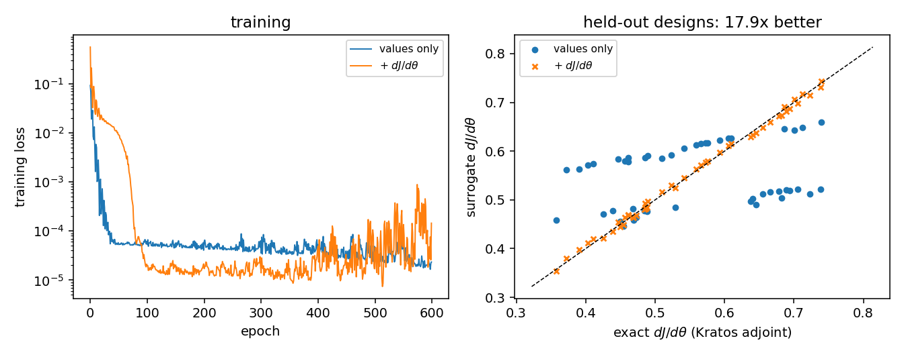

# Adjoint integration

Kratos computes exact design sensitivities. This application computes them too, by a different route, and until now the two never met: `sensitivity_utils` produced gradients nothing outside the application could read, and no training path used Kratos's gradients as data.

The adjoint integration closes both directions, and it is built the same way the [RomApplication interop](../Reduced_Order_Models/Reduced_Order_Models.html) is — by consuming a *contract*, not an application:

| | |
|---|---|
| **`bridges/adjoint_bridge`** | Kratos response functions and `SensitivityBuilder` output → row-ordered dJ/dX arrays |
| **`processes/adjoint_sensitivity_process`** | puts that field on the model part, where every export process already picks it up |
| **`training/sobolev_training`** | trains a surrogate to match it — derivative-informed learning |
| **`deployment/surrogate_response_function`** | a trained model *as* a Kratos response function |

## What is being consumed

`ResponseFunctionInterface` lives in the **core**, not in any application:

```
kratos/python_scripts/response_functions/response_function_interface.py
```

Every Kratos response implements it — `CalculateValue`/`CalculateGradient`, then `GetValue` and `GetNodalGradient`/`GetElementalGradient` — and the gradients themselves come from the core `SensitivityBuilder`. So the bridge needs the core plus whichever application owns the response, and never a compiled optimization application. Three implementations are dispatched by name:

| `response_application` | Response types | Machinery |
|---|---|---|
| `structural_mechanics` | `adjoint_nodal_displacement`, `adjoint_local_stress`, `adjoint_max_stress`, … | `AdjointFiniteDifferencing*` elements, a *separate* `Model` for the adjoint part |
| `convection_diffusion` | `point_temperature` | `AdjointDiffusionElement`, primal and adjoint in the same model |
| `compressible_potential_flow` | its own response set | potential-flow adjoint solver |

Anything else is reachable through `"response_module"`, a module path exposing `CreateResponseFunction(response_id, response_settings, model)` — the same escape hatch the [co-simulation wrapper](../CoSimulation/CoSimulation.html) uses.

```python
import KratosMultiphysics as Kratos
from KratosMultiphysics.PhysicsNeMoApplication.bridges import adjoint_bridge

model = Kratos.Model()
response = adjoint_bridge.CreateResponseFunction(Kratos.Parameters("""{
    "response_id"          : "tip_displacement",
    "response_application" : "structural_mechanics",
    "response_settings"    : {
        "response_type"                    : "adjoint_nodal_displacement",
        "gradient_mode"                    : "semi_analytic",
        "primal_settings"                  : "cantilever_primal.json",
        "adjoint_settings"                 : "auto",
        "primal_data_transfer_with_python" : true,
        "response_part_name"               : "Tip",
        "direction"                        : [0.0, 0.0, 1.0],
        "traced_dof"                       : "DISPLACEMENT",
        "sensitivity_settings"             : {
            "sensitivity_model_part_name"               : "Design",
            "nodal_solution_step_sensitivity_variables" : ["SHAPE_SENSITIVITY"],
            "build_mode"                                : "static"
        }
    }
}"""), model)

fields = adjoint_bridge.EvaluateResponse(response, model["Structure"])
fields.value                          # J
fields.nodal["SHAPE_SENSITIVITY"]     # (n_nodes, 3) dJ/dX
```

## The row-order contract

Kratos hands out `{entity_id: value}` **dicts**. A dict carries no order, and its iteration order is the *adjoint* model part's, which need not be the primal's. `EvaluateResponse` converts by id:

> Row `r` of a nodal field ↔ `model_part.Nodes` iteration order.
> Row `r` of an elemental field ↔ `model_part.Elements` iteration order.

That is the same order `graph_bridge.NodePositions`, `differentiable_residual.DofFieldMap` and every gather in this application use, so a gradient lines up with a field by construction. Entities the response says nothing about keep a zero row — restricting the sensitivity model part to a design surface is the normal case, not an error.

For sensitivities a solver wrote directly into a variable (no response object involved), `ReadSensitivityField`/`WriteSensitivityField` go through the same tensor-adaptor factory the exporters use, so the key `"<VARIABLE>__<data_location>"` is the one the `.npz` samples carry.

## Defining the objective once

Two things in this application need to know what J *is*: the sensitivity process (which contracts weights with the FEM state to get ∂J/∂u) and the surrogate response function (which contracts them with a prediction to get J). They share one builder, `MakeObjectiveWeights`, deliberately — so "the objective" cannot quietly mean two things on the two sides of a comparison.

```json
{ "type" : "traced_node",  "variable_name" : "DISPLACEMENT",
  "node_id" : 9, "direction" : [0.0, 0.0, 1.0] }

{ "type" : "weighted_sum", "variable_name" : "TEMPERATURE",
  "model_part_name" : "HeatFlux2D_right", "weight_variable_name" : "NODAL_AREA" }
```

`weighted_sum` with a nodal volume or area in `weight_variable_name` is an integral.

## Cross-validation: two physics, two independent adjoints

`test_adjoint_integration.py` compares the bridge's array node by node against `sensitivity_utils.ComputeShapeSensitivityField` — this application's own, separately implemented adjoint — on both compiled stacks.

- **Cantilever (StructuralMechanics)**: agreement to `1e-4` relative (measured: `7e-7`). The tolerance is Kratos's, not ours: its `semi_analytic` gradient takes a **forward** difference while the shipped field is central, so Kratos carries the larger step error of the two.
- **Diffusion square (ConvectionDiffusion)**: agreement to `1e-6` relative, with the out-of-plane row **exactly** zero.

One factor is worth stating because it looks like a disagreement and is not: Kratos's `point_temperature` response **averages** the temperature over the traced part while `weighted_sum` sums it. The ratio is the node count. Two correct adjoints of two different objectives disagree for a reason that has nothing to do with either being wrong, which is why the test pins the normalization explicitly.

## Putting the field on the model part

```json
{
    "python_module" : "adjoint_sensitivity_process",
    "kratos_module" : "KratosMultiphysics.PhysicsNeMoApplication.processes",
    "Parameters"    : {
        "model_part_name"    : "ThermalModelPart",
        "sensitivity_source" : "shipped",
        "dof_fields"         : [
            { "variable_name" : "TEMPERATURE", "data_location" : "node_historical" } ],
        "objective"          : {
            "type" : "weighted_sum", "variable_name" : "TEMPERATURE",
            "model_part_name" : "HeatFlux2D_right" },
        "output_variable"    : "SHAPE_SENSITIVITY",
        "execution_point"    : "finalize_solution_step"
    }
}
```

`"sensitivity_source"` picks the producer: `"shipped"` is `ComputeShapeSensitivityField` (exact, central-differenced, one element-local pass, nothing but the solved model part needed); `"response_function"` runs Kratos's own stack through the bridge.

The process writes a **variable** and no files, deliberately. Once dJ/dX is an ordinary Kratos variable, `DatasetExportProcess`, `StreamingDatasetExportProcess`, `MeshExportProcess` and the vtk/vtu outputs all carry it unchanged, and

```python
CreateNpzDataset(directory, input_keys,
                 output_keys=[..., "SHAPE_SENSITIVITY__node_non_historical"])
```

yields gradient-carrying training targets with no new dataset code at all.

Two placement rules, both of which fail quietly rather than loudly:

- Attach it **after** the step's solve and **before** any export process.
- Never after `analysis.Finalize()`. The boundary-condition processes release the DOFs they fixed in their `ExecuteFinalizeSolutionStep`, leaving an unconstrained — singular — tangent. You get finite sensitivities wrong by about six orders of magnitude.

## Sobolev training: learning the gradient too

A surrogate fitted on values alone is graded on values alone, and its derivatives are whatever the fit left behind. That matters the moment the surrogate is used for anything gradient-driven, because those workflows read dJ/dX — a quantity the training objective never looked at.

```python
from KratosMultiphysics.PhysicsNeMoApplication.training import sobolev_training, training_utils

term = sobolev_training.MakeSensitivityLossTerm(Kratos.Parameters("""{
    "coordinate_channels" : 3,
    "gradient_columns"    : [1, 2, 3],
    "reduction"           : "relative",
    "weight"              : 1.0
}"""))

training_utils.TrainModel(model, dataset, Kratos.Parameters("""{
    "epochs" : 400, "target_channels" : [0] }"""), extra_loss_terms=[term])
```

The term differentiates the *model's own* objective with respect to the coordinate channels of its input and matches the result against the stored adjoint gradient. It follows the idiom `physics_informed`'s `"autodiff"` path established: the coordinate channels are detached into a fresh leaf, the input is rebuilt around them, and the model is re-run — a graph that merely *reaches* the coordinates gives autograd nothing to differentiate against. `create_graph=True` keeps the second derivative, so the matching term is itself trainable.

Measured on a held-out set (`test_sobolev_training.py`, same architecture, same seed, same data): the gradient RMSE drops **4.8×**, from 0.376 to 0.079, and the value RMSE improves as a by-product, 0.110 to 0.022. On a real case — notebook 19's two-parameter FFD family of thermal solves, with `dJ/dθ` from `ComputeShapeSensitivityField` pushed through `ComputeControlSensitivities` — the same comparison gives **17.9×** (0.113 → 0.0063) at designs neither run saw:

 The `"relative"` reduction divides by the reference gradient's own energy, which is what makes the term usable when dJ/dX sits orders of magnitude below the field itself — a shape gradient usually does.

Two mechanics worth knowing:

- **`extra_loss_terms` now resolves arity.** A term declaring a fourth positional argument is called `term(model, inputs, prediction, targets)`; three-argument terms (`physics_informed`, `differentiable_residual`) are called exactly as before. The arity is read once, before training starts, never per batch.
- **`"target_channels"` is not optional here.** torch does not reject a 1-channel prediction against a 4-column target — it **broadcasts**. Leaving the setting out silently trains the model against the mean of the value and the three gradient columns, and reports a loss that looks like a fit.

## A surrogate as a Kratos response function

The mirror of the co-simulation solver wrapper: that one puts a model where a *solver* goes, this one puts it where a *response function* goes.

```json
{
    "model_part_name"       : "Structure",
    "model_settings"        : { "checkpoint_file" : "surrogate.mdlus", "device" : "auto" },
    "input_fields"          : [ { "variable_name" : "TEMPERATURE", "data_location" : "node_historical" } ],
    "output_fields"         : [ { "variable_name" : "PRESSURE",    "data_location" : "node_historical" } ],
    "objective"             : { "type" : "weighted_sum", "variable_name" : "PRESSURE" },
    "gradient_mode"         : "surrogate",
    "model_interface"       : "generic"
}
```

`CreateResponseFunction(response_id, response_settings, model)` has the signature the applications' own factories use, so any driver that resolves a response by module path — `adjoint_bridge.CreateResponseFunction`'s `"response_module"` included — takes it with no special case.

| `gradient_mode` | dJ/dX from | Cost | Accuracy |
|---|---|---|---|
| `"surrogate"` | autograd through the model's forward | one backward pass | the surrogate's |
| `"exact"` | the FEM adjoint around the state the surrogate wrote | one element-local mesh pass | discretely exact *for that state* |

`"exact"` is the honest positioning of what a surrogate replaces: the **solve**, not the sensitivity analysis. Use it to check the surrogate mode, or when the prediction is a warm start good enough to differentiate around.

### Traps

- **`"flat"` cannot give a surrogate gradient** and is refused at construction: that interface feeds the model field values only, so the node coordinates it would have to differentiate against never enter the forward pass. Use a point-cloud interface.
- **`normalize_coordinates` needs a chain rule**, and it is applied here: autograd returns dJ/dx_norm, and the physical gradient is that divided by the bounding-box extent. What the chain rule neglects is that the box is itself recomputed from the design every call — exact for a design that does not move the bounding box (an interior design surface, the usual case), approximate for one that does. It is therefore **off by default** in this class and on by default in the deployment processes.
- **A model card's `"output_normalization"` reaches the gradient too.** J is a function of the *physical* prediction, so the de-normalization is applied inside the autograd objective (in torch, graph intact) as well as on the written field; test-pinned as `dJ/dX = std × (raw gradient)`. Applying it only where the field is written would leave the gradient wrong by exactly the training scale.
- **`GetElementalGradient` always refuses.** A surrogate response differentiates with respect to the node coordinates only; elemental sensitivities (thickness, Young's modulus) need Kratos's own adjoint elements, reached through `adjoint_bridge.CreateResponseFunction`.

## Where the pieces live

| Module | Provides |
|---|---|
| `bridges.adjoint_bridge` | `CreateResponseFunction`, `EvaluateResponse`, `SensitivityFields`, `ReadSensitivityField`/`WriteSensitivityField`, `MakeObjectiveWeights`, `EvaluateObjective` |
| `processes.adjoint_sensitivity_process` | `AdjointSensitivityProcess` |
| `training.sobolev_training` | `MakeSensitivityLossTerm`, `SensitivityGradient` |
| `deployment.surrogate_response_function` | `SurrogateResponseFunction` |
| `physics.sensitivity_utils` | the shipped adjoints themselves — `ComputeShapeSensitivityField`, `ComputeParameterSensitivities`, `ComputeControlSensitivities`, `ComputeSurrogateSensitivities` |
