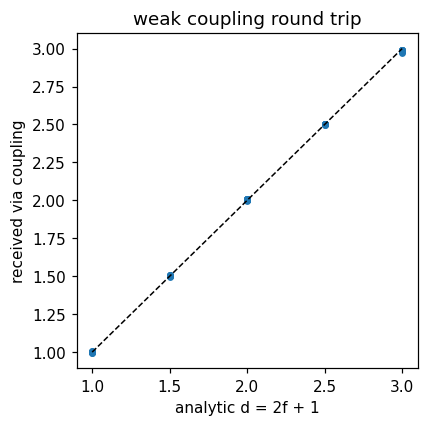

# A surrogate as a co-simulation solver

`cosim_surrogate_solver_wrapper` lets a trained PhysicsNeMo/TorchScript model participate as a **solver** in Kratos co-simulation: each coupling iteration, the wrapper gathers its configured input fields from its own interface model part, runs one forward pass and writes the output fields back. `CoSimulationApplication`'s coupled solver moves the interface data to and from the other solvers through its data-transfer operators (MappingApplication mappers included) and convergence accelerators/criteria — the surrogate replaces a physics solver without the coupling orchestration noticing.

Reference the wrapper in the co-simulation `ProjectParameters` by **full module path** (the solver-wrapper factory falls back to `PYTHONPATH` imports):

```json
"solvers" : {
    "structure_surrogate" : {
        "type" : "KratosMultiphysics.PhysicsNeMoApplication.deployment.cosim_surrogate_solver_wrapper",
        "solver_wrapper_settings" : {
            "mdpa_file"       : "surrogate_interface",
            "time_step"       : 0.0,
            "model_settings"  : { "checkpoint_file" : "surrogate.mdlus", "checkpoint_type" : "physicsnemo" },
            "model_interface" : "flat",
            "input_fields"    : [ { "variable_name" : "POINT_LOAD",   "data_location" : "node_historical" } ],
            "output_fields"   : [ { "variable_name" : "DISPLACEMENT", "data_location" : "node_historical" } ]
        },
        "data" : {
            "load" : { "model_part_name" : "Surrogate", "variable_name" : "POINT_LOAD",   "dimension" : 3 },
            "disp" : { "model_part_name" : "Surrogate", "variable_name" : "DISPLACEMENT", "dimension" : 3 }
        }
    },
    "fluid" : { "..." : "any other solver wrapper" }
}
```

## Settings

| Key | Meaning |
|---|---|
| `mdpa_file` | The wrapper's interface mesh (read into its own `Model`; historical variables from the field specs and `data` blocks are allocated before reading). A nodes-only `.mdpa` suffices for `nearest_neighbor` transfer — but note that Metis needs a connectivity graph, so an element-free mesh requires `"partition_mdpa" : false` in a distributed run. |
| `main_model_part_name` | Name of the created model part (default `"Surrogate"`) — reference it in the `data` blocks. |
| `time_step` | `> 0`: the wrapper owns time (`AdvanceInTime` returns `current_time + time_step`). `0.0` (default): another solver drives the time — the coupled solver takes the max over all wrappers. |
| `model_settings` | Exactly `model_registry.LoadModel`'s settings (checkpoint, device, model-card policy, `torch_compile`, `nvtx_ranges`). Loading is deferred to the first solve. |
| `model_interface` | `"flat"` (default): the `InferenceProcess` contract — inputs concatenate to one `(n_entities, total_input_width)` tensor, the model returns `(n_entities, total_output_width)`. Or any point-cloud interface (`"generic"`, `"transolver"`, `"flare"`, `"geotransolver"`, `"figconvnet"`) — dispatched through `point_cloud_inference_process.RunPointCloudForward` with the node coordinates (`normalize_coordinates`/`pass_geometry` apply). |
| `input_fields` / `output_fields` | The usual `[{variable_name, data_location}]` specs, gathered from / written to the wrapper's model part. |

The `data` blocks are `CouplingInterfaceData` configs, exactly as for any other wrapper; the coupled solver's `coupling_sequence` decides what is imported/exported around each `SolveSolutionStep`. `Check()` warns when a `data` variable is neither an input nor an output field of the surrogate.



## Coupling patterns

- **Weak (staggered) coupling** — `coupled_solvers.gauss_seidel_weak`: the surrogate solves once per step in sequence with the other solvers; use it when the surrogate replaces a one-way or loosely coupled field.
- **Strong coupling** — `coupled_solvers.gauss_seidel_strong` with a convergence accelerator: the surrogate participates in the sub-iteration loop (its forward is deterministic under `no_grad`, which the accelerators require). Note that for interface maps whose residual directions are (nearly) collinear — e.g. a surrogate acting like a uniform relaxation — `aitken` is the robust accelerator choice; `mvqn`'s secant Jacobian needs linearly independent residual updates.

## Running the surrogate across MPI ranks

By default the wrapper is serial — it takes the rank-zero data communicator, like the sdof wrapper — and behaves identically to a non-MPI run. Setting `"distributed" : true` hands the communicator back to the base class, so the wrapper spans the world, or, when `mpi_settings` names a `num_processes`/`data_communicator_name`, the first N ranks:

```json
"surrogate" : {
    "type" : "KratosMultiphysics.PhysicsNeMoApplication.deployment.cosim_surrogate_solver_wrapper",
    "mpi_settings" : {
        "num_processes"          : 2,
        "data_communicator_name" : "surrogate_group"
    },
    "solver_wrapper_settings" : {
        "distributed" : true,
        "...."        : "as above"
    }
}
```

| Key | Meaning |
|---|---|
| `distributed` | `false` (default): serial, rank-zero communicator. `true`: the wrapper runs on its communicator's ranks. In a non-MPI run this degrades cleanly back to serial rather than failing. |
| `partition_mdpa` | `true` (default): the mesh is Metis-partitioned in memory over the wrapper's ranks. `false`: every rank reads the whole `.mdpa` and ownership is assigned round-robin — the path for point clouds with **no elements or conditions**, which Metis cannot partition at all (`number of connected nodes = 0`). It trades memory for that ability; the prediction is identical either way. |
| `assume_partition_safe` | Opts a point-cloud interface into distributed mode — see below. |

Inference runs on the **owned** nodes only (the communicator's `LocalMesh`, which is also the layout `CouplingInterfaceData` uses), and ghosts are refreshed with `SynchronizeVariable` afterwards. Owned sets partition the global mesh exactly, so a partitioned run reproduces the single-rank prediction node for node — which is what the MPI tests assert, at both `np=2` and `np=3`.

**Only the `"flat"` interface is partition-safe by construction**: it maps each entity row independently. The point-cloud interfaces mix information across the whole cloud (attention in `transolver`/`flare`/`geotransolver`, and the min-max coordinate normalization is computed per rank), so a partitioned run does *not* reproduce the serial answer. They are rejected under `"distributed"` unless `"assume_partition_safe" : true` asserts the model really is pointwise.

> **Known CoSimulation hazard.** If *both* coupled wrappers use the rank-zero data communicator in an MPI run, the `kratos_mapping` data-transfer operator deadlocks: it chooses the serial mapper on rank 0, which sees two plain model parts, and the MPI mapper on the other ranks, which see the rank-zero dummy parts — and those report `IsDistributed() == True`. Keep at least one side of such a coupling distributed. Distributed↔distributed, distributed↔rank-zero and N-rank↔M-rank subgroup couplings are all exercised in the tests.

**Not covered by these tests.** Nearest-neighbour mapping between identical meshes is exact, so it hides mapper error; strong-coupling convergence with a residual distributed across ranks, non-conforming interface quality and load-balance realism all need a second *physical* MPI solver rather than a second surrogate.
