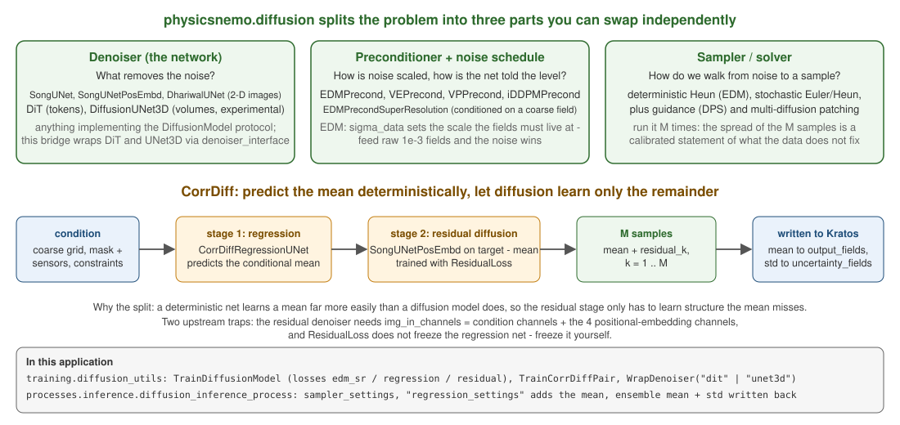
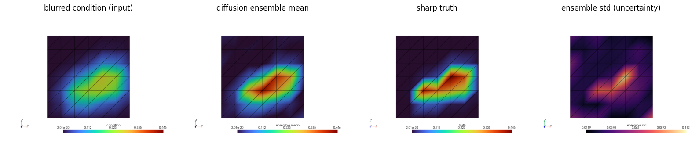
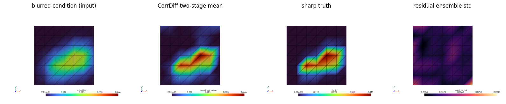

# Conditional diffusion field models

CorrDiff-style downscaling with `physicsnemo.diffusion`: a denoiser learns the distribution of fine fields **conditioned** on a coarse (or otherwise partial) field, and sampling it repeatedly yields an ensemble whose mean is the prediction and whose spread is a calibrated uncertainty band.

<p align="center">
    
</p>
<p align="center">Figure 1: The three replaceable parts, and the regression-plus-residual split this page's recipe implements.</p>

## Training

`diffusion_utils.TrainDiffusionModel(model, dataset, settings)` runs the conditional EDM loss (`EDMLossSR`) over `(condition, target)` grid pairs — `CreateGridPairDataset(input_directory, target_directory)` builds them from two `GridDatasetExportProcess` outputs matched by step:

```python
from physicsnemo.diffusion.preconditioners import EDMPrecondSuperResolution
from KratosMultiphysics.PhysicsNeMoApplication.training import diffusion_utils, training_utils
from KratosMultiphysics.PhysicsNeMoApplication.training.torch_dataset import CreateGridPairDataset

model = EDMPrecondSuperResolution(
    img_resolution=64, img_in_channels=1, img_out_channels=1,
    model_type="SongUNet")                       # a physicsnemo Module
dataset = CreateGridPairDataset("coarse_grids", "fine_grids", squeeze_axis=2)
diffusion_utils.TrainDiffusionModel(model, dataset, Kratos.Parameters("""{ "epochs": 500 }"""))
training_utils.SaveTrainedModel(model, "downscaler.mdlus")   # regular .mdlus checkpoint
```

Settings additionally expose the EDM noise schedule (`P_mean`, `P_std`, `sigma_data`).

## Deployment

`DiffusionInferenceProcess` samples the condition fields onto a grid, generates a reverse-diffusion ensemble (`GenerateEnsemble`: `num_samples`, `num_steps`, `solver`), and scatters the ensemble **mean** onto `output_fields` — and, when configured, the ensemble **standard deviation** onto `uncertainty_fields`:

```json
{
    "python_module" : "diffusion_inference_process",
    "kratos_module" : "KratosMultiphysics.PhysicsNeMoApplication.processes.inference",
    "Parameters"    : {
        "model_part_name"        : "CoarsePart",
        "output_model_part_name" : "FinePart",
        "model_settings"         : { "checkpoint_file" : "downscaler.mdlus", "checkpoint_type" : "physicsnemo" },
        "input_fields"           : [ { "variable_name" : "TEMPERATURE", "data_location" : "node_historical" } ],
        "output_fields"          : [ { "variable_name" : "TEMPERATURE", "data_location" : "node_non_historical" } ],
        "uncertainty_fields"     : [ { "variable_name" : "NODAL_ERROR", "data_location" : "node_non_historical" } ],
        "grid_shape"             : [64, 64, 2],
        "squeeze_axis"           : 2,
        "sampler_settings"       : { "num_samples" : 16, "num_steps" : 18 }
    }
}
```

SongUNet-based denoisers are 2D: planar Kratos cases use the thin-axis idiom (`squeeze_axis`, see the Sequence Models page). Genuinely volumetric grids run through `"denoiser_interface": "unet3d"` instead — see below.

**Model cards.** The denoiser's card (`model_settings`) carries the `"output_normalization"` of what the ensemble emits — in the two-stage recipe, regression mean included. The ensemble mean is scaled and shifted, the spread written to the `uncertainty_fields` is **scaled only**, both per channel along axis 0 (see the [Inference](../Inference/Inference.html) page).


<p align="center">
    
</p>
<p align="center">Figure 2: Notebook 09 - what DiffusionInferenceProcess read and wrote, on the mesh: condition, ensemble mean, truth and the per-node standard deviation.</p>

## Variations

The process is agnostic to what the condition channels mean:

- **Downscaling (CorrDiff)**: condition = the coarse solve, target = the fine field.
- **Generative design (TopoDiff-style)**: condition = constraint/mask fields, target = the design field.
- **Flow reconstruction from sparse data**: condition = masked observations (zeros where unobserved plus an indicator channel), target = the full field.

Only the training pairs differ — build them with `CreateGridPairDataset` over appropriately exported series.

The ensemble-mean + per-node uncertainty pattern this process introduced is now available for **every** deployed model through the `"uncertainty"` block (MC dropout or checkpoint ensembles) — see [Uncertainty and Governance](../Uncertainty/Uncertainty.html).

## DiT denoisers

`physicsnemo.models.dit.DiT` (diffusion transformer) plugs into the same bridge through `"denoiser_interface": "dit"` on `DiffusionInferenceProcess` (or `diffusion_utils.WrapDenoiser(dit, "dit")` in training scripts): the wrapper maps the EDM contract `net(x, img_lr, sigma)` onto `dit(x, t)` by concatenating the conditioning grid into the input channels — construct the DiT with `in_channels = C_out + C_cond` and `out_channels = C_out` — broadcasting `sigma` to the per-sample timestep tensor and casting at the float64-sampler/float32-weights boundary. RoPE, invalid-region masking and attention backends are DiT **construction** choices (`block_kwargs`/`attn_kwargs`/`attention_backend`); the wrapper only standardizes the forward call, and the raw DiT acts as the denoiser directly (no EDM pre/post-scaling), so train it through the same wrapper.

Note on upstream naming: `physicsnemo.models.diffusion` was renamed to `physicsnemo.models.diffusion_unets` (`SongUNet`, `UNet`, `DhariwalUNet`, ...). There is **no** compatibility shim: `import physicsnemo.models.diffusion` raises `ModuleNotFoundError` on 2.2.0, so the old path must be updated rather than relied on.

## Volumetric (3D) U-Net denoisers

`physicsnemo.experimental.models.diffusion_unets.DiffusionUNet3D` — a genuine volumetric diffusion U-Net, under `experimental` in 2.2 — plugs in through `"denoiser_interface": "unet3d"` (or `diffusion_utils.WrapDenoiser(unet, "unet3d")` in training scripts). Three things differ from `"dit"`:

- **Conditioning is native, not concatenated**: the wrapper passes the conditioning grid as the model's `TensorDict` `condition["volume"]` — construct the model with `x_channels = C_out` (its output width equals its latent width) and `vol_cond_channels = C_cond`. `sigma` broadcasts to the per-sample timestep tensor exactly as for DiT.
- **The grid stays 5-D**: the condition is the full `(C, D, H, W)` sample — `squeeze_axis` is rejected in this mode, and each spatial extent must be a power of 2 or a multiple of `2**(num_levels - 1)` (the model validates this itself).
- **Training selects a rank-generalized EDM loss automatically**: upstream's legacy `EDMLossSR` hard-codes the 4-D image rank (`randn([B, 1, 1, 1])`), so volumetric samples cannot broadcast against it; `TrainDiffusionModel` detects `(C, D, H, W)` samples and uses a faithful clone whose noise-level draw follows the batch rank. The 2D-only CorrDiff losses (`"regression"`/`"residual"`) reject volumetric input with a clear error.

`GenerateEnsemble`, the deterministic sampler and the ensemble-mean/uncertainty scatter are rank-agnostic and work unchanged.

## CorrDiff two-stage recipe (regression + residual diffusion)

CorrDiff/StormCast-style downscaling splits the prediction: a deterministic **regression** stage learns the conditional mean, and the diffusion stage denoises only the **residual** `target − regression(condition)` — sharper ensembles, better-calibrated spread. The bridge ships the full recipe on verified 2.2.0 APIs:

- **Stage 1**: `TrainDiffusionModel(regression_model, dataset, settings)` with `"loss": "regression"` — `physicsnemo.diffusion`'s `RegressionLoss` (plain MSE against `net(zeros, img_lr)`) on a `physicsnemo.models.diffusion_unets.CorrDiffRegressionUNet`.
- **Stage 2**: `"loss": "residual"` with `regression_model=` the trained stage 1 — `ResidualLoss(regression_net=...)` drives the same `net(x, img_lr, sigma)` denoiser interface. The regression net is frozen explicitly (`.eval()` + `requires_grad_(False)` — upstream does **not** `no_grad` it), and `P_mean` defaults to upstream's `0.0` for this loss (vs `−1.2` for `edm_sr`; explicit values always win). **The residual-stage denoiser must wrap `SongUNetPosEmbd`** (`model_type="SongUNetPosEmbd"`; its `N_grid_channels`, default 4, count toward `img_in_channels` — upstream CorrDiff's own sizing): `ResidualLoss` passes positional-embedding kwargs a plain `SongUNet` rejects.
- `TrainCorrDiffPair(regression_model, diffusion_model, dataset, settings)` runs both stages (`"regression_epochs"`/`"regression_learning_rate"` override the shared values).
- **Inference**: `DiffusionInferenceProcess` gains an optional `"regression_settings"` block (`model_settings`-shaped, loaded through the model registry with card checks); when present, `RunRegressionMean`'s prediction is added to the generated ensemble **before** the mean/std are taken — the mean shifts by the regression stage, the ensemble spread stays the denoiser's, exactly CorrDiff inference. Pinned by a test asserting the with-regression run differs from the plain run (same sampler seed) by exactly the scattered regression mean.

Static/invariant conditioning — topography-like fields for `WindEngineeringApplication`/`DamApplication` cases — is just an extra `input_fields` entry (a nodal field that never changes).


<p align="center">
    
</p>
<p align="center">Figure 3: Notebook 15 - the two-stage recipe on the same case: the regression mean plus the residual ensemble sharpens the condition; the residual spread is the uncertainty.</p>

## Subsurface inversion (FWI-style)

Inversion by conditional diffusion needs **nothing beyond the shipped bridge**: condition = sparse observations (e.g. borehole columns) plus a binary observation-mask channel, target = the subsurface property grid; `GenerateEnsemble`'s per-node standard deviation is the inversion uncertainty. The layered-earth recipe is pinned by `tests/test_corrdiff_recipe.py::TestFwiInversionRecipe`; the `GeoMechanicsApplication` pairing is availability-gated (not compiled in the reference environment).
