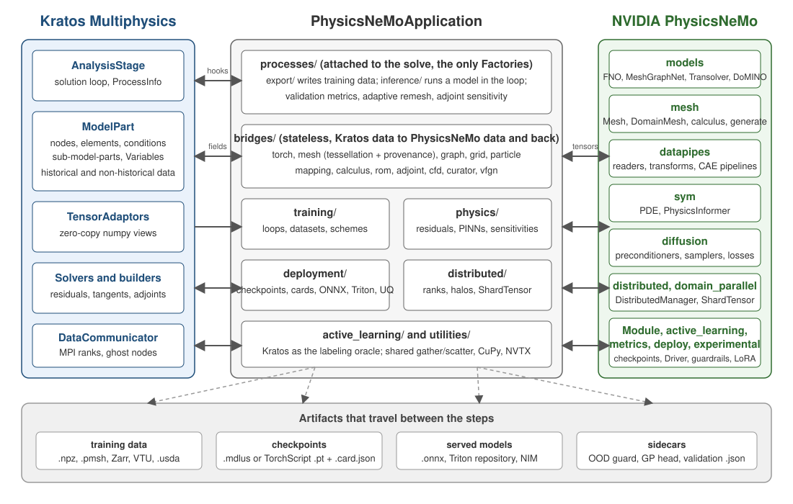

# Architecture

The application is a Python layer between two frameworks that know nothing about each other. Kratos owns the geometry, the physics and the solution loop; PhysicsNeMo owns the models, the mesh representation for machine learning and the training machinery. Everything here either converts data between the two or decides *when* in the solve a conversion happens.

    

Figure 1: The three columns and the artifacts row. Arrows are data; the processes column is the only one Kratos calls into.

## The three columns

**Kratos** contributes the `AnalysisStage` (the solution loop and its hooks), the `ModelPart` (nodes, elements, conditions, sub-model-parts, historical and non-historical variables), the core `TensorAdaptors` (zero-copy numpy views of entity data), the solvers and builders (which also expose residuals, tangents and adjoints), and the `DataCommunicator` for MPI. None of it was modified for this application; the C++ side of the application registers no components at all.

**PhysicsNeMo** contributes `physicsnemo.models`, `physicsnemo.mesh`, `physicsnemo.datapipes`, `physicsnemo.sym`, `physicsnemo.diffusion`, the two distributed packages, the `Module` checkpoint format, active learning, metrics, ONNX export and the experimental guardrails, uncertainty heads and LoRA. [PhysicsNeMo Basics](../PhysicsNeMo_Basics/Overview.html) explains each.

**The application** is `python_scripts/`, a tree of packages where the folder says what kind of thing a module is:

| Package | Role | Rule |
|---|---|---|
| `processes/` | everything attached to a solve - `inference/` runs a model in the loop, `export/` writes training data, the top level holds validation metrics, adaptive remeshing and adjoint sensitivities | **the only modules with a `Factory`**, so the only ones `ProjectParameters.json` can name |
| `bridges/` | stateless conversion: Kratos containers to tensors, meshes, graphs, grids, particle graphs, POD bases, adjoint gradients, pyvista flow fields, curator sources | a bridge knows nothing about the solution loop; a process calls it at the right moment |
| `training/` | loops, datasets and schemes: `TrainModel`, the dataset factories, streaming, temporal schemes, diffusion, Sobolev training, DoMINO fine-tuning, ROM temporal attention | |
| `physics/` | the three residuals and the sensitivities - the solver as a signal | |
| `deployment/` | checkpoint loading and model cards, ONNX and Triton, the NIM client, USD export, the co-simulation wrapper, the response function, uncertainty and OOD guards | |
| `distributed/` | alignment of `DistributedManager` with the `DataCommunicator`, halo-partitioned graphs, `ShardTensor` over the Kratos ranks | |
| `active_learning/` | Kratos as the label strategy of a `physicsnemo.active_learning` loop, with in-process and subprocess execution backends | |
| `utilities/` | the shared gather/scatter entry point, opt-in CuPy, NVTX ranges, two numpy reference integrators | |

[Where things live](Module_Map.html) lists every module; [Process reference](Process_Reference.html) lists every process with its settings.

## Where processes hook into the solve

A Kratos `Process` has one method per stage of the solution loop, and this application's processes are ordinary processes: a `ProjectParameters.json` entry names the module and the package, Kratos builds it through the `Factory`, and the `AnalysisStage` calls its hooks.

    

Figure 2: Which hook each family of processes uses. Inference defaults to FinalizeSolutionStep; the hybrid initialization and the PINN solve run once before the loop.

One time step, seen from the processes that are attached:

sequenceDiagram
    autonumber
    participant S as AnalysisStage
    participant K as Kratos solver
    participant I as inference process
    participant E as export process
    participant V as validation process
    S->>I: ExecuteInitializeSolutionStep
    Note over I: predicts here only if execution_point is initialize_solution_step
    S->>K: SolveSolutionStep
    Note over K: the solver sees predicted values like any other nodal data
    S->>I: ExecuteFinalizeSolutionStep
    Note over I: gather inputs, normalize, forward, de-normalize, scatter to output_fields
    S->>E: ExecuteFinalizeSolutionStep
    Note over E: every output_interval steps, one sample written or queued
    S->>V: ExecuteFinalizeSolutionStep
    Note over V: predicted vs reference fields, one row of metrics
    S->>S: OutputStep
    Note over S: vtk, GiD or HDF5 output carries the predicted fields unchanged

Three consequences of the placement are worth stating once:

- A prediction written in `FinalizeSolutionStep` is what the output step, the exporters and the next step's history see. One written in `InitializeSolutionStep` is what the solver starts from - which is how `HybridInitializationProcess` warm-starts Newton, except that it runs once, in `ExecuteBeforeSolutionLoop`.
- Exports run after the solve, so they capture converged fields; `validation_metrics_process` compares them against reference fields in the same hook, so a surrogate and a solver can be compared step by step in one run.
- Topology is extracted once (`ExecuteInitialize`) and values every step. The graph, DoMINO and export processes cache what depends only on connectivity, and their cache invalidation matches what the cache depends on - a count for a pure topology map, coordinates for anything holding simplex geometry.

## The artifacts

Steps communicate through files, and each file type has exactly one writer and one reader here:

| Artifact | Written by | Read by |
|---|---|---|
| `sample_<step>.npz` | `processes.export.dataset_export_process` | `training.torch_dataset` (`CreateNpzDataset`), the active-learning subprocess backend |
| `grid_<step>.npz` | `processes.export.grid_dataset_export_process` | `CreateGridSequenceDataset`, `CreateGridPairDataset` |
| `case_<id>.npz` (CAE layout) | `processes.export.cae_dataset_export_process` | `CreateDoMINODataPipe`, `CreateTransolverDataPipe`, `DominoInferenceProcess` |
| `mesh_<step>.pmsh` | `processes.export.mesh_export_process` | `CreateMeshDataset`, physicsnemo's `MeshReader` |
| Zarr store or VTU series | `processes.export.curator_export_process` | physicsnemo-curator sinks, upstream readers |
| `twin.usda` | `processes.export.usd_export_process` | any USD viewer |
| `surrogate.mdlus` or `surrogate.pt`, plus `.card.json` | `training.training_utils.SaveTrainedModel` | `deployment.model_registry` in every inference process |
| `surrogate.onnx` plus `.card.json` | `training.training_utils.ExportOnnxModel` | `processes.inference.onnx_inference_process`, `deployment.triton_export` |
| a Triton model repository | `deployment.triton_export` | Triton Inference Server, called by `processes.inference.triton_inference_process` |
| `.ood_guard`, `.gp_head.pt` sidecars | `TrainModel`, `deployment.uncertainty_utils` | the `"ood_guard"` and `"uncertainty"` blocks |
| `validation_metrics.json` | `processes.validation_metrics_process` | you |

The model card is the artifact that makes the others safe to combine: it records which fields are in which channel and under which normalization, and every reader above validates against it. See [Core and checkpoints](../PhysicsNeMo_Basics/Core_And_Checkpoints.html).

## Two contracts that hold everything together

**Row order.** Every array in the application is ordered the same way: one row per entity, entities in ascending id, node-major and component-minor for vector fields. `CreateNpzDataset` produces it, `inference_process` consumes it, `graph_bridge`, `rom_bridge`, `adjoint_bridge` and the MPI gathers all reproduce it. If you build a dataset by hand, match it; if you get a gradient back from Kratos as an `{id: value}` dictionary, convert by id, never by iteration order.

**Lazy imports.** No module imports `torch`, `physicsnemo` or `cupy` at module scope; each one does so inside a helper that raises an actionable message. That is what lets `import KratosMultiphysics.PhysicsNeMoApplication` succeed on a machine with no ML stack, the export processes run there, and the torch-free CI exercise the whole tree. `tests/test_import_contract.py` enforces it.

Next: [Kratos concepts for ML readers](Kratos_Concepts_For_ML.html), or [Where things live](Module_Map.html).
