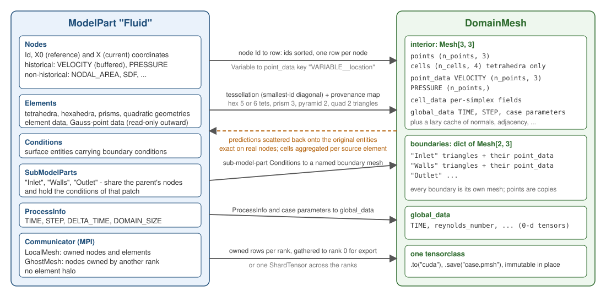

# Kratos concepts for ML readers

If you come from PhysicsNeMo rather than from Kratos, the settings on every page here use words - `node_historical`, `finalize_solution_step`, sub-model-part, `ProcessInfo` - that Kratos users take for granted. This page defines them once, and maps each onto the PhysicsNeMo concept it becomes on the other side of the bridge.

<p align="center">
    
</p>
<p align="center">Figure 1: What each part of a ModelPart becomes on the PhysicsNeMo side, and how predictions come back.</p>

## ModelPart, and what lives in it

A **`Model`** owns named **`ModelPart`s**; a `ModelPart` is the container a solver works on. It holds:

- **Nodes** - points with an integer `Id`, reference coordinates `X0, Y0, Z0` and current coordinates `X, Y, Z` (they differ once the mesh moves), and two kinds of data described below.
- **Elements** - the finite elements, each with a geometry (tetrahedron, hexahedron, prism, pyramid, triangle, quadrilateral, and their quadratic versions) over a list of nodes, plus `Properties` (material data) and element-level data.
- **Conditions** - surface or line entities carrying boundary conditions; same structure as elements, one dimension lower.
- **SubModelParts** - named subsets that *share* the parent's nodes and hold the conditions or elements of one patch: `"Inlet"`, `"Walls"`, `"Outlet"`. Boundary conditions are applied to them, which is why they map onto PhysicsNeMo's named boundaries.
- **`ProcessInfo`** - solver-level scalars: `TIME`, `STEP`, `DELTA_TIME`, `DOMAIN_SIZE`, the current nonlinear iteration.
- A **`Communicator`** under MPI - which nodes and elements this rank *owns* (`LocalMesh`) and which nodes it holds as read-only copies of another rank's (`GhostMesh`). There is no element halo.

Kratos keeps `ModelPart.Nodes` sorted by `Id` regardless of creation order. That is the fact the whole row-order contract of this application rests on.

## Variables and where they are stored

A **`Variable`** is a typed, globally registered name: `TEMPERATURE` (a double), `VELOCITY` (a 3-component array), `CAUCHY_STRESS_VECTOR`, and so on. Applications register their own. A variable is not data; it is the *key* under which data is stored on an entity, and the same variable can be stored in several places at once. The `"data_location"` string in every settings block picks the place:

| `data_location` | Where the values live | Notes |
|---|---|---|
| `node_historical` | the nodal *solution-step* database, one slot per buffered time step | what solvers read and write (DOFs and their derivatives); a variable must be added to the model part before the mesh is read; the buffer keeps the last `buffer_size` steps for time integration |
| `node_non_historical` | the nodal *data-value* container, one value, no history | free-form storage: derived quantities, SDFs, predicted fields you want to keep apart from the solver's own, a computed sensitivity |
| `element` | the element data-value container | one value per element |
| `condition` | the condition data-value container | one value per condition |
| `element_gauss_point`, `condition_gauss_point` | values *computed* at the integration points on request | **read-only** from this side: the core cannot write onto Gauss points, so an outward Gauss field collapses to a per-element mean and can only come back as an element field |

Two things follow. Writing a prediction into a *historical* variable makes it indistinguishable from a solved value - which is exactly what in-loop inference wants and exactly why the model card exists. And the exporter's field keys are `"<VARIABLE>__<location>"`, e.g. `"TEMPERATURE__node_historical"`, because the same variable at two locations is two different fields.

## TensorAdaptors

Entity data in Kratos is not stored contiguously, so a tensor view of it does not exist for free. The core **`TensorAdaptors`** are the bridge's foundation: `HistoricalVariableTensorAdaptor`, `VariableTensorAdaptor`, `GaussPointVariableTensorAdaptor`, `ConnectivityIdsTensorAdaptor`, `NodePositionTensorAdaptor`, and friends. `CollectData()` copies the entities' values into a contiguous staging buffer, `.data` exposes that buffer as a zero-copy numpy array (and therefore a zero-copy `torch.Tensor`), and `StoreData()` writes the buffer back. The application's `utilities.tensor_adaptor_dataset_utils` builds the right adaptor from a `data_location` string; `bridges.torch_bridge` wraps the two directions.

## Processes and the solution loop

A **`Process`** is Kratos's unit of "something that happens at a fixed moment of the solve". It has one method per stage:

| Hook | When |
|---|---|
| `ExecuteInitialize` | once, after the model part is read and the solver is created |
| `ExecuteBeforeSolutionLoop` | once, just before the time loop |
| `ExecuteInitializeSolutionStep` | every step, before the solve |
| `ExecuteFinalizeSolutionStep` | every step, after the solve |
| `ExecuteBeforeOutputStep`, `ExecuteAfterOutputStep` | around the output |
| `ExecuteFinalize` | once, at the end |

The settings key `"execution_point"` on this application's inference processes chooses between `initialize_solution_step` and `finalize_solution_step`; the export processes always write in the finalize hook, at every `output_interval` steps. The `AnalysisStage` is the class that runs the loop and calls each hook of each process in order; [Architecture](Architecture.html) shows the timeline.

A process is declared in `ProjectParameters.json` by module and package, and Kratos builds it by calling the module's `Factory(settings, model)`:

```json
{
    "python_module" : "dataset_export_process",
    "kratos_module" : "KratosMultiphysics.PhysicsNeMoApplication.processes.export",
    "Parameters"    : { "model_part_name" : "ThermalModelPart" }
}
```

## Parameters

**`Kratos.Parameters`** is the JSON-backed configuration object every settings block here is. Two behaviours matter: `ValidateAndAssignDefaults` fills missing keys from a default block and rejects unknown ones (so a typo in a setting is an error, not a silent no-op), and **`keys()` returns keys in alphabetical order, not insertion order** - which is why anything order-sensitive, such as DoMINO's global parameters, takes an explicit `"global_params_order"` list.

## Analysis stages, solvers, builders

The **`AnalysisStage`** owns the loop; the **solver** (`python_solver` subclasses per application) owns the model part, the linear solver and the **strategy**; the **builder and solver** assembles the global system. This application reaches into the last one deliberately: `BuildRHS` gives the exact assembled residual of any field you write onto the nodes, `Build` gives the tangent, and that is how the [three residuals](../PhysicsNeMo_Basics/Symbolic_And_Physics.html) and the adjoints work without a single modified element.

## MPI

Under MPI each rank holds a partition of the model part. The **`DataCommunicator`** is the collective-operations abstraction; a collective called on some ranks and not others deadlocks, and several innocuous-looking calls are collectives (`GlobalNumberOfNodes()` among them). The application's `distributed.distributed_utils` aligns the ranks physicsnemo's `DistributedManager` sees with Kratos's, gathers owned rows to rank 0 in the serial layout for export, and rebuilds full mesh topology on a rank-0 shadow model part when a whole mesh has to be written.

## The concept map

| Kratos | PhysicsNeMo | The conversion, and where it lives |
|---|---|---|
| `ModelPart` | `DomainMesh` (interior `Mesh` plus named boundaries plus `global_data`) | tessellation with provenance - `bridges.mesh_bridge.domain_mesh_builder` |
| node `Id` order | row index | ids sorted ascending, one row per entity - every bridge, `training.torch_dataset` |
| element geometry (hex, prism, pyramid, quad, quadratic) | simplices (tetrahedra, triangles) | smallest-id-diagonal tessellation, `higher_order_mode` - `bridges.mesh_bridge.tessellation` |
| `Variable` at a `data_location` | a `point_data` or `cell_data` key `"VARIABLE__location"` | `utilities.tensor_adaptor_dataset_utils`, `bridges.torch_bridge` |
| `SubModelPart` with conditions | a named boundary `Mesh[2, 3]` | `BuildDomainMesh(boundary_sub_model_part_names=)` |
| `ProcessInfo` `TIME`, `STEP`; case parameters | `global_data` 0-d tensors; the `TIME` and `STEP` arrays of an `.npz` sample | the export processes |
| element-edge connectivity | a PyG `edge_index` | `bridges.graph_bridge` |
| nodes as a cloud | `(B, N, C)` point tensors, or a `Mesh[0, 3]` | `processes.inference.point_cloud_inference_process`, `bridges.particle_bridge` |
| fields sampled on a lattice | `(C, D, H, W)` grids | `bridges.grid_bridge` |
| `DataCommunicator` ranks | `DistributedManager` ranks, a `DeviceMesh` | `distributed.distributed_utils`, `distributed.domain_parallel_utils` |
| a solve | a labeled sample; a `LabelStrategy` call | `active_learning.kratos_label_strategy` |
| `BuildRHS`, `Build` | a `torch.autograd.Function` | `physics.differentiable_residual` |
| a response function | a training target, or a surrogate standing in for it | `bridges.adjoint_bridge`, `deployment.surrogate_response_function` |

Next: [Where things live](Module_Map.html), or [From scratch](From_Scratch.html) to run the whole path once.
