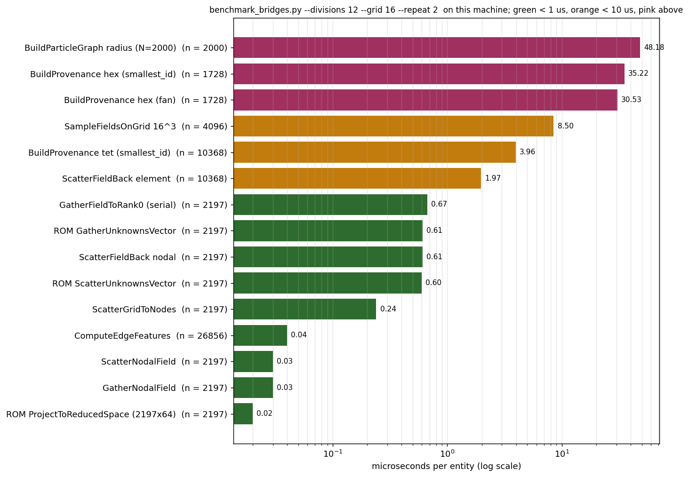

# Performance

The question this page answers is not "how fast is the model" - that is PhysicsNeMo's business - but "what does it cost to move data between Kratos and a tensor every step, and what did we do about it".

## Per-entity costs

`benchmarks/benchmark_bridges.py` times every per-entity path a training or inference step exercises, on structured meshes of configurable size (`--divisions`, `--grid`, `--repeat`, `--backend numpy|cupy|both`). It is executed by a smoke test so it cannot rot, but its *numbers* are something a human runs and reads:

```bash
python3 applications/PhysicsNeMoApplication/benchmarks/benchmark_bridges.py --divisions 24 --grid 32
```

<p align="center">
    
</p>
<p align="center">Figure 1: Microseconds per entity from one run of the benchmark on the reference laptop (the size is in the figure title; regenerate with the figure script).</p>

The shape of the result has been stable across machines:

| Path | Cost per entity | Why |
|---|---|---|
| nodal gather and scatter (`GatherNodalField`, `ScatterNodalField`) | about 0.03 to 0.2 us | `searchsorted` over the sorted node ids; the values move as one contiguous block |
| graph edge features | about 0.04 us | vectorized differences of positions |
| element scatter-back through provenance | about 2 us | one `bincount` per source entity |
| grid sampling (`SampleFieldsOnGrid`) | about 3 to 9 us per grid point | one Kratos point-locator query per grid point |
| provenance construction, tetrahedra | about 4 to 8 us | the homogeneous-simplex fast path |
| provenance construction, hexahedra | about 30 to 40 us | per-element Dompierre tables in Python |
| particle proximity graph, brute force | about 50 us at N = 2000 | the quadratic distance matrix - the one path where CuPy pays unconditionally |

Two conclusions were drawn from these and are recorded so they are not re-derived. **No custom C++ adaptors are warranted**: the per-entity arithmetic is already sub-microsecond or close, and the core `TensorAdaptors` (including `ConnectivityIdsTensorAdaptor`) provide the contiguous connectivity a C++ path would. And **most of what looked like array cost was interpreter cost**: replacing `{id: row}` dictionaries and `numpy.fromiter` with `searchsorted`, and `numpy.add.at` with `bincount`, made the nodal gather 15x and the scatter 10x faster with no new dependency.

## Per-step costs, and the caching rule

The expensive things are not per entity but per step, and every one of them was invisible to a suite whose tests ran each process for one step:

| Process | What it rebuilt every step | Measured | Fixed by |
|---|---|---|---|
| `domino_inference_process` | the surface provenance and its entity row map | 241 ms per step on a 28k-triangle surface | a cache keyed on the entity count |
| `graph_inference_process` | the whole element-edge graph, to read 2.8 ms of node features | 1073 ms per step on 64k nodes / 59k hexes, now 5.2 ms | edge index and scatter rows cached at `ExecuteInitialize` |
| `cae_dataset_export_process`, `mesh_export_process` | the tessellation | 154 ms per export, now 0.22 ms | a `ProvenanceCache` keyed on node coordinates |

The rule that fell out: **topology once, values every step - and the invalidation guard must match what the cache depends on.** A cache holding a pure cell-to-entity row map may key on the entity count (a remesh changes it; a deforming mesh does not, and must not trigger a rebuild). A cache holding simplex *coordinates* must compare coordinates (0.22 ms to check, 154 ms to rebuild; it detects a 1e-9 displacement). Copying a guard from one cache to the other produces either a wrong answer after a count-preserving remesh or a needless rebuild on every step of a moving mesh. The MPI branches of the exporters re-gather a fresh shadow part deliberately, so moving meshes stay correct there; the cache is serial-branch only.

## CuPy: what it bought, and the honest negatives

`utilities.array_backend_utils` gives four measured sites a `"backend"` switch, with numpy the default and the fallback everywhere. Measured on one RTX 2000 Ada, transfers included:

| Site | Speed-up | Note |
|---|---|---|
| particle proximity graph, brute force | 2.1x | the work grows as N^2 while the transfer grows as N - the one unambiguous win |
| graph edge features | 1.7x to 4.4x | falls as the edge count rises, because the edge index crosses the bus on every call |
| grid interpolation at points | 11.6x on a 3-channel 64^3 grid at 100k points, **0.7x** on a 1-channel 48^3 grid at 15k | which is what the per-site size threshold is for |
| ROM basis projection | 6.7x at 1e7 basis entries, within noise below | the basis is uploaded once and stays resident |

Converted, measured and **reverted**: the provenance gather/scatter (0.74x to 0.97x) and the cell aggregation (0.49x to 1.42x) - their operands live in Kratos-owned host buffers that must be re-read every step, so the transfer is the same O(N) as the arithmetic and no crossover exists. CuPy is opt-in per call or process-wide (`KRATOS_PHYSICSNEMO_ARRAY_BACKEND`) because it reorders floating-point reductions and installing it must not silently change anyone's results.

## The model side

- `"torch_compile": true` in `model_settings` wraps a physicsnemo checkpoint in `torch.compile(fullgraph=True)`. One-off compile latency on the first forward; no recompiles afterwards, since the mesh and therefore the input shape are fixed inside a solution loop. TorchScript checkpoints cannot be compiled and are refused. Models with graph-breaking custom kernels (FIGConvUNet's Warp neighbour search) may reject `fullgraph=True`.
- `"nvtx_ranges": true` emits `PhysicsNeMo::GatherInputs`, `PhysicsNeMo::Forward` and `PhysicsNeMo::WriteOutputs` ranges (and the grid and graph equivalents) so a deployed surrogate shows up in an Nsight Systems timeline next to the solver's own ranges:

```bash
nsys profile -t cuda,nvtx,osrt -o surrogate python3 MainKratos.py
```

- ONNX Runtime on the GPU: `"device": "cuda"` with `onnxruntime-gpu`; GPU and CPU agree to about 2.5e-4 relative under TF32.
- Training-side performance (AMP, CUDA graphs, upstream's `Profiler`) is not wired into `TrainModel` yet; see [Training utilities and performance](../PhysicsNeMo_Basics/Training_Utilities_And_Performance.html) and the roadmap.

## Measuring your own case

Attach `nvtx_ranges`, run under `nsys`, and read three numbers per step: the gather range, the forward range, and the scatter range. If gather plus scatter dominate, the mesh is small enough that the interpreter overhead of the process matters and a coarser `output_interval` is the lever. If the forward dominates, the model is the lever - and that is where `torch.compile`, a smaller architecture or ONNX come in. If neither does, the solver does, which is the situation a surrogate is supposed to produce.

Next: [Troubleshooting and traps](Troubleshooting_And_Traps.html).
