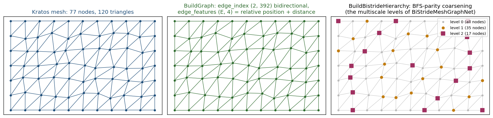
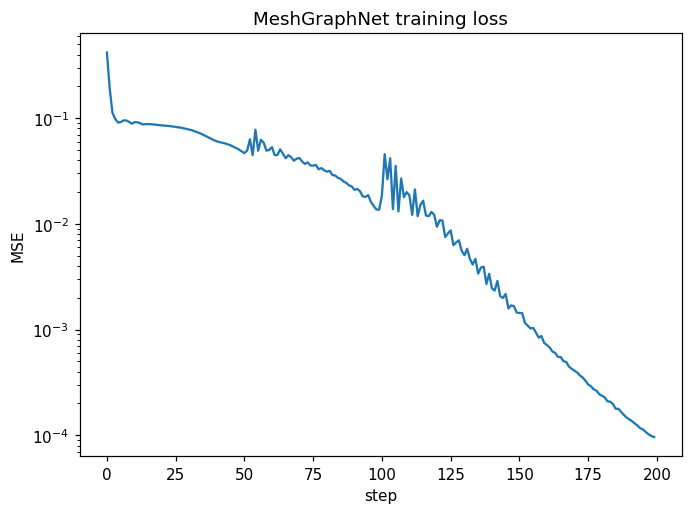

# Graph neural networks on the mesh

Unstructured meshes are the native representation of a finite element model, and graph neural networks (`physicsnemo.models.meshgraphnet.MeshGraphNet`) operate on them directly — no voxelization loss, unlike the grid/superresolution path.

<p align="center">
    
</p>
<p align="center">Figure 1: What graph_bridge extracts (generated by the figure script): the true element edges as a bidirectional edge_index with relative-position features, and the BFS-parity hierarchy BiStrideMeshGraphNet pools over.</p>

## Graph extraction (`graph_bridge.py`)

`BuildGraph(model_part, field_specs=(), source_container="Elements")` returns `(node_features, edge_index, edge_features, node_ids)`:

- **Edges** are the true geometric element edges (corner-node pairs along each geometry's edges — tetrahedra contribute 6, hexahedra 12, prisms 9, pyramids 8, no cell diagonals), deduplicated across elements and included in **both directions** (the MeshGraphNet convention). `edge_index` is `(2, E)` int64.
- **Edge features** `(E, 4)`: relative position `x_j − x_i` plus Euclidean distance — the standard MeshGraphNet edge encoding.
- **Node features** `(N, F)`: the requested nodal fields, flattened and concatenated per node (the application-wide channel convention).

`ScatterNodeFeatures` writes per-node predictions back (exact, same-mesh bijection). `ToPyGGraph(edge_index, num_nodes)` produces the `torch_geometric.data.Data` object MeshGraphNet's forward expects.

**Extra optional dependency**: running MeshGraphNet requires PyTorch Geometric and torch_scatter (`pip install torch_geometric torch_scatter`) on top of torch/physicsnemo. Graph extraction itself needs neither.



## GraphInferenceProcess

```json
{
    "python_module" : "graph_inference_process",
    "kratos_module" : "KratosMultiphysics.PhysicsNeMoApplication.processes.inference",
    "Parameters"    : {
        "model_part_name" : "FluidModelPart",
        "model_settings"  : {
            "checkpoint_file" : "meshgraphnet.mdlus",
            "checkpoint_type" : "physicsnemo",
            "device"          : "auto"
        },
        "input_fields"    : [ { "variable_name" : "VELOCITY", "data_location" : "node_historical" } ],
        "output_fields"   : [ { "variable_name" : "PRESSURE", "data_location" : "node_historical" } ],
        "update_edge_features" : false,
        "output_interval" : 1
    }
}
```

The graph topology is extracted once in `ExecuteInitialize`; node features are re-gathered per execution. Set `"update_edge_features": true` for moving meshes (ALE/Lagrangian) so relative positions/distances track the deforming geometry.

**Model cards.** A card's `"output_normalization"` is applied to the `(N, C_out)` prediction before `ScatterNodeFeatures` writes it, in the concatenated `output_fields` order (see the [Inference](../Inference/Inference.html) page).

## GraphCast grid surrogates

`physicsnemo.models.graphcast.GraphCastNet` is a grid-to-grid model with an internal icosahedral mesh: `forward((1, C, H, W)) → (1, C_out, H, W)`, a physicsnemo Module (`.mdlus` checkpoints work). It slots straight into the shipped grid machinery — **no new process code**:

- **Extra dependency (hard gate)**: construction needs `torch_geometric` **plus `torch_sparse`** (or `dgl`) — `pip install torch_geometric torch_sparse`. The recipe's tests self-skip when unavailable.
- **Training**: `training_utils.TrainModel` over next-state pairs with **`batch_size: 1`** — GraphCastNet's forward is batch-size-1 only.
- **Deployment**: `GridInferenceProcess` with the `"grid"` interface, `grid_shape [H, W, 2]` and `"squeeze_axis": 2` — the squeezed `(1, C, H, W)` batch matches `forward` exactly (`input_res` must equal the squeezed grid shape). Tiny CPU config: `GraphCastNet(mesh_level=1, input_res=(8, 16), input_dim_grid_nodes=3, output_dim_grid_nodes=3, processor_layers=3, hidden_dim=16, hidden_layers=1)`.
- **Data**: `utilities/shallow_water_reference.py` ships a numpy-only linear shallow-water integrator (periodic grid, RK2 under a CFL guard, mass exactly conserved, energy-drift-bounded — all pinned by tests) generating `(T, 3, H, W)` trajectories and next-state pairs, so the recipe runs without any compiled application. The `ShallowWaterApplication` pairing (its `HEIGHT`/`VELOCITY` fields on a rectangle) follows the same deployment settings and is availability-gated.

## Scalable GNN variants (external-aero family)

`GraphInferenceProcess` gained a `"model_interface"` setting selecting how the loaded model is called, so the scalable MeshGraphNet family deploys through the same bridge:

| interface | call | needs |
|---|---|---|
| `"meshgraphnet"` (default) | `(node_features, edge_features, graph)` | — |
| `"meshgraphkan"` | same | `MeshGraphKAN`'s Fourier-KAN node encoder (`num_harmonics`) |
| `"bistride"` | `(..., graph, ms_edges, ms_ids)` | `graph.pos` + the multiscale tables |
| `"hybrid"` | `(node_features, mesh_edge_features, world_edge_features, graph)` | proximity edges |

- **Bistride multiscale** (`BiStrideMeshGraphNet`) runs a U-Net over coarsened copies of the mesh graph — the scalability mechanism of the bistride/XAeroNet line. `graph_bridge.BuildBistrideHierarchy(edge_index, num_nodes, positions, num_levels)` builds the tables: each level two-colours every connected component by breadth-first distance from a geometric-centre seed, keeps one parity class, and connects the survivors through the squared adjacency. Two contract details the model does not check for you: `ms_edges` has **one more entry than `ms_ids`** (level 0 is the full graph), each level's edges are renumbered into **that level's own node space**, and `graph.pos` is mandatory with no fallback (`ToPyGGraph` now takes an optional `positions` argument; the process also casts `pos` to the model dtype, since it feeds the bistride edge MLPs). physicsnemo ships the same algorithm in `physicsnemo.datapipes.gnn.bsms`, but that path squares the adjacency through `sparse_dot_mkl` and raises without it (and without a working MKL runtime), so the bridge implements it on scipy — a hard Kratos core dependency, no new optional package. It also sets the adjacency diagonal before squaring: upstream's message passing derives its node count from `max(edge index)`, so a level whose highest-numbered node sources no edge would otherwise break, and isolated nodes would divide by a zero degree.
- **Hybrid mesh + world edges** (`HybridMeshGraphNet`) adds the MeshGraphNet paper's proximity edges — nodes merely *close in space* (contact, free surfaces, self-approach) rather than connected by an element. `graph_bridge.BuildWorldEdges(model_part, connectivity)` builds them through the shipped particle-bridge neighbour search (same `(2, E)` / `(E, 4)` convention as the mesh graph, so the two compose), and `ConcatenateEdgeSets` enforces the ordering the model depends on: **both edge sets live in one graph object, mesh edges first**, and the model splits the concatenated set positionally by row count. Getting that order backwards runs silently and trains nonsense — which is why the helper exists.
- `RunGraphForward(model, device, model_interface, ...)` is the free function holding the dispatch, for callers that already have a graph in hand.

The pairing is exercised on a **real FluidDynamics solve**: a lid-driven cavity built entirely in memory (`tests/kratos_solver_cases/fluid_case.py`, monolithic VMS) whose solved velocity field trains a two-level bistride surrogate for the pressure, which then deploys through the process unchanged.
