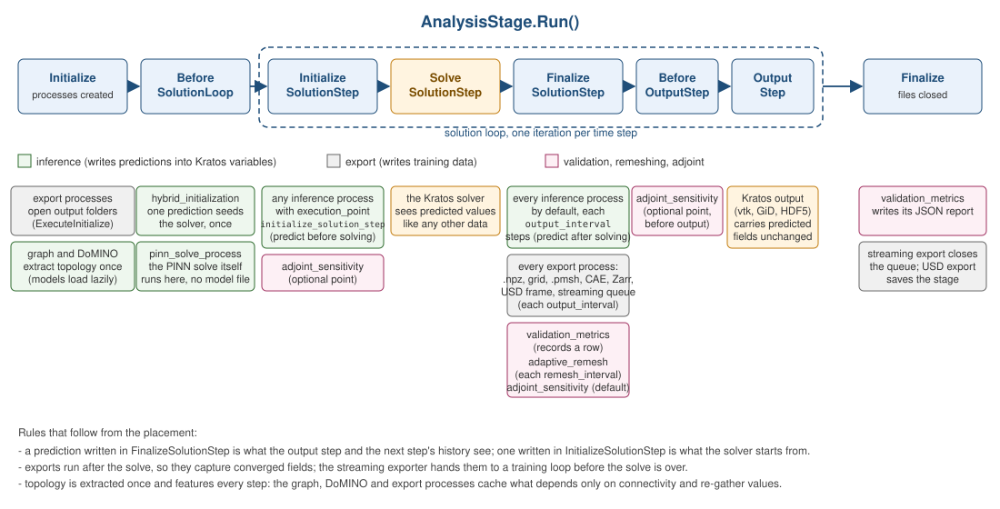
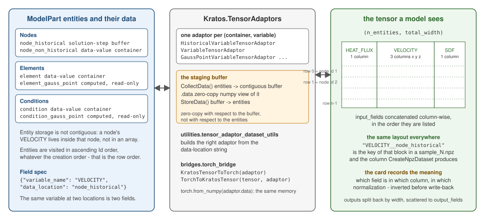
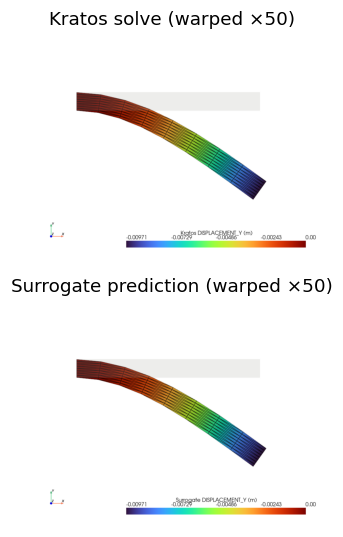
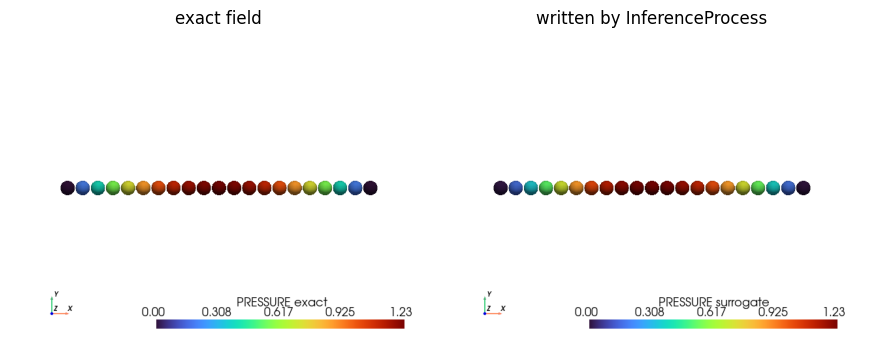
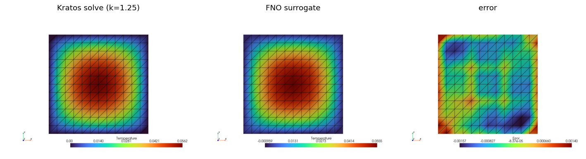
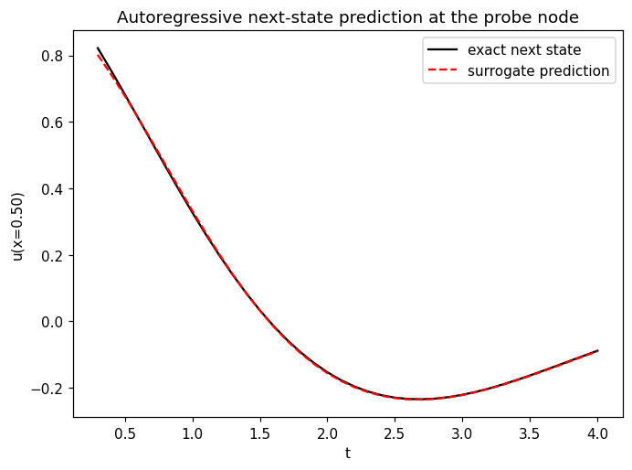

# Inference inside a solution loop

<p align="center">
    
</p>
<p align="center">Figure 1: Where an inference process runs. The default is after the solve; initialize_solution_step predicts before it, and hybrid initialization runs once before the loop.</p>

<p align="center">
    
</p>
<p align="center">Figure 2: The gather/forward/scatter contract every inference process follows, with the card's normalization applied on the way in and inverted on the way out.</p>

## Checkpoints and model cards

When a model card sidecar (`<checkpoint>.card.json`, see [Training](../Training/Training.html)) exists next to the checkpoint, every deployment process validates its configured `input_fields`/`output_fields` against it at model-load time. The `"model_card_policy"` key of `model_settings` decides what a mismatch does: `"advisory"` (default) warns and continues, `"strict"` raises, `"ignore"` skips the check.

### De-normalizing a model trained on normalized targets

A model trained on standardized targets emits standardized predictions, and writing those onto Kratos variables as if they were physical is wrong by whatever the training scaling was — silently, since the numbers are finite and plausible. The card is where that scaling travels with the checkpoint:

```json
"output_normalization" : { "type" : "mean_std", "mean" : [...], "std" : [...] }
"output_normalization" : { "type" : "min_max",  "min"  : [...], "max" : [...],
                           "range": [-1.0, 1.0] }
```

Each array is length 1 (broadcast) or one entry per channel, in the concatenated `output_fields` order. `"range"` is the interval the training normalization mapped onto — `[0, 1]` by default; DoMINO's convention is `[-1, 1]`. A card without the key, or with `{"type": "none"}`, is the identity, so configurations written before this existed are unaffected.

Three things worth knowing:

- **It is read regardless of `model_card_policy`.** `"ignore"` means "do not validate the field lists"; dropping the de-normalization there would reintroduce exactly the bug the key exists to prevent.
- **A spread is scaled, never shifted.** `"uncertainty"` fields carry a standard deviation, and shifting one by the training mean is meaningless. `InferenceProcess` passes `scale_only` for those; anything calling `WriteOutputFields` directly with a spread must do the same.
- **A degenerate scale or a wrong channel count raises** rather than producing silent NaNs or a misaligned field — a wrong-length array is exactly how a `scaling_factors` file from a *different* checkpoint announces itself.

**Covered** — every process that loads a checkpoint with a card: `InferenceProcess` and everything inheriting its write path (hybrid initialization, point clouds, ONNX, Triton), `ParticleInferenceProcess`, `GraphInferenceProcess`, `TimeSeriesInferenceProcess`, the grid writers (`SuperResolutionProcess`/`GridInferenceProcess`, `SequenceInferenceProcess`, `DiffusionInferenceProcess` — per channel along axis 0, the grid layout, and the diffusion spread scaled only), the co-simulation surrogate wrapper, `SurrogateResponseFunction` (on the written field *and* inside its autograd objective, so `dJ/dX` carries the training scale) and DoMINO's volume branch. An earlier version of this list named the co-simulation wrapper as covered while it passed no normalization at all — the case is now test-pinned, as is every other process named here, each by a mutation that removes the call. **Not covered, deliberately**: `RomSurrogateProcess` (its model emits modal coefficients, not a field, so a per-channel vector is meaningless), `PinnSolveProcess` (trained in-session, no checkpoint and no card), and `NimInferenceProcess` (the microservice returns physical fields; there is no checkpoint on this side). DoMINO's surface branch keeps its own `scaling_factors.pkl` path, which is keyed per field group rather than by concatenated column.

`model_registry.ApplyOutputNormalization` is type-preserving and, for a torch tensor, runs the arithmetic in torch on the tensor's own device and dtype with the autograd graph intact — a CUDA prediction stays on the GPU, and a gradient taken through it is scaled correctly. Grid callers pass `channel_axis=0`.

### Normalizing inputs the way training did

The symmetric half. A model trained on standardized *features* expects standardized features, and feeding it the raw Kratos fields is wrong by the same silent factor — measured as an 18% position drift on the particle path, where `CreateParticleTrajectoryDataset(normalize=True)` standardizes the velocity history the deployment process then fed raw. The card's `"input_normalization"` key carries that scaling, with the same schema and broadcast rule as `"output_normalization"` (length 1 or one entry per channel of the concatenated `input_fields`); `model_registry.ApplyInputNormalization` applies the forward map, the exact inverse of the output map for the same entry:

```json
"input_normalization"  : { "type" : "mean_std", "mean" : [...], "std" : [...] }
```

Three rules, followed by every process that reads a card:

- **Both keys, one rule.** Every process named as *covered* above applies `"input_normalization"` to what it feeds the model — the concatenated input fields, a particle process's `K×3` velocity history (before the node-type one-hot is appended), a time-series process's whole `(N, K×W)` window, or a grid's channels along axis 0.
- **Before the OOD guard.** Inputs are normalized *before* `ood_guard` checks them, because the guard was calibrated on what the model saw in training. A GP head fitted on the model's own inputs sees them normalized too; one fitted on explicit `gp_feature_fields` does not.
- **Fields, not coordinates.** Point-cloud coordinates keep their own convention (`normalize_coordinates`); the key scales only the gathered fields, so `SurrogateResponseFunction`'s coordinate chain rule is untouched by it.

`torch_dataset.MakeNormalizationCardEntries` builds both entries from a `normalize=True` particle dataset's statistics; `model_registry.MakeMeanStdNormalization` builds one from any per-channel mean and standard deviation.

## Checkpoints

`model_registry.LoadModel` is the single entry point for loading trained models:

- `"checkpoint_type": "torchscript"` — `torch.jit.load` (default),
- `"checkpoint_type": "physicsnemo"` — `physicsnemo.Module.from_checkpoint` (self-describing `.mdlus` checkpoints),
- `"device"`: `"auto"` (CUDA when available), `"cpu"` or `"cuda"`.

## Deployment performance: torch.compile and NVTX

Two opt-in `model_settings` keys tune deployed-model performance and profiling:

- `"torch_compile": true` wraps the loaded model with `torch.compile(fullgraph=True)` after it is placed on the device. Only `"physicsnemo"` checkpoints are compilable — TorchScript modules do not compose with dynamo, so combining it with `"checkpoint_type": "torchscript"` raises. Expect a one-off compile latency on the first forward pass; the mesh (and hence the input shape) is fixed inside a solution loop, so no recompiles follow. Models with graph-breaking custom kernels (e.g. FIGConvUNet's warp neighbor search) may reject `fullgraph=True`.
- `"nvtx_ranges": true` enables NVTX ranges (`utilities.nvtx_utils`) around every deployment process's hot phases — `PhysicsNeMo::GatherInputs` / `SampleFieldsOnGrid` / `BuildGraph`, `PhysicsNeMo::Forward`, and `PhysicsNeMo::WriteOutputs` / `ScatterGridToNodes` / `ScatterNodeFeatures` — so they show up in NVIDIA Nsight Systems timelines next to the solver's own profile. Ranges only emit when CUDA is available; CPU runs stay no-ops.

## ONNX export and inference

`training_utils.ExportOnnxModel(model, sample_inputs, "surrogate.onnx", card=...)` exports a trained model through `physicsnemo.deploy.onnx.export_to_onnx_stream` (torch's exporter additionally needs the `onnxscript` package), writing a portable `.onnx` file plus the usual model-card sidecar. `OnnxInferenceProcess` then deploys it with the exact `InferenceProcess` gather/split contract, but the forward pass runs through a **cached** ONNX Runtime session — `onnxruntime` (CPU) or `onnxruntime-gpu` replaces torch for the forward pass (torch remains the array bridge to Kratos):

```json
{
    "python_module" : "onnx_inference_process",
    "kratos_module" : "KratosMultiphysics.PhysicsNeMoApplication.processes.inference",
    "Parameters"    : {
        "model_part_name" : "FluidModelPart",
        "model_settings"  : {
            "onnx_file"         : "surrogate.onnx",
            "device"            : "cpu",
            "require_device"    : false,
            "model_card_policy" : "advisory"
        },
        "input_fields"    : [ { "variable_name" : "VELOCITY", "data_location" : "node_historical" } ],
        "output_fields"   : [ { "variable_name" : "PRESSURE", "data_location" : "node_historical" } ]
    }
}
```

The exported graph must take one `(n_entities, total_input_width)` tensor and return one `(n_entities, total_output_width)` tensor; gathered inputs are cast to the graph's input dtype (float32 for models exported from float32 weights). Note that some operators are not supported by the CPU ONNX Runtime — e.g. the FFTs inside FNO-style models run only on the CUDA provider — while MLP/conv models export and run everywhere.

### Running on the GPU

`"device"` takes `"cpu"` (default), `"cuda"` or `"cuda:N"`, and needs a CUDA build of ONNX Runtime — `pip install onnxruntime-gpu`. **That is a replacement, not an addition**: `onnxruntime` and `onnxruntime-gpu` install the same `onnxruntime/` package directory and overwrite each other file for file, so pick one per environment (a virtualenv is the clean way to keep both around). It is never a declared dependency of this application, for the same reasons torch is not: it is large and CUDA-variant-specific.

Verified against `onnxruntime-gpu` 1.29.0 (a CUDA-13 build, `ort.cuda_version == 13.0`) on an RTX 2000 Ada: the CUDA provider is genuinely instantiated, and GPU and CPU results agree to ~2.5e-4 relative — float32 with TF32 matmuls, so the agreement is numerical, not bitwise.

Two failure modes the bridge now guards, because ONNX Runtime reports neither:

- **A silent fall back to CPU.** ORT keeps `CPUExecutionProvider` appended as a fallback, so a missing CUDA build — or simply a device index that does not exist — yields a perfectly working CPU session that looks like success. `CreateOrtSession` compares what was requested against `session.get_providers()` (which reports what ORT actually *instantiated*) and logs a warning; `"require_device" : true` turns that into an error instead.
- **A dropped device index.** `"cuda:1"` used to be matched by a substring test that discarded the index, so it ran on device 0. The index is now parsed, validated (`"cuda:x"` is rejected rather than silently accepted) and passed through as `provider_options=[{"device_id": N}]`.

`OnnxInferenceProcess` creates its session *before* importing torch — deliberately, since the point of ONNX deployment is that torch is not needed — but ORT resolves its CUDA libraries for free only when torch was imported first. The CUDA path therefore calls `onnxruntime.preload_dlls()` itself.

## InferenceProcess

Runs a model every `output_interval` steps at a configurable execution point, writing predictions into **existing, physically-meaningful variables** — downstream code cannot tell an ML-predicted value from a solver-computed one:

```json
{
    "python_module" : "inference_process",
    "kratos_module" : "KratosMultiphysics.PhysicsNeMoApplication.processes.inference",
    "Parameters"    : {
        "model_part_name" : "FluidModelPart",
        "model_settings"  : {
            "checkpoint_file" : "surrogate.pt",
            "checkpoint_type" : "torchscript",
            "device"          : "auto"
        },
        "input_fields"    : [ { "variable_name" : "VELOCITY", "data_location" : "node_historical" } ],
        "output_fields"   : [ { "variable_name" : "PRESSURE", "data_location" : "node_historical" } ],
        "execution_point" : "finalize_solution_step",
        "output_interval" : 1
    }
}
```

Input fields are flattened per entity and concatenated along the last axis into one `(n_entities, total_input_width)` tensor; the model must return `(n_entities, total_output_width)`, which is split back by each output field's width. The model is loaded lazily on first execution, so the process can be constructed without torch installed.

When the predicted field is a displacement, the core `KratosMultiphysics.pyvista_utilities.PlotModelPart(..., warpByVector=...)` bridge renders the deployed prediction directly on the warped mesh, next to the exact solve it approximates:




<p align="center">
    
</p>
<p align="center">Figure 3: Notebook 03 - the exact field and what InferenceProcess wrote onto the model part's nodes at an unseen parameter.</p>

## HybridInitializationProcess

Warm-starts a solve: one forward pass in `ExecuteBeforeSolutionLoop`, writing the prediction (typically into historical solution-step variables) so the first nonlinear solve starts from the ML prediction instead of a cold state. Same settings as `InferenceProcess` minus `execution_point`/`output_interval` (it always runs exactly once). For blending an ML prediction with a second flow state (potential flow, previous solve) through `physicsnemo-cfd`'s recipes, see the delegation section below.

## Grid-to-grid models (FNO, UNet)

`GridInferenceProcess` deploys same-resolution grid models — the pattern of PhysicsNeMo's Darcy-FNO and datacenter-thermal-UNet examples: input fields are sampled onto a regular grid over the model part, the model maps grid to grid, and the output fields are scattered back onto the same model part:

```json
{
    "python_module" : "grid_inference_process",
    "kratos_module" : "KratosMultiphysics.PhysicsNeMoApplication.processes.inference",
    "Parameters"    : {
        "model_part_name" : "ThermalModelPart",
        "model_settings"  : { "checkpoint_file" : "fno.mdlus", "checkpoint_type" : "physicsnemo" },
        "input_fields"    : [ { "variable_name" : "CONDUCTIVITY", "data_location" : "node_historical" } ],
        "output_fields"   : [ { "variable_name" : "TEMPERATURE",  "data_location" : "node_non_historical" } ],
        "grid_shape"      : [16, 16, 16]
    }
}
```

It shares all machinery with `SuperResolutionProcess` (which is the two-model-part, upscaling variant of the same idea — see [Super Resolution](../Super_Resolution/Super_Resolution.html)).



Each field above is a genuine mesh-aware render — real element connectivity via `pyvista_utilities.ScreenshotModelPart`, not a scattered-point Delaunay triangulation.

## Transient surrogates

`TimeSeriesInferenceProcess` runs an autoregressive next-state surrogate inside a transient analysis: it keeps a rolling history of the last `history_size` gathered input states (appended each sampled step, **before** predicting) and, once the history is full, feeds the model the window `(N, K·W_in)` — history concatenated along channels, oldest first — expecting the next state `(N, W_out)` back. During the first `K−1` sampled steps it only warms up (logged, nothing written).

```json
{
    "python_module" : "time_series_inference_process",
    "kratos_module" : "KratosMultiphysics.PhysicsNeMoApplication.processes.inference",
    "Parameters"    : {
        "model_part_name" : "ThermalModelPart",
        "model_settings"  : { "checkpoint_file" : "step_predictor.pt" },
        "input_fields"    : [ { "variable_name" : "TEMPERATURE", "data_location" : "node_historical" } ],
        "output_fields"   : [ { "variable_name" : "TEMPERATURE", "data_location" : "node_non_historical" } ],
        "history_size"    : 2,
        "output_interval" : 1
    }
}
```



## Validating predictions

`ValidationMetricsProcess` benchmarks an ML-predicted field against a reference Kratos field each interval, using `physicsnemo.metrics.general` (plus a torch-native max error), logging each evaluation and writing the accumulated history to a JSON report in `ExecuteFinalize`:

```json
{
    "python_module" : "validation_metrics_process",
    "kratos_module" : "KratosMultiphysics.PhysicsNeMoApplication.processes",
    "Parameters"    : {
        "model_part_name"     : "FluidModelPart",
        "list_of_comparisons" : [{
            "predicted_variable" : "PRESSURE",
            "predicted_location" : "node_non_historical",
            "reference_variable" : "PRESSURE",
            "reference_location" : "node_historical",
            "metrics"            : ["mse", "rmse", "max_abs_error", "wasserstein"]
        }],
        "output_interval"     : 1,
        "output_file"         : "validation_metrics.json"
    }
}
```

Supported metrics: `mse`, `rmse` (from `physicsnemo.metrics.general.mse`), `max_abs_error`, and `wasserstein` (`wasserstein_from_samples` over the flattened fields).

## physicsnemo-cfd delegation

`cfd_bridge` delegates to the separately installable [`nvidia-physicsnemo-cfd`](https://github.com/NVIDIA/physicsnemo-cfd) package (importable as `physicsnemo.cfd`; `pyvista` comes with it). Both dependencies are optional and imported lazily with actionable errors, like torch/physicsnemo.

**Kratos → pyvista**: `ModelPartToPolyData(model_part, field_specs, ...)` triangulates a surface through the mesh bridge (all `tessellation_mode` / `higher_order_mode` / `curved_refinement_levels` knobs apply — curved synthetic points are interpolated into `point_data` like any other point) and returns `(polydata, provenance)`; `NodesToPolyData` builds a point-cloud PolyData from the nodes.

**Hybrid initialization**: `CreateFlowfield(model_part, settings)` maps nodal Kratos variables onto a `physicsnemo.cfd` `Flowfield` (`velocity_variable`/`pressure_variable`/`k_variable`/`omega_variable`; unset slots become zero arrays since the blend reads all four fields), `CreateHybridInitialization(flowfield_a, flowfield_b, settings)` blends them (`blend_strategy`: `"constant"` with `constant_weight`, the only strategy valid for point-located data; `"from_field_a_k"`, upstream's turbulence-threshold default for cell-located data; or any Python callable `(a, b) -> weight array`), and `FlowfieldToModelPart(blended, model_part, provenance, {"p": "PRESSURE", "U": "VELOCITY"})` writes the result back onto the nodes:

```python
from KratosMultiphysics.PhysicsNeMoApplication.bridges import cfd_bridge
settings = Kratos.Parameters('{"velocity_variable": "VELOCITY", "pressure_variable": "PRESSURE"}')
ml_field, provenance = cfd_bridge.CreateFlowfield(prediction_part, settings.Clone())
ref_field, _ = cfd_bridge.CreateFlowfield(reference_part, settings.Clone())
blended = cfd_bridge.CreateHybridInitialization(
    ml_field, ref_field, Kratos.Parameters('{"constant_weight": 0.7}'))
cfd_bridge.FlowfieldToModelPart(blended, prediction_part, provenance,
                                {"U": "VELOCITY", "p": "PRESSURE"})
```

When both flowfields live on the same mesh the blend is computed locally with upstream's exact semantics (physicsnemo-cfd 0.0.3a0's no-interpolation branch returns `flowfield_b` unchanged due to a mesh-aliasing bug, so that case cannot be delegated — pinned by test); distinct meshes delegate to `create_hybrid_initialization`'s kNN interpolation.

**CFD metric registry**: `EvaluateCfdMetrics([("l2_pressure", "surface"), ...], ground_truth, predictions)` resolves metrics from `physicsnemo.cfd.evaluation.metrics` (`ListCfdMetrics()` enumerates them: relative-L2 metrics, `drag`/`lift`, physics-residual norms, UQ calibration metrics, ...) and evaluates their numpy path on dicts keyed by the registry's semantic names (`"pressure"`, `"velocity"`, ...; each metric documents the keys it reads — `drag`/`lift` also need normals/areas). `ValidationMetricsProcess` exposes the registry through its optional `cfd_metrics` block, merged into the same JSON records as `cfd_<name>`:

```json
"cfd_metrics" : [{
    "name"   : "l2_pressure",
    "domain" : "surface",
    "fields" : {
        "pressure" : {
            "predicted_variable" : "PRESSURE",
            "predicted_location" : "node_non_historical",
            "reference_variable" : "PRESSURE",
            "reference_location" : "node_historical"
        }
    }
}]
```

## Serving through Triton Inference Server

`triton_export.ExportTritonModelRepository(model, sample_inputs, settings)` turns a trained surrogate into inference-as-a-service. Triton loads a directory tree, so the exporter writes exactly that:

```
<repository>/<model_name>/config.pbtxt
<repository>/<model_name>/<version>/model.onnx     # or model.pt
```

and `TritonInferenceProcess` then calls the running server from inside the solution loop — same gather/split contract as every other deployment process, but the forward pass is an RPC, so the solver host needs neither model weights nor a GPU. `tritonclient` is an optional, lazily imported dependency (note that a `tritonclient` installed *without* its protocol extra raises `RuntimeError`, not `ImportError` — the bridge translates that into the usual actionable message), and `SetClient()` injects a pre-built or stub client.

Two choices in the generated config are worth understanding:

- **`max_batch_size: 0`.** Triton's batch axis assumes the leading dimension is a sample index it may freely stack; here it is the *entity* count of one Kratos case. Declaring 0 disables batching, which makes the declared `dims` the full tensor shape — with `-1` on the entity axis so any mesh size is served. `dynamic_batching` is refused in that mode (there is no batch axis to fill), and only becomes meaningful if you deliberately export a batched model.
- **ONNX goes through `torch.onnx.export`, not physicsnemo's `export_to_onnx_stream`.** The upstream helper exposes no `dynamic_axes`, `input_names` or `output_names`, so it would freeze the entity count into the served graph (and it runs the model twice per call); `training_utils.ExportOnnxModel` remains the right tool for the fixed-size local artifact `OnnxInferenceProcess` consumes.

Tensor names come from the model card, so the served names match the fields the Kratos side gathers, and the card is copied next to the served artifact.

The server itself is external and not part of the test environment, so the shipped tests validate the parts that can be validated honestly: the repository layout and a parsed-back `config.pbtxt`, the exported ONNX reproducing the torch model through ONNX Runtime **at a different mesh size** (which is what proves the dynamic axis took), and the client's request payload plus write-back pinned against an injected stub.

## Calling a PhysicsNeMo NIM microservice

Where Triton serves *your* trained checkpoint, a **NIM** is NVIDIA's packaged model-as-a-container (e.g. `nvcr.io/nim/nvidia/domino-automotive-aero`). `NimInferenceProcess` calls a running one from inside the solution loop — the solver host needs neither weights, nor a GPU, nor torch: the client (`deployment.nim_client`) is stdlib `urllib` + numpy.

```json
{
    "python_module" : "nim_inference_process",
    "kratos_module" : "KratosMultiphysics.PhysicsNeMoApplication.processes.inference",
    "Parameters"    : {
        "model_part_name"       : "Skin",
        "base_url"              : "http://localhost:8000",
        "stream_velocity"       : 30.0,
        "surface_output_fields" : [
            { "nim_key" : "pressure_surface",  "variable_name" : "PRESSURE" },
            { "nim_key" : "wall_shear_stress", "variable_name" : "REACTION" }
        ]
    }
}
```

The documented physics-NIM contract, implemented verbatim: `POST /v1/infer` (also `/v1/infer/surface`, `/v1/infer/volume`) as multipart/form-data with the geometry as an STL file field named `design_stl` (built from the model part's triangle skin by `nim_client.MakeBinaryStlBytes`) plus string form fields (`stream_velocity`, `stencil_size`, `point_cloud_size`, and free-form `extra_form_fields`); the response is a numpy `.npz`. Because the NIM samples **its own** point cloud, its points are not the mesh nodes and no exact provenance scatter exists on this path — surface outputs are mapped onto the sent surface's nodes and volume outputs onto all nodes by **nearest neighbour** (scipy `cKDTree`), and one-element outputs (`drag_force`, `lift_force`, ...) are collected into `last_scalars` and logged.

Auth is worth being precise about: the NGC API key gates **pulling the container** (`docker login nvcr.io`), not calling a locally running NIM — the HTTP endpoint of a local container needs no header. A *hosted* deployment behind an authenticating gateway is served by `"api_key"` (or `"api_key_env"`), which becomes a bearer header.

Honesty note: this environment has neither an NGC key nor docker, so the contract is implemented from NVIDIA's published NIM documentation and pinned against a stub transport (`SetClient`, like Triton) — the multipart payload, the auth header, the endpoints and the `.npz` decode are all asserted; the one thing no test here has seen is a live NIM. `TestNimLive` runs the moment `PHYSICSNEMO_NIM_URL` points at one, and `NimClient.IsReady()` is the first call to make against a real deployment.
