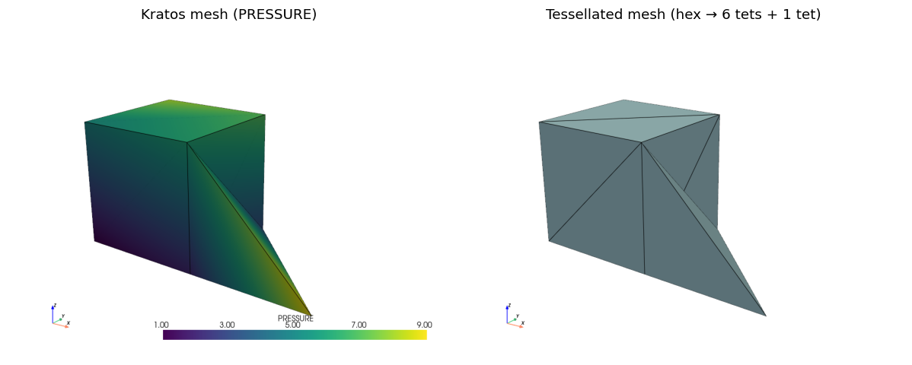

# Mesh bridge

`physicsnemo.mesh` handles strictly **simplicial** meshes (triangles/tetrahedra), while Kratos routinely uses hexahedra, prisms, pyramids, quadrilaterals and higher-order elements. The mesh bridge tessellates any Kratos mesh into simplices and keeps a **provenance map** so predictions on the simplicial mesh can be scattered back onto the original Kratos entities.

## Tessellation rules (no synthetic points — only real Kratos nodes)

Two tessellation modes exist (`tessellation_mode`, threaded through `BuildProvenance` / `BuildMesh` / `BuildDomainMesh` and the `MeshExportProcess` settings):

| Mode | Rule | Face consistency |
|---|---|---|
| `"smallest_id_diagonal"` (default) | every quadrilateral face splits along the diagonal through the face's **smallest global node id** (Dompierre et al., IMR 1999); hexahedra decompose into 5 or 6 tetrahedra depending on the resulting configuration | **watertight on any conforming mesh** — the diagonal choice depends only on node ids, so neighbouring elements (and quadrilateral surface conditions on hexahedron faces) always triangulate a shared face identically |
| `"fan"` (legacy) | fixed tables: 6-tet fan around the hexahedron 0–6 diagonal, shortest-diagonal quadrilateral split | only for translationally consistent numbering (e.g. structured grids) |

| Kratos geometry | Decomposition (`smallest_id_diagonal`) |
|---|---|
| Triangle / Tetrahedron | identity |
| Quadrilateral | 2 triangles (smallest-id diagonal) |
| Hexahedron | 5 or 6 tetrahedra (Dompierre tables) |
| Prism (wedge) | 3 tetrahedra (smallest-id rule on the free quad face) |
| Pyramid | 2 tetrahedra (smallest-id base diagonal) |

Higher-order geometries are controlled separately by `higher_order_mode`:

| Mode | Behaviour |
|---|---|
| `"reduce"` (default) | reduced to the linear corner sub-geometry; mid-side/interior nodes and their field values are dropped |
| `"subdivide"` | subdivided through the **real** mid-side/interior nodes: Triangle6 → 4 triangles, Quadrilateral8 → 6 triangles, Quadrilateral9 → 8 triangles, Tetrahedra10 → 8 tetrahedra, Hexahedra27 → 8 sub-hexahedra (then per the active mode). Serendipity types without interior nodes (Hex20, Prism15, Pyramid13) fall back to corner reduction with a one-time warning. The subdivision is straight-edged: sub-entity vertices interpolate the curved geometry, curvature between them is lost |
| `"curved"` | samples the **exact isoparametric geometry** on a dyadic parameter lattice (`curved_refinement_levels` = k, `2^k` cells per parametric axis; cell counts grow ~`8^k` in 3D / `4^k` in 2D) with **synthetic points** carrying `point_provenance = -1` plus parent/local-coordinate/shape-weight arrays. `GatherNodalField` interpolates synthetic values through the parent's shape functions; **scatter-back drops the synthetic rows and stays exact on the real nodes**. Watertight across curved neighbours: exact integer classification keys merge coinciding interface points and drive the diagonal rules, so shared faces triangulate identically from both sides. Requires `tessellation_mode="smallest_id_diagonal"`; at level 1 it coincides with `"subdivide"` (Quad8 gains its parametric center as one synthetic point); Hex20/Prism15/Pyramid13 still corner-reduce |



Both meshes above are rendered with the core `KratosMultiphysics.pyvista_utilities` bridge (`PlotModelPart`/`ScreenshotModelPart` for the left, live Kratos mesh; a hand-built `pyvista.UnstructuredGrid` reusing `GEOMETRY_TYPE_TO_VTK_CELL_TYPE` for the right, physicsnemo-side tessellation, since it is not itself a `ModelPart`) — see [`02_mesh_bridge_round_trip.ipynb`](../Examples/Examples.html).

Known limitations (documented and tested, by design):

- **Higher-order data loss in `"reduce"` mode**: mid-side/interior nodes and their field values are dropped (use `higher_order_mode="subdivide"` to keep them, where supported).
- **`"fan"` face consistency**: the fixed 6-tet table triangulates shared faces identically only for translationally consistent node numbering; general unstructured hex meshes may produce non-watertight triangulations. Use the default `"smallest_id_diagonal"` mode for unstructured meshes.
- **Gauss points are write-only-asymmetric**: Kratos cannot write back onto Gauss points (`GaussPointVariableTensorAdaptor.StoreData()` throws in the core), so Gauss-point fields are collapsed to a per-element mean on the way out and can only return as element fields.

## Round trip

```python
from KratosMultiphysics.PhysicsNeMoApplication.mesh_bridge import domain_mesh_builder

provenance = domain_mesh_builder.BuildProvenance(model_part)          # numpy only, no ML deps
mesh, provenance = domain_mesh_builder.BuildMesh(                     # physicsnemo.mesh.Mesh
    model_part, field_specs=[(Kratos.VELOCITY, "node_historical")])

# ... run a model on the simplicial mesh ...

domain_mesh_builder.ScatterFieldBack(
    provenance, predicted_point_field, model_part, Kratos.VELOCITY, "node_historical")
```

Nodal scatter-back is **exact on the real nodes** (node ↔ simplex-point is a bijection there — including mid-side nodes under `higher_order_mode="subdivide"`); in `"curved"` mode the synthetic sample points are gather-only (interpolated on the way out, dropped on the way back). Cell fields are aggregated per source entity with a configurable reduction (`mean`, `weighted_mean` by sub-cell volume, or `first`).

## DomainMesh with named boundaries

Sub-model-parts holding boundary conditions map onto `physicsnemo.mesh.DomainMesh` named boundaries:

```python
domain_mesh, provenance_maps = domain_mesh_builder.BuildDomainMesh(
    model_part,
    field_specs=[(Kratos.PRESSURE, "node_historical")],
    boundary_sub_model_part_names=["Inlet", "Walls"])
# provenance_maps: {"interior": ..., "Inlet": ..., "Walls": ...}
```

Each boundary is tessellated from the sub-model-part's Conditions container (falling back to Elements; skipped with a warning when it has neither).

## Saving and loading

`SaveMesh(mesh, prefix)` / `LoadMesh(prefix)` wrap physicsnemo's native memory-mapped on-disk format, which supports partial/lazy loading of large meshes.

## Exporting a mesh training series

`MeshExportProcess` saves the tessellated model part (with the requested fields attached) once per interval as `<output_path>/<file_prefix>_<step>.pmsh` — exactly the layout `physicsnemo.datapipes.mesh_dataset.MeshReader` consumes (the `.pmsh` suffix matters: it is the reader's default glob):

```json
{
    "python_module" : "mesh_export_process",
    "kratos_module" : "KratosMultiphysics.PhysicsNeMoApplication",
    "Parameters"    : {
        "model_part_name" : "FluidModelPart",
        "list_of_fields"  : [ { "variable_name" : "VELOCITY", "data_location" : "node_historical" } ],
        "output_path"     : "mesh_series",
        "output_interval" : 10
    }
}
```

`MeshExportProcess` is MPI-aware: on distributed model parts the topology and
fields are gathered onto rank 0 (`distributed_utils.GatherModelPartToRank0`) and
the file is written with the exact serial layout — see the Distributed page.

Training then goes through physicsnemo's own mesh datapipe:

```python
from KratosMultiphysics.PhysicsNeMoApplication.torch_dataset import CreateMeshDataset

dataset = CreateMeshDataset("mesh_series")           # MeshDataset(MeshReader(...))
mesh, metadata = dataset[0]                           # physicsnemo.mesh.Mesh per sample
```

`CreateMeshDataset` accepts physicsnemo `transforms`, a `device`, and `num_workers` and passes them through to `MeshDataset`.

## Curator ETL (Zarr / VTU sinks)

[physicsnemo-curator](https://github.com/NVIDIA/physicsnemo-curator) builds AI-ready datasets as `Source → Filter → Sink` pipelines. `curator_bridge` supplies the **source** side — the sinks ship upstream — so a Kratos solve becomes a curator data source:

```python
from KratosMultiphysics.PhysicsNeMoApplication import curator_bridge

source = curator_bridge.CreateKratosMeshSource(
    [model_part_a, model_part_b],                       # or (callable, count), evaluated lazily
    field_specs=[(Kratos.PRESSURE, "node_historical")],
    higher_order_mode="curved")                          # every BuildMesh knob applies
summary = curator_bridge.RunCuratorPipeline(
    source, curator_bridge.CreateZarrSink("curated"))     # or CreateVtuSink(...)
```

Each item yields one `physicsnemo.mesh.Mesh` from `BuildMesh`, so higher-order and curved tessellations reach curator with the same fidelity they reach training. `RunCuratorPipeline` accepts upstream `filters` and returns the pipeline `summary()`.

For an in-loop export, `CuratorExportProcess` is the curator counterpart of `MeshExportProcess` — it writes one store per exported step (the sink names its output from the step index) and is MPI-aware in the same way:

```json
{
    "python_module" : "curator_export_process",
    "kratos_module" : "KratosMultiphysics.PhysicsNeMoApplication",
    "Parameters"    : {
        "model_part_name" : "FluidModelPart",
        "list_of_fields"  : [ { "variable_name" : "PRESSURE", "data_location" : "node_historical" } ],
        "sink"            : "zarr",
        "output_path"     : "curated",
        "output_interval" : 10
    }
}
```

Three things are easy to get wrong here:

- The mesh sinks are typed on `physicsnemo.mesh.**Mesh**`, **not** `DomainMesh` — passing a `DomainMesh` fails with `AttributeError: point_data`, and only upstream's `MeshSink` accepts one. This is why the source yields `BuildMesh(...)` rather than `BuildDomainMesh(...)`.
- The VTK sink writes **`.vtu`** (unstructured grid), not `.vtp`.
- `MeshZarrSink` stores coordinates as `mesh_pos` with a leading time axis and adds a `thickness` array; values are written as **float32**. It also looks for edge connectivity in `global_data["edges"]` — a bridge-built mesh carries none, so it logs that it found no edges and writes without them. Run curator's `EdgeComputeFilter` first if the consumer needs them.

**Installing curator.** It is Apache-2.0 and public but published on **no package index**, so it must be installed from a git checkout, and because its build backend is maturin a plain `pip install` downloads a large Rust toolchain rather than falling back to pure Python — an offline CI hard-fails instead of degrading. The mesh sinks additionally need curator's `mesh` extra (notably `pyarrow`); the source side needs only `physicsnemo_curator.core.base`, which is why the bridge imports the two separately and reports them with distinct errors. Both are optional: without curator installed the bridge still imports and only its entry points raise.

## Non-matching transfer via MappingApplication

When an ML grid (or auxiliary ML mesh) matches no tessellation of the Kratos mesh —
non-simplex geometries the point locator rejects, partial overlaps, distributed
runs — `mapping_bridge` transfers fields through MappingApplication's mappers
instead of FE interpolation:

```python
from KratosMultiphysics.PhysicsNeMoApplication import mapping_bridge

grid_part = mapping_bridge.CreateBackgroundGridModelPart(
    model, "MLGrid", bounding_box, divisions=31,
    historical_variables=[Kratos.VELOCITY])
bridge = mapping_bridge.MappingBridge(solver_part, grid_part)     # nearest_element by default
bridge.MapFields([("VELOCITY", "VELOCITY")])                       # solver -> grid
grid = mapping_bridge.GatherGridArray(grid_part, ["VELOCITY"], (32, 32, 32))  # (C, D, H, W)
# ... run the grid model ...
bridge.InverseMapFields([("VELOCITY", "VELOCITY")])                # grid -> solver
```

`MappingBridge` picks `CreateMPIMapper` automatically for distributed parts, and the
`mapper_type` setting exposes MappingApplication's catalogue (`nearest_neighbor`,
`nearest_element`, `barycentric`, ...). Prefer `grid_bridge` when the FE
interpolation applies — it is exact for fields the elements interpolate exactly;
prefer the mapping bridge for robustness beyond its reach. MappingApplication is a
compiled optional dependency: it is imported lazily with an actionable error, like
the torch/physicsnemo policy.

## Performance

`benchmarks/benchmark_bridges.py` times every bridge hot path on structured meshes
(`--divisions`, `--grid` knobs). Reference numbers on a 20-core desktop CPU at
117k nodes / 663k tetrahedra / 110k hexahedra (64³ sampling lattice):

| Path | Cost | Per entity |
|---|---|---|
| `BuildProvenance`, homogeneous tets (vectorized fast path) | 2.4 s | 3.6 µs/tet |
| `BuildProvenance`, hexahedra (Dompierre, per-entity) | 3.9 s | 36 µs/hex |
| Nodal gather/scatter through the provenance map | 0.01 s | 0.1 µs/node |
| `ScatterFieldBack` element fields (vectorized) | 1.3 s | 2.0 µs/entity |
| `SampleFieldsOnGrid` (vectorized locator) | 2.3 s | 8.6 µs/point |
| ROM gather/scatter (`VariableUtils`-backed) | 0.1 s | 0.8 µs/node |

Homogeneous simplex containers (linear triangles/tetrahedra, quadratic variants in
`reduce` mode) take a fully vectorized fast path built on the C++
`ConnectivityIdsTensorAdaptor` — bit-identical to the per-entity path (pinned by
tests) and ~3.5× faster. Hexahedron/prism/pyramid tessellation stays per-entity
(the diagonal-rule rotation logic) at ~36 µs/hex, and only runs once per export
step. **Verdict of the profiling the roadmap called for: the recurring in-loop
paths (gather/scatter, grid interpolation) are all sub-µs-per-entity C++/numpy
already — custom C++ tensor adaptors are not warranted.** Re-run the benchmark
before revisiting that conclusion.

## Discrete calculus on the tessellated mesh

`calculus_bridge` evaluates solver-free differential operators directly on the
simplex mesh `BuildMesh` produces — physics-consistent derivative features and
conserved-quantity monitors without a builder-and-solver assembly (for the
physics' own assembled residual use `solver_residuals`/`differentiable_residual`
instead):

- `ComputeGradient(mesh, values)` / `ComputeDivergence` / `ComputeCurl` /
  `ComputeLaplacian` / `IntegrateField` wrap `physicsnemo.mesh.calculus`, and
  `ComputeNodalDerivatives(model_part, settings)` runs a settings-driven list of
  operations and scatters the results back to nodal variables (exact nodal
  bijection via the provenance map). `IntegrateNodalField` gives one-line
  integrals. Everything is autograd-differentiable (even w.r.t. `mesh.points`).
- **Backend validity, enforced by the bridge** (re-probed against physicsnemo
  2.2.0): the LSQ operators are correct on surface and volume meshes alike; the
  DEC gradient/divergence are *silently wrong* on volume (codimension-0) meshes
  and are therefore refused there; the DEC Laplacian is valid on volumes but
  **only at interior points**. None of the upstream operators treat boundaries —
  `InteriorPointMask(mesh)` (pure-torch facet counting) masks them, and
  `ComputeNodalDerivatives`'s `"zero_boundary": true` applies it for you.
- Surface meshes automatically use the intrinsic (tangent-plane) LSQ gradient —
  the extrinsic default carries an ill-conditioned normal component — with the
  upstream multi-channel crash worked around by a channel loop; multi-channel
  outputs are normalized to `(N, C, D)` regardless of backend. float32/float64
  only.
- **The 2.2 gradient-layout flip is absorbed here.** Upstream's multi-channel
  LSQ gradients changed to derivative-first `(N, D, C)` in 2.2 while the bridge
  keeps its own stable `(N, C, D)` contract. The flip was invisible to the
  original canary field, whose Jacobian `diag(1, 2, 3)` is *symmetric* — every
  test passed while the numbers were transposed. The canary is now an
  asymmetric Jacobian.

On linear fields the LSQ operators are exact to ~1e-8 (float64), pinned by
`tests/test_calculus_bridge.py`. Grid-side counterparts (uniform / rectilinear /
spectral stencils on `(C, *spatial)` grids) live in
`grid_bridge.ComputeGridDerivatives` — note the upstream stencils are
**periodic-only**, so non-periodic data needs the `"boundary": "trim"` mode
(the boundary layer wraps around and is garbage otherwise).

## Adaptive remeshing driven by surrogate error

`adaptive_remeshing` + `AdaptiveRemeshProcess` close the loop between the
residual scoring and mesh adaptation:

- `ComputeTargetSizeField(model_part, nodal_error, settings)` turns a per-node
  error (e.g. `ResidualEvaluator.ComputeNodalResiduals()`, collapsed by
  `NodalErrorArray`) into a target edge length by equidistribution:
  `h_target = clip(NODAL_H · (target_error/error)^exponent, h_min, h_max)`.
- `RunMmgAdaptation(model_part, size_field, mmg_parameters)` remeshes with
  MeshingApplication's MMG through the **scalar metric**: sizes go to
  `METRIC_SCALAR` (target edge length), `NODAL_H` is refreshed, and
  `MmgProcess2D/3D` (chosen from `DOMAIN_SIZE`) interpolates the nodal values
  onto the new mesh. Two MMG facts the module encodes: the metric mode is
  decided by whether the *first node* carries `METRIC_TENSOR_<dim>D` — so
  `MetricFastInit` (which seeds zero tensors everywhere) must **not** run before
  a scalar-driven remesh — and MMG requires `NODAL_H`
  (`FindNodalHNonHistoricalProcess`). MeshingApplication with `INCLUDE_MMG` is
  an optional, lazily-checked dependency.
- `AdaptiveRemeshProcess` chains the two at a step interval: assemble the
  residual of the current state (whatever a solver or deployed surrogate last
  wrote) → size field → MMG. The DOF set is rebuilt each time (the mesh
  changes).
- Surface path (pure torch, always available):
  `WeightedSurfacePartition(mesh, n_clusters, weights)` samples
  `partition_cells` seeds with probability ∝ a per-cell error weight, so cluster
  density follows the error. `RemeshSurface` wraps
  `physicsnemo.mesh.remeshing.remesh` — isotropic ACVD clustering needing the
  optional `pyacvd` package, CPU-only, and **dropping all point/cell data** by
  upstream design (re-sample fields afterwards).

## Shape deformation and design parameterization

`mesh_bridge/deformation.py` is the design-parameterization layer that
physicsnemo 2.2 unblocked: a handful of control parameters map
*differentiably* to node coordinates, so a surrogate objective's gradient
reaches the shape itself.

```
control displacements --DeformPoints--> deformed coordinates --WriteNodeCoordinates--> moved mesh
```

- `DeformPoints(points, control_displacements, method, **options)` dispatches
  `"ffd"` (a control lattice over a bounding box), `"rbf"` (thin-plate spline
  through scattered control points), `"morph"` (compact-support radial
  kernel) and `"displace"` (one displacement per point). **Control values are
  displacements, not destination coordinates** — a zero control array is
  exactly the identity, which the tests pin. A uniform FFD lattice reproduces
  a rigid translation to machine precision, and RBF interpolates its control
  displacements exactly at the control points (note its thin-plate system is
  singular if the control points are degenerate, e.g. coplanar — use points in
  general position).
- `RegularizationEnergy(reference_mesh, points, energy)` exposes the upstream
  energies as objective *terms*, not constraints: `"strain"` resists
  distortion from the reference, `"inversion"` blows up as elements approach
  zero or negative volume (the term that stops an optimizer tearing the mesh),
  plus measure/bending/volume variants. Degenerate reference cells produce NaN
  by upstream design — that means a broken reference mesh, not a numerical
  hiccup.
- `WriteNodeCoordinates(model_part, coordinates, update_displacement=False)`
  is the only mutating call in the module, and the app's first use of
  `NodePositionTensorAdaptor.StoreData()`. It moves the current configuration
  while leaving `X0` (the reference) alone, and can also store `X − X0` into
  `DISPLACEMENT`, which is what MeshMovingApplication and the structural
  solvers read. When only a surface should move and the interior should follow
  smoothly, drive MeshMovingApplication with that boundary displacement rather
  than writing interior nodes directly.
- `sensitivity_utils.ComputeShapeSensitivities(...)` closes the loop:
  controls → deformation → surrogate → objective, differentiated in one
  backward pass to give `dJ/d(control)` without finite-differencing the shape.
  It is pinned against central finite differences.
- `sensitivity_utils.ComputeControlSensitivities(...)` is its **FEM-exact**
  counterpart: it takes the discretely exact nodal `dJ/dX` produced by
  `ComputeShapeSensitivityField` and applies only the deformation's chain
  rule, as a vector-Jacobian product through the same four deformers. Same
  parameterization, but the accuracy of the FEM adjoint rather than of a
  surrogate - validated against finite differences that deform the mesh and
  re-solve the problem. See
  [Physics Informed](../Physics_Informed/Physics_Informed.html), and
  notebook 17 for the whole chain driving a shape optimization.

**How this relates to `ShapeOptimizationApplication` vertex morphing.** They are close relatives, not the same operator, and `tests/test_vertex_morphing_comparison.py` pins the difference against reference fields generated from the real `KSO.MapperVertexMorphing`:

| | Kratos vertex morphing | `DeformPoints(..., "morph")` |
|---|---|---|
| normalization | `u = Σ wⱼ dⱼ / Σ wⱼ` — an exact partition of unity | `u = Σ aⱼ dⱼ / (1 + Σ aⱼ)` — a *regularized* compact Shepard field |
| uniform control field | maps to an exact translation | approaches one only as the weight sum grows |
| at a control point | damped (it is a filter) | exact (a coincident control has unbounded weight) |
| kernel | linear / gaussian / constant / cosine / quartic / green | `wendland_c2` only |
| support, linearity | radius; linear | radius; linear |

So the two agree in the **dense-control limit** — a control point at every node reproduces a translation to floating-point precision — and differ visibly when controls are sparse. If you want interpolating rather than filtering semantics, `"rbf"` is the closer analogue; on planar geometry it needs `polynomial=False`, since the `(1, x, y, z)` polynomial term is rank-deficient for coplanar controls and the solve is otherwise singular.

The reference fixture was produced in a **wheel-only** environment (`KratosMultiphysics` + `KratosShapeOptimizationApplication` from PyPI) by `tests/shape_optimization_cases/generate_reference.py`. That is deliberate: those wheels are GCC-built while a typical local core is Clang-built, and pybind11 keys its type registry on compiler identity, so the two cannot share a process. Generating once and committing the `.npz` keeps the comparison a permanent test without compiling ShapeOptimizationApplication locally.

`MeshMovingApplication` is compiled in the reference environment;
`ShapeOptimizationApplication` is not, so the roadmap's "validate against
vertex morphing" comparison remains open and the validation here is
finite-difference and self-consistency based.

## Signed distance fields as features

`mesh_bridge/spatial.py` turns geometry itself into a feature: every point
carries its signed distance to the boundary, which is what lets a surrogate
generalize across shapes instead of memorizing one mesh.

The integration point is deliberately boring. `WriteSignedDistanceField`
stores the result in an ordinary nodal (non-historical) Kratos variable, and
because every gather in this application keys off
`(variable_name, data_location)`, the SDF then flows into grids, graphs and
point clouds through their existing `input_fields` settings — no signature
changes anywhere. `SampleSignedDistanceOnGrid` covers the one case that
cannot work that way, since lattice points are not nodes.

Two things this module fixes rather than passes through:

- **Orientation.** The SDF needs a 3D triangle surface, so a tetrahedral
  model part must be reduced to its boundary — but `Mesh.get_boundary_mesh()`
  winds those triangles *inconsistently*: the closed surface's signed volume
  comes out 0 instead of the enclosed volume, and both sign methods then
  report interior points as outside. `BoundarySurface` therefore rebuilds the
  boundary with an exact outward orientation, taking each single-use facet and
  fixing its winding so the normal points away from its parent cell's opposite
  vertex. The tests assert signed-volume == enclosed volume, and that interior
  nodes come out negative with the deepest at exactly the inradius.
- **Sign convention**: negative inside, positive outside, zero on the surface.
  `max_dist` restricts the search to a narrow band, and queries beyond it
  return NaN by design rather than a distance.

Distances are computed in float32 internally (Warp-backed, CPU and CUDA) and
returned as float64 to match the rest of the application.

## Mesh generation and repair from implicit geometry

`mesh_bridge/generate.py` adds the direction the bridge never had. Until now
a Kratos `ModelPart` became a physicsnemo `Mesh` and predictions were
scattered back onto entities that already existed; now meshes can be
*generated* from geometry and *materialized as real Kratos entities*, so a
shape defined by a signed distance function can actually be solved on.

```
ModelPart --SampleSignedDistanceOnGrid--> level set --SurfaceFromLevelSet--> surface
phi       --GenerateImplicitDomain------> tets      --PopulateModelPartFromMesh--> ModelPart
                                                    --RunMmgAdaptation--------> quality cleanup
old part  --MappingBridge---------------> fields on the new mesh
```

- `GenerateImplicitDomain(phi, bounds, h, settings)` meshes the region where
  `phi` is negative. `SdfPrimitives()` returns the building blocks
  (`sphere`, `box`, `polygon_2d`, and the `union`/`intersection`/`difference`
  combinators) — plain differentiable closures, so geometry composes.
  `"full_output": true` returns the upstream diagnostics; assert on
  `q_median`, `all_volumes_positive` and `boundary_closed_manifold` rather
  than `q_min`, which is **not monotone in `h`**.
- **It runs under an explicit `torch.enable_grad()`, and that is load-bearing.**
  Upstream differentiates `phi` to project boundary vertices, so inside a
  plain `torch.no_grad()` the coverage guard trips — or, with the guard
  disabled, it *silently* returns a worse mesh. Any deployment process may
  have wrapped the world in `no_grad`, so the wrapper re-enables it and a
  regression test pins both halves of that behaviour.
- `SurfaceFromLevelSet(field, bounding_box, threshold)` extracts the zero
  level set. Its triangles are **consistently outward-wound** (the closed
  surface's signed volume equals the enclosed volume), which is exactly what
  `Mesh.get_boundary_mesh()` fails to give — the same inconsistency the SDF
  section above documents. So for a surface you want to query distances
  against, prefer marching cubes. Output is always CPU float32 and detached,
  whatever you feed it.
- `FillBoundaryLoop(boundary, settings)` fills closed **2D** loops with
  triangles meeting a minimum-angle guarantee (upstream caps the request at
  33°; `max_cell_size` is an *area*). Nesting and holes are resolved
  automatically and the input loop's vertices survive as the leading rows.
  A 3D triangle surface is redirected to `FillSurfaceWithTetrahedra` below.
- `FillSurfaceWithTetrahedra(surface, settings)` fills a watertight **3D**
  triangle surface with tetrahedra. Upstream's `fill_interior` is 2D-only in
  physicsnemo 2.2 (`n = 3` raises `NotImplementedError` — "exact 3D boundary
  recovery is planned"), so this tries upstream first, and inherits it the day
  it lands, then falls back to a Delaunay tetrahedralization carved by the
  **winding-number sign** — which is what makes it correct on *non-convex*
  solids, where a plain convex-hull tetrahedralization is not.
  It guarantees that every input vertex survives bit-identically in the
  leading rows, and it **checks its own work**: filled volume against the
  surface's enclosed volume, carved boundary area against the input area, and
  boundary edge-manifoldness. By default a mismatch raises; `"strict": false`
  warns and returns anyway, and `"full_output": true` hands back the ratios.
  Two things it does *not* promise, unlike upstream's planned `n = 3`.
  Individual facets are not preserved — Delaunay retriangulates planar faces
  with its own diagonals, so the boundary covers the same surface while its
  triangles may differ (a cube keeps 8 of its 12 facets), and on a curved
  surface that retriangulation moves the enclosed volume by ~1e-5, which is
  why the tolerances are relative and default to 1e-3 rather than to zero.
  And solids needing Steiner points for boundary recovery — the Schönhardt
  class — cannot be filled this way at all; they fail the validation instead
  of returning something wrong. Coplanar input (a prismatic skin) can leave
  flat slivers, which are **kept** because they seal the boundary while
  carrying no volume, but are counted and warned about: they are
  zero-Jacobian elements, so run `RunMmgAdaptation` before solving. No
  Steiner points are inserted, so cell size follows the input's vertex
  density — refine afterwards rather than expecting a size knob.
  `FillModelPartWithTetrahedra(model, name, surface_part)` is the Kratos-facing
  composition: a skin model part in, a solvable volume model part out.
- `RefitToImplicit(mesh, phi, ...)` is the **differentiable** counterpart:
  topology fixed, boundary vertices snapped onto `phi = 0`, gradients flowing
  back to `phi`'s parameters — which is what composes with the shape
  deformation layer. The generator itself is not differentiable.
- `PopulateModelPartFromMesh(model, name, mesh, settings)` materializes the
  result. It handles what Kratos requires and physicsnemo does not provide:
  **node ids are 1-based** so the 0-based connectivity is shifted, a
  `Properties` object is mandatory, `DOMAIN_SIZE` comes from the point width,
  the element name follows the cell shape, and every numpy scalar is cast
  (numpy types do not bind to the pybind overloads). Historical variables are
  declared before the buffer is sized, in that order. `GenerateModelPart` is
  the one-call composition.

Generation is deterministic on the CPU and is pinned there: CUDA generation
is non-reproducible (atomics) and was slower at these sizes.

To carry a solution onto a generated mesh, use the mapping bridge —
`MappingBridge(old_part, new_part, {"mapper_type": "nearest_element"})` +
`MapFields`, which is exact for linear fields and handles non-matching
topology. It maps *historical nodal* variables. When the new mesh comes from
MMG instead of from generation, MMG's own `interpolate_nodal_values` has
already done the transfer.

## Grid divergence, curl and Laplacian

`grid_bridge.ComputeGridVectorOperator` completes the grid-operator set that
`ComputeGridDerivatives` started, sharing its `operator`/`boundary`
conventions. Three details are worth knowing, all of them upstream contracts
this wrapper makes explicit:

- The two upstream families **disagree on layout**: the gradients take a bare
  *scalar* field and prepend a derivative axis, while divergence and curl take
  a **channel-first vector** field whose channel count must equal the number
  of spatial axes. Passing a 3-channel field on a 2-D grid is the classic
  mistake and is rejected with that explanation.
- Shapes: divergence → `(*spatial)`; curl → scalar vorticity in 2D and
  `(3, *spatial)` in 3D; Laplacian → the input's shape. For a Laplacian,
  `(C, *spatial)` and `(*spatial)` cannot be told apart from the shape alone,
  so the channel axis is **declared** (`"has_channel_axis"`) rather than
  guessed.
- The stencils are still periodic-only, so `"boundary": "trim"` crops the
  wrapped layer exactly as it does for the gradients. There is no spectral
  variant upstream.

One performance-versus-accuracy trap is handled for you: the Warp backend
computes in float32 and is selected automatically whenever a CUDA device
exists, silently costing about seven digits on float64 input. The wrapper
therefore keeps the torch backend for float64 grids (`"implementation":
"auto"`, the default) and leaves float32 on the fast path; pass
`"implementation": "default"` to restore upstream's own choice.
