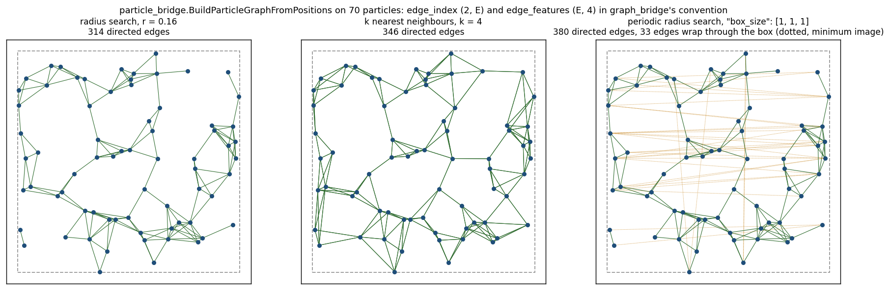
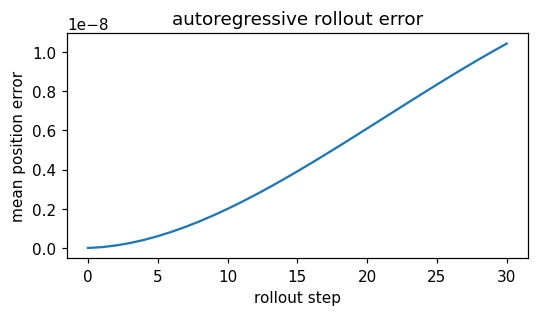
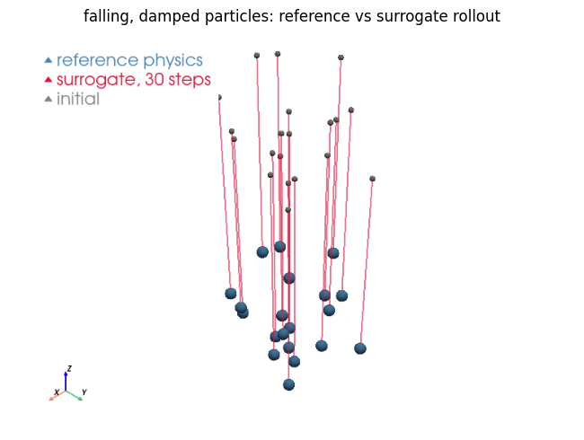

# Lagrangian particle surrogates (Learning-to-Simulate)

Particle methods (`MPMApplication`, `SPHApplication`, `DEMApplication`, `PfemFluidDynamicsApplication`) have no persistent element-edge graph — connectivity is **proximity, rebuilt every step**. The particle bridge brings the Learning-to-Simulate recipe (position/velocity/node-type in, acceleration out, autoregressive) to Kratos node clouds.

<p align="center">
    
</p>
<p align="center">Figure 1: The three connectivities of particle_bridge on one cloud (generated by the figure script); dotted edges wrap through the periodic box by the minimum image.</p>

## Particle graphs

`particle_bridge.BuildParticleGraph(model_part, connectivity, field_specs=())` connects the nodes by `"radius"` or `"knn"` and returns exactly `graph_bridge.BuildGraph`'s contract (`(N, F)` node features, bidirectional `(2, E)` edge index, `(E, 4)` relative-position + distance edge features, node ids) — so `ScatterNodeFeatures`, `ToPyGGraph` and every downstream idiom work unchanged. Neighbor search runs through `physicsnemo.nn.functional` (warp-backed `radius_search`/`knn`) when available, with an exact numpy brute-force fallback (`"backend": "numpy"`, also the reference the accelerated path is tested against). `BuildKinematicFeatures(model_part, K)` gathers the last K velocity states from the historical buffer, oldest first.

## Deployment: `ParticleInferenceProcess`

```json
{
    "python_module" : "particle_inference_process",
    "kratos_module" : "KratosMultiphysics.PhysicsNeMoApplication.processes.inference",
    "Parameters"    : {
        "model_part_name" : "Particles",
        "model_settings"  : { "checkpoint_file" : "l2s.mdlus", "checkpoint_type" : "physicsnemo" },
        "connectivity"    : { "type" : "radius", "radius" : 0.015 },
        "history_size"    : 2,
        "node_type_variable" : "FLAG_VARIABLE",
        "num_node_types"     : 2
    }
}
```

Each due step the graph is rebuilt from the **current** positions, the K-velocity window (plus the optional node-type one-hot from a nodal variable) feeds the model, and the predicted per-particle acceleration advances the state with semi-implicit Euler using `ProcessInfo[DELTA_TIME]` — `VELOCITY`/`ACCELERATION` are written, the nodes are moved, and `DISPLACEMENT` tracks the motion. The velocity history lives in the process itself (a rolling deque, like `TimeSeriesInferenceProcess`): with `history_size` K > 1 the first K−1 due steps only warm the history up. It deliberately does **not** read the historical buffer — in a self-driving loop the freshly cloned buffer slot duplicates the current value, which would silently degrade models trained on genuine multi-step windows (`BuildKinematicFeatures` remains for pipelines whose driver fills the buffer properly). Model interfaces: `"meshgraphnet"` (default — `physicsnemo.models.meshgraphnet.MeshGraphNet` with `input_dim_edges=4`, `output_dim=3`; needs `torch_geometric`/`torch_scatter`) and `"tensor"` (`model(nodes, edges, edge_index)` plain tensors — scriptable stubs and custom GNNs).




<p align="center">
    
</p>
<p align="center">Figure 2: Notebook 13 - the particle cloud after thirty autoregressive steps of ParticleInferenceProcess against the integrated reference.</p>

## Training data

`torch_dataset.CreateParticleTrajectoryDataset(trajectories, history_size, delta_time)` windows `(T, N, 3)` position trajectories into `(features, acceleration)` pairs — finite-difference velocities oldest-first (exactly `BuildKinematicFeatures`'s layout) and central-difference acceleration targets — exposing per-sample positions (`dataset.positions[i]`, for graph building in the training collate) and the normalization statistics (`feature_mean/std`, `target_mean/std`). With `normalize=True` **both** are baked into the tensors, so record both in the model card — `MakeNormalizationCardEntries(dataset)` returns the `"input_normalization"`/`"output_normalization"` pair — together with `connectivity_radius` and `history_size`, so deployment matches training.

The graph is rebuilt every step — the round-1 NVTX ranges (`PhysicsNeMo::BuildParticleGraph`) make that cost visible in Nsight; prefer the warp backend for large clouds.

## Molecular dynamics: the Lennard-Jones recipe

NVIDIA's own `examples/molecular_dynamics/lennard_jones` trains the **generic `MeshGraphNet`** — no molecular architecture exists upstream, and none is needed — on OpenMM frames of argon: trivial node features, edge features the minimum-image relative position plus distance, a radius graph in a periodic box, per-atom forces out. The roadmap had this item gated on "no molecular architecture" for several rounds; the gap was the **periodic neighbour search**, which the bridge now has.

- **`"box_size"`** in the `connectivity` block makes `particle_bridge`'s search periodic: `[]` (default, open space), `[L]` or `[Lx, Ly, Lz]`. A pair straddling the boundary is a neighbour with the *short* edge vector, and positions may be unwrapped — images are taken modulo the box. `"auto"` runs scipy's `cKDTree` with `boxsize` (exact, O(N log N)); `"numpy"`/`"cupy"` take the minimum image on the brute-force distance matrix; warp's `radius_search` is not periodic and is never used with a box. `radius` may not exceed half the box.
- **`utilities.lennard_jones_reference`** is the data source when neither OpenMM nor a compiled `DEMApplication` is at hand (the `shallow_water_reference` precedent): a numpy velocity-Verlet integrator of the truncated-and-shifted Lennard-Jones potential in reduced units, returning **unwrapped** positions, forces and per-atom potential energies. Velocity Verlet *is* the Störmer-Verlet recurrence, so `CreateParticleTrajectoryDataset`'s central-difference acceleration targets equal the reference forces at `x_t` to round-off — the test pins it.
- **Deployment is `ParticleInferenceProcess` unchanged**: the same `connectivity` block with a `box_size`, velocity-history features, the predicted acceleration (force at unit mass) integrated and the nodes moved — unwrapped, which the periodic graph does not mind. Train with `normalize=True` and write both card keys (`MakeNormalizationCardEntries`). The per-atom potential energy is a second node-regression head on the same graphs.

`tests/test_lennard_jones_recipe.py` asserts the physics (energy and momentum conservation, force antisymmetry, zero force at `2^(1/6)`, the boundary image), the periodic graph against brute force, and the recipe end to end: a tiny `MeshGraphNet` trained on periodic graphs beats the mean-force predictor when deployed through the process on a Kratos atom cloud. A `DEMApplication` cloud fits the same contract once that application is compiled.

## Virtual Foundry GraphNet (sintering)

VFGN (`physicsnemo.models.vfgn`) is a Learning-to-Simulate model for metal binder-jetting **sintering**: particles shrink and deform under a temperature schedule. It reuses the shipped Lagrangian machinery — the same radius graph from `particle_bridge`, the same history window, the same integration — but `vfgn_bridge` absorbs three differences:

- it consumes a **position sequence** `(N, T, 3)`, not a velocity window;
- it takes `senders`/`receivers` as separate 1-D tensors, and **builds no graph of its own** despite having a `graph_mode` argument (that argument is dead code upstream — the caller always supplies the edges);
- it **requires normalization statistics** and produces silent NaNs without usable ones, since it divides by the velocity/acceleration standard deviations with no epsilon. `MakeNormalizationStats` rejects a zero std rather than letting it through.

```python
stats = vfgn_bridge.StatsFromTrajectoryDataset(dataset)   # already computed there
model = vfgn_bridge.CreateVfgnSimulator(settings, stats)
loss  = vfgn_bridge.ComputeVfgnLoss(model, sequence, next_positions, edges, predict_length)
positions = vfgn_bridge.RunVfgnRollout(model, sequence, edges, predict_length)
```

Two upstream contracts are enforced by the bridge rather than left to bite: `num_dimensions` must equal `3 × predict_length` (the decoder's width and its reshape must agree), and the model **creates parameters lazily on its first forward** — so build the optimizer *after* one loss evaluation or rollout, or it will optimize roughly half the network.

**`VFGNLearnedSimulator.forward()` is unusable in physicsnemo 2.2.** Its shape guard demands a 2-D `next_positions` while the body's arithmetic needs `(N, predict_length, 3)`: the guard-legal shape fails inside the body, and the math-legal shape is rejected by the guard. Rollout therefore goes through the public `inference()`, which works, and `ComputeVfgnLoss` runs the same encode → process → decode composition `forward()` would have performed, with the same random-walk input noise and noise-corrected target. A test deliberately **pins the upstream bug**, so when it starts failing we know the workaround can be removed.

The normalization round trip (`StatsToCard`/`StatsFromCard`) covers VFGN, which needs the statistics at construction. The general case is the model card's `"output_normalization"` key (see [Inference](../Inference/Inference.html)): `ParticleInferenceProcess` reads it and de-normalizes the predicted acceleration before integrating. That matters more here than almost anywhere else, because the output is integrated *twice* — `v += Δt·a`, then `x += Δt·v` — so a model trained on standardized targets and deployed raw compounds its error straight into node positions. The input half matters just as much: `normalize=True` standardizes the velocity-history *features* too, and a model trained that way deployed on raw velocities drifted 18% over a rollout on the Examples case. The process therefore reads `"input_normalization"` as well, standardizing the `K×3` history it gathers (before the node-type one-hot) exactly as the dataset did. Write both keys with `torch_dataset.MakeNormalizationCardEntries(dataset)` when training with `CreateParticleTrajectoryDataset(..., normalize=True)`.

**Pairing**: the roadmap originally paired VFGN with `GeoMechanicsApplication`, which is not compiled in this reference environment (nor DEM, nor MPM). StructuralMechanics and ConvectionDiffusion are, and ConvectionDiffusion ships a `CoupledThermoMechanicalSolver`, so a sintering-flavoured thermo-mechanical case is buildable there; the shipped tests use synthetic shrinking-cloud trajectories rather than claiming a solver pairing that has not been built.

### A real sintering case behind the bridge

`tests/kratos_solver_cases/thermomechanical_case.py` replaces the synthetic shrinking clouds with an actual coupled solve: a unit square held at a reference temperature is cooled through its boundary, and thermal contraction pulls it inward — roughly 21 % isotropic shrinkage over the shipped configuration. The tests assert the *physics*, not merely the absence of errors: the span contracts monotonically, a faster cooling ramp contracts more, and displacement really is the deformed configuration (`node.X` versus `X0`).

It runs on ConvectionDiffusion's `CoupledThermoMechanicalSolver`, which is worth understanding before extending the case:

- The step is **one-pass staggered** — thermal, then structural. The coupled solver's own `InitializeSolutionStep`/`Predict` are no-ops; the sub-solvers' run *inside* `SolveSolutionStep`, so a process assuming the strategy was already touched will misbehave.
- There is **no mapper**. `ConnectivityPreserveModeler` makes the thermal part share the structural part's nodes, Properties and ProcessInfo, so the coupling is just the shared nodal `TEMPERATURE`, read at Gauss points and converted to strain through `THERMAL_EXPANSION_COEFFICIENT` and `REFERENCE_TEMPERATURE`.
- The fixture pre-adds the **union** of both sub-solvers' historical variables. This is stricter than the single-physics cases: `MergeVariableListsUtility::Merge` unions the lists by calling `AddNodalSolutionStepVariable` on the already-meshed structural part, so a missing variable raises *"…which is not empty"* — and it fires at analysis construction, before `Initialize()`.
- The thermal model part must **not** be created by the caller (the modeler needs an empty destination), `domain_size` is required in three places, and the `Thermal*` constitutive laws live in **ConstitutiveLawsApplication** — StructuralMechanics registers none.
- `THERMAL_EXPANSION_COEFFICIENT` must be non-negative, so shrinkage comes from cooling *below* the reference temperature rather than a sign flip.

Feeding VFGN from it: the harness collects `(T, N, 3)` and VFGN wants node-major `(N, T, 3)`, so transpose. Set `connectivity_param` to the element scale — the 0.015 default is far below a typical mesh's spacing and yields an **empty** radius graph, which a shipped test pins explicitly. The furnace schedule enters as VFGN's `global_context`, the sintering-specific input the synthetic trajectories could not exercise.
