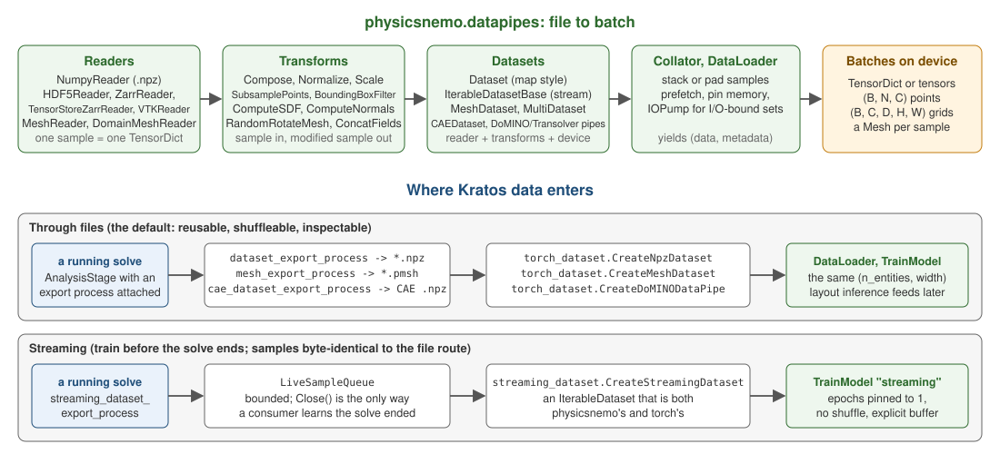

# Data and datapipes

`physicsnemo.datapipes` is the answer to "I have simulation output on disk; how does it become batches?". It is a set of readers, transforms and dataset classes built on torch's `Dataset`/`DataLoader`, plus a handful of ready-made pipelines for specific model families.

## The pieces

**Readers** turn a file into a `TensorDict`: `NumpyReader`, `HDF5Reader`, `VTKReader`, `ZarrReader`, `TensorStoreZarrReader`, `MeshReader`, `DomainMeshReader`.

**Transforms** are composable operations on what a reader produced — `Compose`, `Normalize`, `Scale`, `Translate`, `Rename`, `ConcatFields`, `DropMeshFields`, `SubsampleMesh`, `SubsamplePoints`, `KNearestNeighbors`, `ComputeSDF`, `ComputeNormals`, `ComputeCellCentroids`, `CreateGrid`, `BoundingBoxFilter`, and the mesh augmentations `RandomRotateMesh`, `RandomScaleMesh`, `RandomTranslateMesh`.

**Datasets** hold it together: `DatasetBase`, `IterableDatasetBase`, `MeshDataset`, `MultiDataset` (mixing several series), plus `Collator` variants and physicsnemo's own `DataLoader`.

**Ready-made pipelines** under `datapipes.cae` for external aerodynamics (`domino_datapipe`, `transolver_datapipe`, `mesh_datapipe`, `cae_dataset`), and under `datapipes.gnn` for the published GNN benchmarks (Ahmed body, DrivAerNet, Stokes, vortex shedding, Lagrangian, HydroGraphNet). Also `datapipes.climate` and `datapipes.healpix`.

## Four contracts that bite

These are not obvious from the API, and this application encodes all four:

1. **`IterableDatasetBase` is an ABC, not a `torch.utils.data.IterableDataset`.** A bare subclass is rejected by torch's `DataLoader` for having no `len()`. Inherit both.
2. **physicsnemo's `DataLoader` unpacks each item as `(data, metadata)`** — an `(inputs, targets)` tuple would have its targets silently swallowed. Setting `yields_batches = True` passes items through verbatim.
3. **`num_workers > 0` duplicates an iterable stream across workers**, training on every sample twice.
4. **Output buffers must not be reused across yields** — the loader may still be reading the previous one.

## Where Kratos data enters

Two routes, and the difference is whether the data touches disk.

<p align="center">
    
</p>
<p align="center">Figure 1: The datapipe stages, and the two places a Kratos solve feeds them.</p>

**Through files.** A process writes `.npz` (or `.pmsh`, or Zarr) during the solve; a dataset factory reads them back afterwards. Samples are reusable, shuffleable and inspectable — the right default.

```
solve --> processes.export.dataset_export_process --> *.npz
                                                        |
                            training.torch_dataset.CreateNpzDataset --> DataLoader
```

**Streaming.** The solve pushes each step into a queue that an iterable dataset drains, and training starts before the solve finishes. The items are byte-identical to the file path's — asserted by running one case both ways.

```
solve --> processes.export.streaming_dataset_export_process --> LiveSampleQueue
                                                                      |
                       training.streaming_dataset.CreateStreamingDataset --> TrainModel
```

## What this application uses it for

| PhysicsNeMo API | Kratos-side module | Writes / reads |
|---|---|---|
| `Dataset`, `DataLoader` | `training.torch_dataset` | `.npz` sample directories |
| `MeshDataset`, `MeshReader` | `training.torch_dataset` | `.pmsh` mesh series |
| `MultiDataset` | `training.torch_dataset` | mixing several mesh series |
| `RandomRotateMesh` and friends | `training.torch_dataset` | coherent augmentation (see below) |
| `datapipes.cae` DoMINO/Transolver pipelines | `training.torch_dataset` | `processes.export.cae_dataset_export_process` output |
| `IterableDatasetBase` | `training.streaming_dataset` | the live queue |

Kratos-side factories: `torch_dataset.CreateNpzDataset`, `CreateMeshDataset`, `CreateMultiMeshDataset`, `CreateAugmentedMeshDataset`, `CreateDoMINODataPipe`, `CreateTransolverDataPipe`, `CreateCaeDataset`, `CreateGridSequenceDataset`, `CreateGridPairDataset`, `CreateParticleTrajectoryDataset`.

**On augmentation.** Rotating a mesh must rotate its vector and rank-2 tensor fields with it. Upstream's transform defaults skip them, which quietly teaches the model that a rotated velocity field is the same velocity field. `MakeMeshAugmentations` transforms them coherently, casts to the dtype the transforms require, and seeds per epoch reproducibly.

Next: [Mesh and geometry](Mesh_And_Geometry.html).
