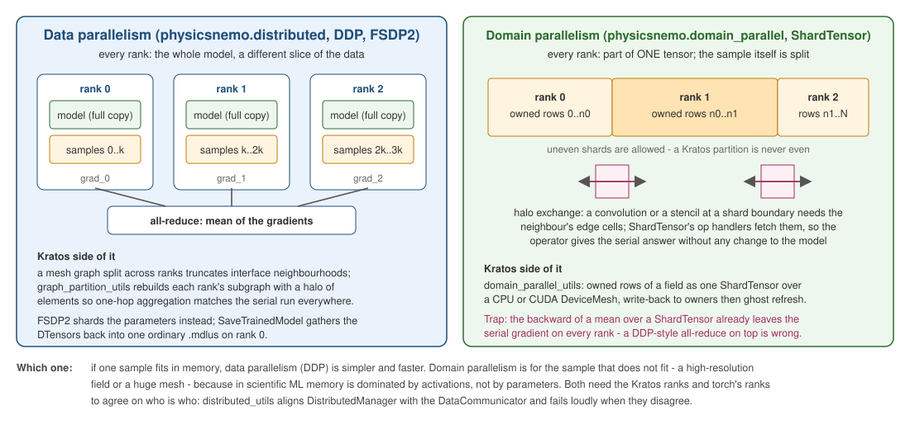

# Distributed and scale

Two different subpackages, two different kinds of parallelism, and confusing them is the usual mistake.

    

Figure 1: Data parallelism replicates the model and splits the batch; domain parallelism splits the sample itself.

## `physicsnemo.distributed` — data parallelism

Every rank holds the **whole model** and a **different slice of the data**. Gradients are averaged across ranks; the model is replicated.

- `DistributedManager` — the singleton that owns rank, world size, device and the backend. Everything else asks it.
- `ProcessGroupConfig`, `ProcessGroupNode` — subgroups of ranks, for models that want more than one axis of parallelism.
- Collectives with autograd support: `gather_v`, `all_gather_v`, `scatter_v`, `indexed_all_to_all_v`, `reduce_loss`, `fused_all_reduce`.
- `mark_module_as_shared` — tells the gradient machinery a module's parameters are replicated rather than sharded.
- `distributed.fft` — distributed FFTs, for spectral models.

### The alignment problem

Kratos has its own communicator abstraction (`DataCommunicator`), and torch has `torch.distributed`. If they disagree about which rank you are, the failure is silent and the results are garbage.

`distributed.distributed_utils` aligns the two and **checks loudly** when they disagree. `CreateMatchedProcessGroup(s)` and `InitializeDeviceMesh` pair physicsnemo subgroups with registered Kratos sub-communicators over the same ranks.

### Halo partitioning

Splitting a mesh graph across ranks naively truncates the interfaces: a node near a partition boundary loses the neighbours that live on another rank, so its one-hop neighbourhood no longer matches a serial run and the message-passing result is wrong at exactly the places that matter.

`distributed.graph_partition_utils` builds per-rank subgraphs whose owned sets partition the global node set exactly and whose one-hop neighbourhoods do match, then syncs gradients with `DistributedDataParallel` — asserted bit-identical across ranks over gloo.

## `physicsnemo.domain_parallel` — domain parallelism

Every rank holds **part of one tensor**. The mesh itself is split, not the batch. This is what you want when a single sample does not fit on one GPU.

- `ShardTensor` — a tensor sharded across a device mesh, with `shard_tensor`, `scatter_tensor` and `sync_module_over_mesh`.

Note it moved: `ShardTensor` lives in `physicsnemo.domain_parallel`, **not** in `physicsnemo.distributed`, as of 2.2.

### What this application ships of it, and the honest limit

`distributed.domain_parallel_utils` — a one-dimensional device mesh over the Kratos ranks (`InitializeDomainMesh`), a `ShardTensor` from each rank's *owned* rows with uneven shapes allowed (`ShardLocalRows`, `ShardKratosField`), the write-back to owned entities plus ghost refresh (`WriteShardedField`), a replicated grid split into halo-exchanging slabs (`ShardGridAlongAxis`), and the mesh-wide value of a sharded loss (`MeshWideValue`). The MPI suite asserts, at np=2 and np=3 over gloo: an uneven sharded field gathers to the serial layout, a pointwise model on the shard equals the serial forward, a 3×3 convolution on a W-sharded grid equals the serial convolution (the halo exchange), and the backward of a mean over the shard leaves the **serial gradient on every rank** — so a DDP-style all-reduce on top would be wrong by the rank count, which the test pins too.

This used to be called hardware-blocked: "forcing a CPU mesh trips `DistributedManager`". That was true of `DistributedManager.initialize_mesh` (it builds a CUDA mesh whenever a GPU is visible) and of `scatter_tensor`, and of nothing else. `ShardTensor` itself needs only a torch `DeviceMesh`, which `init_device_mesh("cpu", ...)` provides, and upstream's op handlers register on a CUDA-less host once asked to (`register_custom_ops()`, which the module calls). What genuinely stays untested here is the NCCL transport — one GPU, and NCCL rejects two ranks on it — plus the CUDA-only remnants: `sharding_shapes="infer"` (a hard-coded `device="cuda"` in its shape exchange, which is why the module exchanges shapes itself), ring attention, and the sharded kNN/radius search.

## Sharded checkpoints

An FSDP2 model's parameters are `DTensor`s — each rank holds a shard. Saving them directly produces a checkpoint that reports success and cannot be loaded, with each rank having written only its own piece.

`training.training_utils.SaveTrainedModel` gathers them to full tensors and writes from rank 0, so a sharded model yields one ordinary `.mdlus`. Asserted at np=2 and np=3 over gloo, with the parameters confirmed genuinely split (`local != global`) before the save. Only the multi-GPU NCCL transport is untested here.

## What this application uses it for

| PhysicsNeMo API | Kratos-side module | Gives you |
|---|---|---|
| `DistributedManager` | `distributed.distributed_utils` | alignment with Kratos's `DataCommunicator`, with a loud check |
| `ProcessGroupConfig` / `ProcessGroupNode` | `distributed.distributed_utils` | `CreateMatchedProcessGroup(s)`, `InitializeDeviceMesh` |
| `DistributedDataParallel` (torch) | `distributed.graph_partition_utils` | halo-partitioned graph training |
| FSDP2 `DTensor` | `training.training_utils` | one loadable `.mdlus` from a sharded model |
| `domain_parallel.ShardTensor` | `distributed.domain_parallel_utils` | one Kratos field or grid sharded across ranks; asserted over gloo, NCCL untested |

MPI-aware export also lives here in spirit: `processes.export.dataset_export_process` and `processes.export.mesh_export_process` do ghost-free gathers and reconstruct full mesh **topology** on a rank-0 shadow part via `GatherModelPartToRank0`, with rank 0 writing the exact serial file layout.

See [Distributed](../Distributed/Distributed.html).

Next: [Companion packages](Companion_Packages.html).
