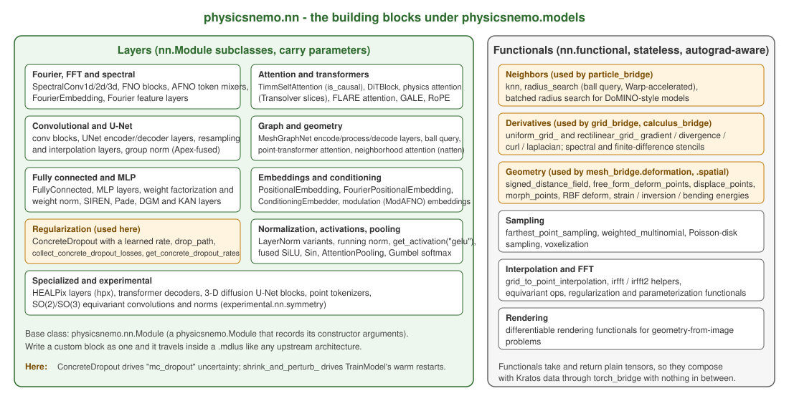

# Layers and functionals

`physicsnemo.models` is built from `physicsnemo.nn`. You rarely need the layers to *use* an architecture, but you need them for three things this application does all the time: building a small custom model that still travels in a `.mdlus`, calling a GPU-optimized operation on Kratos data without any model at all, and understanding what a flag such as `use_te` or `mc_dropout` actually switches on.

    

Figure 1: The layer and functional families. Highlighted boxes are the ones this application calls directly.

## Two kinds of building block

**Layers** are `torch.nn.Module` subclasses that carry parameters. Their base class, `physicsnemo.nn.Module`, is the same `physicsnemo.Module` the architectures use (see [Core and checkpoints](Core_And_Checkpoints.html)): it records its constructor arguments, so a custom block written as one reconstructs itself from a checkpoint like any upstream model.

**Functionals** (`physicsnemo.nn.functional`) are stateless operations on plain tensors, autograd-aware, with Warp or CUDA kernels behind the expensive ones. They take and return tensors, so they compose with Kratos data through `bridges.torch_bridge` with nothing in between.

## The layer families

Upstream's API index groups them the same way; the names below are the ones you will meet in the model source or in a configuration.

| Family | Representative classes | Where you meet it |
|---|---|---|
| Fourier, FFT and spectral | `SpectralConv1d`/`2d`/`3d`, the FNO and AFNO blocks, `FourierEmbedding`, Fourier feature layers | every neural operator on a grid; `FNO(dimension=..)`'s spectral modes are these layers' `modes` |
| Attention and transformers | `TimmSelfAttention` (`is_causal` since 2.2), `DiTBlock`, the physics attention of Transolver (learned "slices"), FLARE attention, GALE, RoPE embeddings | Transolver, GeoTransolver, FLARE, DiT; the `use_te` flag swaps in TransformerEngine kernels (fp8) |
| Convolutional and U-Net | convolution blocks, U-Net encoder/decoder layers, resampling and interpolation layers, Apex-fused group norm | `UNet`, `SRResNet`, the diffusion U-Nets |
| Graph and geometry | the MeshGraphNet encoder/processor/decoder layers, ball query, point-transformer attention (2.2), neighborhood attention (`natten`) | `MeshGraphNet` and its variants, `FIGConvUNet`, DoMINO's local stencils |
| Fully connected and MLP | `FullyConnected`, MLP layers, weight factorization and weight normalization, SIREN, Pade, DGM and KAN layers | `physicsnemo.models.mlp.FullyConnected`, `MeshGraphKAN`, PINN networks |
| Embeddings and conditioning | `PositionalEmbedding`, `FourierPositionalEmbedding` (2.2), `ConditioningEmbedder`, the modulation embeddings of `ModAFNO` | diffusion conditioning, time conditioning of `ModAFNO` |
| Regularization | `ConcreteDropout`, `drop_path`, `collect_concrete_dropout_losses`, `get_concrete_dropout_rates` | **this application**: the `"mc_dropout"` uncertainty method |
| Normalization, activations, pooling | LayerNorm variants, running norm, `get_activation("gelu")`, fused SiLU, `Sin` (2.2), `AttentionPooling`, Gumbel softmax | everywhere; `AttentionPooling` is how a per-point backbone feeds the scalar GP head |
| Specialized and experimental | HEALPix layers, transformer decoders, 3-D diffusion U-Net blocks, point tokenizers, SO(2)/SO(3) equivariant convolutions and norms (`experimental.nn.symmetry`) | weather models, `DiffusionUNet3D`, GeoTransolver's tokenizer; the symmetry layers are a roadmap item |

Around 150 layer classes in total. The practical rule: if you want a small custom model, compose `FullyConnected` or a couple of `SpectralConv` blocks as a `physicsnemo.nn.Module` subclass, save it with `training_utils.SaveTrainedModel`, and it deploys through any inference process here without extra code.

## The functional families

| Family | Functions | Notes |
|---|---|---|
| Neighbors | `knn`, `radius_search` (ball query), batched radius search | Warp-accelerated; upstream measured its ball query at up to 1384x faster and 249x less peak memory than a naive torch implementation |
| Derivatives | `uniform_grid_gradient`/`divergence`/`curl`/`laplacian`, the `rectilinear_grid_` family (2.2), spectral and finite-difference stencils | gradients take a bare scalar field and prepend a derivative axis; divergence and curl take a channels-first vector with channels equal to the spatial rank; the stencils are periodic unless you trim |
| Geometry | `signed_distance_field` (returns `(sdf, hit_points, hit_faces)` since 2.2), `free_form_deform_points`, `displace_points`, `morph_points`, `radial_basis_function_deform_points`, the strain / measure / inversion / bending / volume energies | the Warp backend computes in float32 and is auto-selected whenever CUDA exists |
| Sampling | `farthest_point_sampling` (2.2), `weighted_multinomial`, Poisson-disk sampling, voxelization | subsampling point clouds to a token budget - a roadmap item for the point-cloud process |
| Interpolation and FFT | `grid_to_point_interpolation`, `irfft`/`irfft2` helpers, equivariant ops, regularization and parameterization functionals (`shrink_and_perturb_` lives one level up in `physicsnemo.nn`) | |
| Rendering | differentiable rendering functionals | geometry-from-image problems; unused here |

## What this application uses it for

| PhysicsNeMo API | Kratos-side module | Gives you |
|---|---|---|
| `nn.functional.knn`, `nn.functional.radius_search` | `bridges.particle_bridge` | proximity graphs over particle clouds, with an exact numpy fallback and a periodic (minimum-image) mode upstream does not have |
| `nn.functional` grid derivatives | `bridges.grid_bridge` (`grid_bridge.ComputeGridDerivatives`, `grid_bridge.ComputeGridVectorOperator`) | gradients, divergence, curl and Laplacian on sampled grids, keeping the torch backend for float64 where the Warp one would silently drop to float32 |
| `nn.functional` deformers and energies | `bridges.mesh_bridge.deformation` (`deformation.DeformPoints`, `deformation.RegularizationEnergy`) | FFD / RBF / morph / displace shape parameterizations and the mesh-quality terms that keep an optimizer from inverting elements |
| `nn.functional.signed_distance_field` | `bridges.mesh_bridge.spatial` | SDFs as an ordinary nodal variable, on a boundary surface the bridge re-orients first |
| `nn.ConcreteDropout`, `collect_concrete_dropout_losses`, `get_concrete_dropout_rates` | `deployment.uncertainty_utils` | learned-rate dropout for calibrated MC-dropout error bars |
| `nn.shrink_and_perturb_` | `training.training_utils` | the `"warm_restart"` block of `TrainModel` |
| `nn.AttentionPooling` | `deployment.uncertainty_utils` | pooling per-point backbone features for the scalar GP head |

Two consequences worth remembering. First, the derivative functionals have an inconsistent layout convention between gradients and vector operators; `grid_bridge` normalizes it so you never see the difference. Second, several functionals auto-select Warp on a CUDA machine and compute in float32 - fine for training, wrong by ten orders of magnitude when you are checking a float64 Kratos field against an analytic derivative, which is why the bridge pins the torch backend for float64 input.

Next: [Data and datapipes](Data_And_Datapipes.html).
