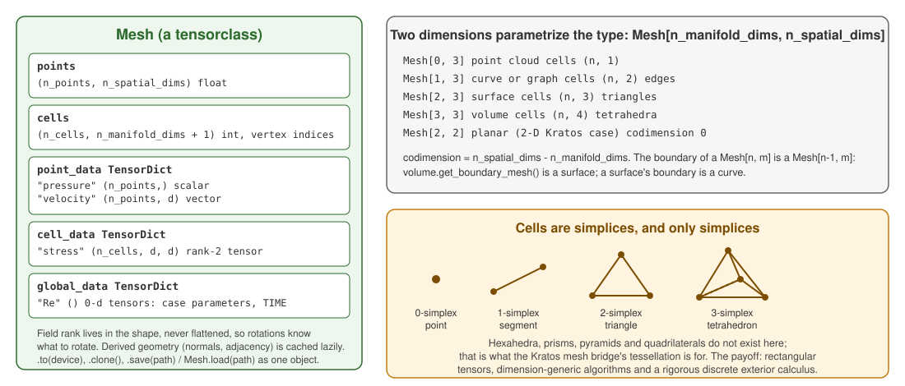

# Mesh and geometry

`physicsnemo.mesh` is the largest subpackage and the one this application leans on hardest. It is also the one where the impedance mismatch with Kratos is biggest, which is why [Mesh Bridge](../Mesh_Bridge/Mesh_Bridge.html) exists.

## The representation, and the one thing to know about it

`physicsnemo.mesh.Mesh` is **points plus simplices plus fields**. Simplices: line segments, triangles, tetrahedra. That is the whole vocabulary.

Kratos meshes are not simplicial. Hexahedra, prisms, pyramids, quadrilaterals and every quadratic geometry have to be **tessellated** into simplices before PhysicsNeMo will look at them — and tessellating each element independently splits shared faces along contradictory diagonals, leaving gaps. The bridge uses the smallest-node-id diagonal rule so neighbours agree, and keeps a **provenance** map so a prediction on a tetrahedron can be written back onto the hexahedron it came from.

`DomainMesh` adds named boundaries to a `Mesh` — the natural target for Kratos sub-model-parts.

Meshes save and load in a memory-mapped format (`.pmsh`), which is what `MeshDataset` reads.

    

Figure 1: The data model. Field rank lives in the tensor shape; the type is parametrized by two dimensions; cells are simplices and nothing else.

## What is in there

| Submodule | What it does |
|---|---|
| `tessellation` | `triangulate`, `fill_interior` — simplices from polygons and surfaces |
| `calculus` | gradient, divergence, curl, Laplacian, integrals on a mesh — LSQ and discrete-exterior-calculus backends, autograd-differentiable |
| `generate` | implicit geometry: `sdf_box`/`sdf_sphere`-style primitives, `sdf_union`/`sdf_difference`/`sdf_intersection` combinators, `marching_cubes`, `mesh_implicit_domain`, `refit_mesh_to_implicit` |
| `spatial` | `signed_distance_field` (a 3-tuple since 2.2: distances, hit points, hit faces), `BVH` for containing-cell and nearest-facet queries, `ClusterTree` for Barnes-Hut style far-field aggregation |
| `remeshing` | `remesh` (Warp-backed) and `partition_cells` surface clustering |
| `deformation` | mesh-quality energies: strain, measure, bending, and **simplex inversion** — the term that stops an optimizer tearing the mesh |
| `geometry` | areas, normals, circumcenters, cotangent weights, dual volumes |
| `neighbors` | point-to-cell, cell-to-cell and point-to-point adjacency |
| `boundaries` | facet extraction and boundary categorization |
| `sampling` | containing-cell search, barycentric coordinates, point sampling |
| `repair` | hole filling, orientation fixing, duplicate and degenerate removal |
| `subdivision` | linear, loop and butterfly refinement |
| `transformations` | rotate, scale, translate, deform |
| `curvature` | `mean_curvature_vertices`, `gaussian_curvature_vertices` (cotangent Laplace-Beltrami) - not bridged yet, a natural node feature next to the SDF |
| `smoothing` | `smooth_laplacian` - not bridged |
| `projections` | `extrude` (an N-D mesh swept into N+1), `embed`, `project` - not bridged; extrusion would turn a 2-D Kratos case into a 3-D mesh |
| `primitives` | canonical meshes (cubes, spheres, planar shapes, procedural surfaces) for tests and demos |
| `validation` | `validate`, `quality_metrics`, `statistics` - the checks the generated-mesh bridge runs on its output |
| `visualization` | `draw` through matplotlib or pyvista |
| `io` | `from_pyvista`/`to_pyvista` (auto-triangulates polyhedral cells - no provenance), `to_zarr`/`from_zarr` (2.2) |

## Two upstream behaviours worth knowing

- **The mesh-calculus gradient layout flipped** between releases. This application absorbs that behind its own stable contract, so `bridges.calculus_bridge` returns the same thing across versions.
- **Boundary surfaces come out inconsistently wound.** The signed-distance feature path re-orients the extracted surface before using it; without that, the sign of the distance field flips from patch to patch.

## What this application uses it for

| PhysicsNeMo API | Kratos-side module | Gives you |
|---|---|---|
| `Mesh`, `DomainMesh` | `bridges.mesh_bridge.tessellation`, `.domain_mesh_builder` | any Kratos mesh as a PhysicsNeMo mesh, with named boundaries |
| `mesh.calculus` | `bridges.calculus_bridge` | differentiable gradient/divergence/curl/Laplacian, with the backend-validity guards and boundary masks upstream lacks |
| `mesh.generate` | `bridges.mesh_bridge.generate` | geometry from SDFs, and `PopulateModelPartFromMesh` — generated geometry as real Kratos entities, handed to MMG or a solver |
| `mesh.spatial.signed_distance_field` | `bridges.mesh_bridge.spatial` | SDFs written into an ordinary nodal variable, so every existing gather picks them up as features |
| `mesh.remeshing` | `bridges.mesh_bridge.adaptive_remeshing` | surrogate-error-driven MMG adaptation |
| `mesh.deformation` energies | `bridges.mesh_bridge.deformation` | FFD/RBF/morph/displace shape parameterizations that stay valid |
| `datapipes.mesh_dataset` | `processes.export.mesh_export_process` | `.pmsh` series for training |

**Curved geometry.** Quadratic elements can be subdivided through their real mid-side nodes, or sampled on a refinement lattice in an opt-in *isoparametric* mode with synthetic points — interpolated on gather, dropped on scatter-back, watertight across curved neighbours.

**Tetrahedral filling** of watertight 3-D surfaces ships (`FillSurfaceWithTetrahedra`): winding-number-carved, so non-convex solids fill correctly, and self-validating against the input's own volume and boundary area. Upstream's `fill_interior` still raises `NotImplementedError` for `n = 3` in 2.2; exact boundary recovery is available locally through the opt-in `"method": "tetgen"` backend (AGPL, never chosen by `"auto"`).

**Generation** goes the other way too: `PopulateModelPartFromMesh` turns a generated PhysicsNeMo mesh into real Kratos nodes and elements, so an SDF-defined shape can be meshed, handed to MMG or a solver, and solved.

Next: [Symbolic and physics](Symbolic_And_Physics.html).
