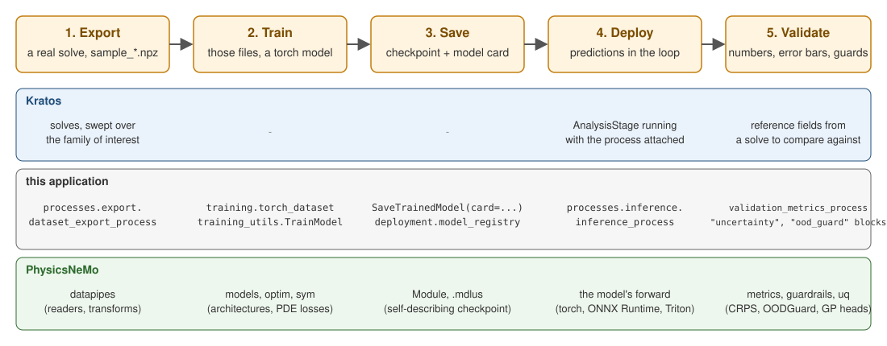

# PhysicsNeMo in practice

The rest of this documentation assumes you already know what a `Module`, a `.mdlus` checkpoint, a datapipe or a `DistributedManager` is. This section does not. It explains **NVIDIA PhysicsNeMo itself** — what it is, what lives in each of its modules, and which piece of this application uses which piece of it — so that you can tell, before writing anything, which part of a large library is relevant to your problem.

Everything here was read off the version this application is exercised against, **physicsnemo 2.2.0**. Where an API is missing, renamed or unusable in that release, it says so; [Versions and compatibility](Versions_And_Compatibility.html) lists what changed from 2.1 and what is installed where this was written.

## What PhysicsNeMo is

PhysicsNeMo is a **PyTorch library for physics machine learning**. It is not a solver, it does not discretize anything, and it has no opinion about your geometry. What it provides is the machinery around a physics-ML model:

- **architectures** for physics data (neural operators, graph networks, transformers over point clouds, diffusion models) — `physicsnemo.models`;
- **a checkpoint format that travels with its own architecture**, so a saved model reconstructs itself without your code — `physicsnemo.Module`;
- **datapipes** that turn simulation output into batched tensors — `physicsnemo.datapipes`;
- **a mesh representation** with calculus, generation and remeshing on it — `physicsnemo.mesh`;
- **the parts that are not the model**: distributed training, diffusion samplers, metrics, ONNX export, symbolic PDE residuals, active learning.

What it does *not* provide is the physics. That is what Kratos is for, and what this application connects.

## The mental model

Almost everything in this application is one of four steps. Knowing which step you are in tells you which PhysicsNeMo module and which Kratos-side package to look at.

| Step | You want | PhysicsNeMo | This application |
|---|---|---|---|
| 1. Data out | Turn solves into training data | `datapipes` | `processes.export`, `bridges` |
| 2. Train | Fit a model to it | `models`, `optim`, `sym` | `training`, `physics` |
| 3. Keep | Save something loadable later | `Module`, `.mdlus` | `deployment.model_registry` |
| 4. Deploy | Run it inside a solve | the model's `forward` | `processes.inference` |

A surrogate that never leaves step 2 is a research result. The reason this application exists is step 4: predictions written back onto real Kratos entities, in the solution loop, with the units and normalization the model was trained under.

<p align="center">
    
</p>
<p align="center">Figure 1: The five steps, and which side owns what at each of them. Step 5 wired back to step 1 is active learning.</p>

## Two words worth pinning down

**Surrogate.** A model that replaces an expensive computation with a cheap approximation of its *output*. Here: input fields or parameters go in, the field the solver would have produced comes out. It is not a solver — it does not iterate, it does not converge, and it is only as trustworthy as its training distribution. That last point is why [Uncertainty](../Uncertainty/Uncertainty.html) exists.

**Neural operator.** A model that learns a mapping between *functions* rather than between fixed-size vectors — trained at one resolution, evaluated at another. FNO is the canonical example. In practice it means the model takes a whole field as input and returns a whole field, instead of taking one point at a time.

## How to read this section

Read in order if you are new; jump if you are not.

| Page | Read it when you want to know |
|---|---|
| [Core and checkpoints](Core_And_Checkpoints.html) | What a `Module` is, and what is actually inside a `.mdlus` file |
| [Models](Models.html) | Which of the 25 architecture families fits your problem, as a decision chart |
| [Layers and functionals](Layers_And_Functionals.html) | The blocks the models are made of, and the GPU operations you can call on Kratos data with no model at all |
| [Data and datapipes](Data_And_Datapipes.html) | How simulation output becomes batched tensors |
| [Mesh and geometry](Mesh_And_Geometry.html) | The mesh representation, its calculus, and generating geometry |
| [Symbolic and physics](Symbolic_And_Physics.html) | Putting a PDE in the loss, and the three ways to do it |
| [Diffusion and deployment](Diffusion_And_Deployment.html) | Generative models, samplers, metrics, ONNX |
| [Uncertainty and guardrails](Uncertainty_And_Guardrails.html) | Error bars, whether they are honest, and refusing inputs the model never saw |
| [Active learning](Active_Learning_Concepts.html) | The loop that lets the model choose its own solves |
| [Training utilities and performance](Training_Utilities_And_Performance.html) | CUDA graphs, AMP, profiling, checkpoints - and where the time actually goes |
| [Distributed and scale](Distributed_And_Scale.html) | Running across ranks, and what is not possible on one GPU |
| [Companion packages](Companion_Packages.html) | `physicsnemo-cfd`, `physicsnemo-curator`, `experimental`, and every optional dependency |
| [Versions and compatibility](Versions_And_Compatibility.html) | The 2.2 pin, the extras, what changed from 2.1, how to upgrade safely |

Then go to [Where things live](../General/Module_Map.html) for the Kratos side, or [From scratch](../General/From_Scratch.html) to build something end to end.

## Installing it

PhysicsNeMo and torch are **optional** for this application: it imports fine without them and only the specific entry points that need them fail, with an actionable message. See [Overview](../General/Overview.html) for the full dependency policy.

```bash
pip install torch                # CPU or CUDA build, your choice
pip install nvidia-physicsnemo
```

Upstream documentation lives at [docs.nvidia.com/physicsnemo](https://docs.nvidia.com/physicsnemo/latest/index.html). It is the reference for API signatures; this section is the map.
