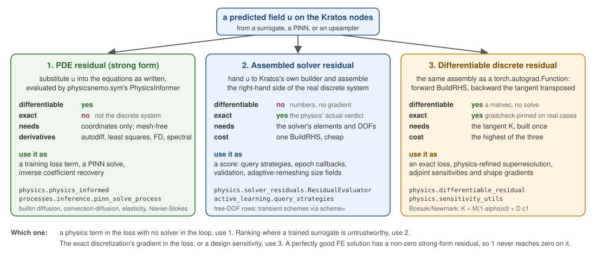

# Symbolic and physics

## `physicsnemo.sym`

`physicsnemo.sym` lets you write a PDE in SymPy and get back something differentiable that scores how badly a network's output violates it.

- `sym.eq.pde` — the `PDE` base class you subclass to declare equations symbolically;
- `sym.eq.phy_informer.PhysicsInformer` — evaluates those equations on a network's output, producing per-point residuals you can add to a loss;
- `sym.eq.gradients` — the derivative machinery underneath, with several backends: autodiff at point coordinates, least squares on a mesh or graph, finite differences or spectral differentiation on a grid.

It ships **bundled** with physicsnemo 2.2 — no separate `physicsnemo-sym` install.

`physicsnemo.nn.functional.derivatives` is the lower-level route to the same operators when you do not want SymPy at all.

## Three things called "residual"

This is the distinction that matters most, and getting it wrong wastes weeks. All three are shipped here, in `physics/`.

    

Figure 1: The three residuals, what each is exact or differentiable about, and what to use it for.

### 1. The PDE residual (approximate, differentiable)

Substitute the network's output into the **strong form** of the PDE and see what is left over. `PhysicsInformer` does this.

- Differentiable, so it can be a **training loss**.
- Mesh-free — it needs coordinates, not a discretization.
- It measures violation of *the PDE*, not of *the discrete system the solver actually solves*. A perfectly good FE solution has a non-zero strong-form residual pointwise.

Kratos side: `physics.physics_informed`, with builtin diffusion, convection–diffusion, linear elasticity and incompressible Navier–Stokes; vector fields are split into per-component SymPy functions automatically. Pass it to `TrainModel(..., extra_loss_terms=[...])`. For a pure PINN forward solve or inverse coefficient recovery, `processes.inference.pinn_solve_process`.

### 2. The assembled solver residual (exact, not differentiable)

Hand the predicted field to **Kratos's own builder** and assemble the real residual of the real discrete system.

- Exact — it is the physics' actual verdict on the prediction.
- **Not** differentiable: it is a number, not a gradient.
- Cheap enough to run often.

Use it as a *score*: active-learning query strategies ranking where the surrogate is weakest, epoch callbacks, validation. Kratos side: `physics.solver_residuals.ResidualEvaluator`.

### 3. The differentiable discrete residual (exact **and** differentiable)

The same assembly, wrapped as a `torch.autograd.Function`: forward is `BuildRHS`, backward is the consistent tangent's transpose — a matrix-vector product, not a solve.

- Exact *and* gradient-carrying, so the physics' own verdict becomes a loss.
- The most expensive of the three.
- Gradcheck-pinned on real ConvectionDiffusion and StructuralMechanics cases, and extended to transients (Bossak/Newmark via `scheme=`, assembling the effective tangent).

Kratos side: `physics.differentiable_residual`, with `MakeExactResidualLossTerm` for the loss form.

### Which to use

| You want | Use |
|---|---|
| A physics term in the loss, no solver in the loop | 1 |
| To rank where a trained surrogate is untrustworthy | 2 |
| The exact discretization's gradient in the loss | 3 |

## Sensitivities

`physics.sensitivity_utils` sits alongside them and answers "how does my objective change if I move something":

- cheap surrogate `dJ/dx` by autograd through any point-cloud interface;
- **exact adjoint parameter sensitivities** — one solve of `Kᵀλ = ∂J/∂u` for all parameters at once, validated against full finite differences through real solves;
- `ComputeShapeSensitivityField` — the discretely exact `dJ/dX` at *every* node from **one** pass over the mesh. Moving a node perturbs only its adjacent entities, so re-evaluating just those local right-hand sides replaces the per-parameter path's `6N` global assemblies with a cost linear in the mesh (measured ~15x faster at 3200 2-D triangles, ~100x at 24k 3-D tetrahedra, independent of the number of design parameters);
- `ComputeControlSensitivities` pushes that field back through the differentiable deformers to give `dJ/d(control)` for FFD, RBF, morph and displace parameterizations.

All three of these are cross-validated against `StructuralMechanicsApplication`'s entirely separate adjoint stack and against finite differences through real solves; the three agree to eight significant digits.

## What this application uses it for

| PhysicsNeMo API | Kratos-side module |
|---|---|
| `sym.eq.phy_informer.PhysicsInformer` | `physics.physics_informed` |
| `sym.eq.pde` | `physics.physics_informed` (builtin PDEs) |
| `nn.functional.derivatives` | `bridges.calculus_bridge`, `bridges.grid_bridge` |
| — (pure Kratos) | `physics.solver_residuals`, `physics.differentiable_residual`, `physics.sensitivity_utils` |

See [Physics-Informed](../Physics_Informed/Physics_Informed.html) for the full treatment.

Next: [Diffusion and deployment](Diffusion_And_Deployment.html).
