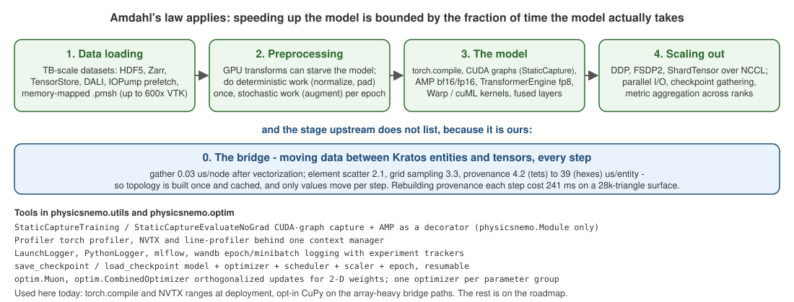

# Training utilities and performance

`physicsnemo.utils` is the part of the library that is not about models at all: capturing a training step into a CUDA graph, mixed precision, profiling, logging, resumable checkpoints. `physicsnemo.optim` adds two optimizers. None of it is required - a plain torch loop works - which is why this application's loop started plain and is only now growing into it.

<p align="center">
    
</p>
<p align="center">Figure 1: Where the time goes. Upstream lists four stages; the bridge between Kratos and tensors is a fifth, and it is ours.</p>

## How upstream thinks about performance

The performance guide opens with Amdahl's law: the gain from speeding up one part is bounded by the fraction of time that part takes. It then names four places time goes, and for scientific ML the surprise is how often the model is not the bottleneck:

1. **Data loading.** Datasets are measured in terabytes; single samples can be gigabytes. HDF5, Zarr and TensorStore readers, DALI, memory-mapped `.pmsh` meshes (upstream measured 20 to 135x faster loads than VTU and 2 to 7x smaller files), and the `IOPump` prefetcher exist for this stage.
2. **Preprocessing.** GPU-side transforms can starve the model. Deterministic work (normalization, padding) belongs in a one-off pass or in the exporter; stochastic work (augmentation) per epoch.
3. **The model.** `torch.compile`, CUDA graphs, mixed precision, TransformerEngine's fp8 attention (`use_te`), and specialized kernels in Warp and cuML.
4. **Scaling out.** Data or domain parallelism over NCCL, plus the unglamorous parts: parallel I/O, gathering checkpoints, aggregating metrics across ranks.

And a fifth stage that is specific to a solver coupling: **moving data between Kratos entities and tensors every step**. After the vectorization rounds recorded on the [Performance](../General/Performance.html) page, the nodal gather costs 0.03 microseconds per node, but provenance construction costs 4 microseconds per tetrahedron and about 39 per hexahedron - so topology is computed once and cached, and only values move per step.

## The tools

| Tool | What it does | Notes |
|---|---|---|
| `StaticCaptureTraining`, `StaticCaptureEvaluateNoGrad` | decorators that capture a training (or evaluation) function into a CUDA graph after a warm-up, with AMP (`amp_type` float16 or bfloat16) and optional `torch.compile` | require a `physicsnemo.Module`; the model's `ModelMetaData` declares whether it supports CUDA graphs and AMP |
| `Profiler` | one context manager configuring the torch profiler, NVTX ranges and line profiling together | pairs with Nsight Systems; the NVTX ranges this application emits at deployment show up in the same timeline |
| `LaunchLogger`, `PythonLogger`, `RankZeroLoggingWrapper` | epoch and mini-batch logging with mlflow and Weights and Biases back-ends, rank-0 only under distribution | the logging stack the upstream examples use |
| `save_checkpoint`, `load_checkpoint`, `get_checkpoint_dir` | a *training* checkpoint: models, optimizer, scheduler, grad scaler, epoch and metadata, local or remote (fsspec) | this is resumable training; the `.mdlus` written by `Module.save` is the *deployable* artifact, a different thing |
| `physicsnemo.optim.Muon` | orthogonalized (Newton-Schulz) updates for 2-D weight matrices, batched across same-shape parameters | a subclass of torch's `Muon` |
| `physicsnemo.optim.CombinedOptimizer` | different optimizers on different parameter groups | e.g. Muon on the matrices, Adam on everything else |
| `physicsnemo.utils.capture` | the machinery behind StaticCapture | |

## What this application's loop does today

`training_utils.TrainModel` is a `Parameters`-driven loop over any `torch.nn.Module` or `physicsnemo.Module`:

```json
{
    "epochs"        : 100,   "batch_size" : 32,     "learning_rate" : 1e-3,
    "optimizer"     : "adam", "loss"      : "mse",   "device"        : "auto",
    "shuffle"       : true,  "echo_interval" : 0,   "seed"          : -1,
    "concrete_dropout_reg_weight" : 0.0,
    "target_channels" : [],
    "streaming"     : false,
    "warm_restart"  : {},
    "ood_guard"     : {}
}
```

- `extra_loss_terms=` adds physics terms (a strong-form residual, the exact discrete residual, a Sobolev gradient term); a four-argument term also receives the batch targets.
- `epoch_callbacks=` run in `eval()` under `no_grad` - they can score the model against the real solver residual but cannot train.
- `"target_channels"` keeps the data loss on the columns the model predicts; without it torch *broadcasts* a one-channel prediction against a multi-column target and trains on the mean of value and gradient.
- `"streaming"` trains out of a running solve (epochs pinned to one, no shuffle); `"warm_restart"` applies `shrink_and_perturb_` after the model is on its device and before the optimizer is built; `"ood_guard"` calibrates the guard on the training inputs and saves it as a sidecar.
- `"concrete_dropout_reg_weight"` adds the concrete-dropout regularizer when the model contains those layers.

`training_utils.SaveTrainedModel` writes `.mdlus` or TorchScript plus the model card, gathering FSDP2 shards first; `training_utils.ExportOnnxModel` writes the ONNX file and its card.

What it does **not** yet do is the upstream tooling above: no AMP, no CUDA-graph capture, no resumable optimizer checkpoints, no experiment tracker. That is one roadmap item, kept separate from correctness work on purpose. `torch.compile` and NVTX ranges *are* available, at deployment, through `model_settings` (see [Inference](../Inference/Inference.html)).

## Where the bridge's own time goes

Three rules came out of profiling the per-step processes, and they are worth more than any single kernel:

1. **Topology once, values every step.** The graph, DoMINO and export processes extract connectivity in `ExecuteInitialize` and cache it; only field values are re-gathered per step. Rebuilding the graph every step cost 1073 ms on a 64k-node hexahedral mesh to keep 2.8 ms of node features.
2. **The invalidation guard must match what the cache depends on.** A cache holding a pure cell-to-entity map may key on the entity *count*; one holding simplex coordinates must compare *coordinates*. Copying a guard between caches produced one wrong answer and one needless rebuild.
3. **Single-step tests cannot see per-step waste.** Every one of these was invisible until a process ran for more than one step.

Opt-in CuPy (`utilities.array_backend_utils`) accelerates four measured sites - the particle proximity graph, graph edge features, grid interpolation and the ROM basis projection - with numpy the default everywhere, because most of what looked like array cost turned out to be interpreter cost that `searchsorted` and `bincount` removed with no new dependency.

Next: [Distributed and scale](Distributed_And_Scale.html).
