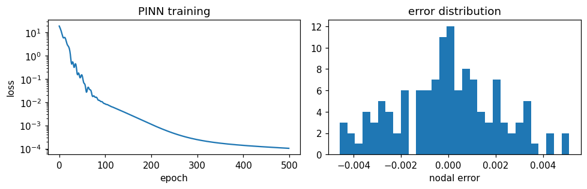

# Differentiable physics: residual losses, PINN solves, exact residuals and adjoints

Three residual notions coexist in this application:

1. **Scored** — `solver_residuals.ResidualEvaluator` assembles the real discrete residual through the solver's own builder machinery, in C++ outside any autodiff graph: it ranks, logs and gates, cheaply.
2. **Analytic strong form** — `physics_informed`: `physicsnemo.sym.eq.phy_informer.PhysicsInformer` evaluates SymPy-defined residuals with gradients, so physics enters the loss (`physicsnemo.sym` ships **bundled** inside `nvidia-physicsnemo` 2.2.x — no extra install).
3. **Exact discrete, with gradients** — `differentiable_residual` wraps the *same assembled residual* as (1) in a `torch.autograd.Function` whose backward is the consistent tangent's transpose, lifting the former "scores, never losses" restriction; `sensitivity_utils` builds exact adjoint design sensitivities on top.

Tensor layout (pinned by tests against the installed 2.2.0): channels-first — fields `(B, C, N)` point clouds or `(B, C, *spatial)` grids, coordinates `(B, 3, N)`; for `"least_squares"` the layout is per-point `(N, C)` with `coordinates (N, 3)`, `nodes` = node **ids** `(N, 1)` and `edges (E, 2)`.

## PDEs

Equations are defined inline (physicsnemo.sym no longer ships pre-built PDE classes). Builtins:

- `"builtin:diffusion"` — `-D lap(u) - source`; `D: null` turns the coefficient into a spatial input named `"D"` (the inverse-problem hook).
- `"builtin:convection_diffusion"` — `c·grad(u) - D lap(u) - source`, the stationary ConvectionDiffusion residual.
- `"builtin:linear_elasticity"` — Navier–Cauchy displacement form `-((λ+μ) grad(div u) + μ lap(u)) - f`, components `u_x/u_y/u_z` (StructuralMechanics small-strain statics; pass `lmbda`/`mu` or `E`/`nu`, which convert).
- `"builtin:incompressible_navier_stokes"` — steady convective-form momentum `ρ (v·∇)v_i − μ lap(v_i) + ∂p/∂x_i − ρ f_i` plus `continuity = div v`, components `velocity_x/_y/_z` and `pressure` (FluidDynamics' incompressible strong form).

Anything else is a dotted `"module.Class"` path to a `physicsnemo.sym.eq.pde.PDE` subclass, constructed with the `pde_arguments` block.

**Vector fields**: physicsnemo.sym resolves informer inputs by the sympy *Function names*, so a width-3 Kratos field is fed as three width-1 components. The `fields` specs handle this via an optional `"components"` list — `{"name": "u", "width": 3}` auto-generates `u_x/u_y/u_z` (widths 2/3; wider needs an explicit list), matching the builtin vector PDEs. Prefer `dim: 3` PDEs with the training terms (the autodiff branch passes 3 coordinate channels; 2D cases are simply z-independent).

## Physics-informed training

`MakePhysicsLossTerm(settings, connectivity_provider=None)` builds an extra loss term for `TrainModel(..., extra_loss_terms=[term])` — `weight * mean(residual²)` per batch, gradient-carrying:

```python
term = physics_informed.MakePhysicsLossTerm(Kratos.Parameters("""{
    "pde"           : "builtin:diffusion",
    "pde_arguments" : { "D" : 1.0 },
    "grad_method"   : "autodiff",
    "weight"        : 0.1
}"""))
training_utils.TrainModel(model, dataset, settings, extra_loss_terms=[term])
```

Per `grad_method`: `"autodiff"` treats the first `coordinate_channels` input channels as the point coordinates (the point-cloud "generic" layout) and **re-runs the model** with them requiring grad — the `(1, 3, N)` coordinates tensor must be the leaf the model input derives from, or the graph breaks at the transpose (handled internally); `"least_squares"` differentiates the prediction itself on a mesh/particle graph (`connectivity_provider() -> (coordinates (N, 3), edge_index (2, E))`, straight from `graph_bridge`/`particle_bridge`) — no re-forward; `"finite_difference"`/`"spectral"` reshape the prediction rows into a grid via `"grid_shape"`.



## `PinnSolveProcess`

A pure-PINN solve on the model part's nodes — no training data: a coordinate MLP (`physicsnemo.models.mlp.fully_connected.FullyConnected`) trains against the autodiff PDE residual (node coordinates plus optional random `collocation_points`) and the **Dirichlet data of the model part** (fixed DOFs keep their solution-step values as boundary targets), then writes the converged field into the output fields at `ExecuteBeforeSolutionLoop`.

`"mode": "inverse"` recovers PDE coefficients from observations instead: coefficients named in `"inverse_parameters"` become trainable scalars fed to the PDE as spatial inputs, the field network trains on the `observation_fields` data loss, and `detach_names` (field values **and** their derivative names, generated automatically) blocks the physics gradients through the field — upstream's documented mechanism, pinned by a test proving the network stays untouched by a physics-only loss. Recovered values land in `process.inverse_values`. `SystemIdentificationApplication`'s adjoint-based identification is the classical baseline.

PINN convergence is stochastic — seed the training block and treat tolerances accordingly (the tests assert a 10× loss drop and loose field errors, the CI-safe pattern).

**Coordinates are normalized for the network, not for the PDE.** `normalize_coordinates` (default `true`) min-max scales the *network's inputs* so the MLP sees values in `[0, 1]`. It deliberately does **not** touch the coordinates the residual is differentiated against — doing so makes autodiff produce `∂u/∂x̂ = L · ∂u/∂x`, so the enforced equation becomes `Σ (1/Lᵢ²) ∂²u/∂xᵢ² = f`: a different PDE, and a per-axis different one on an anisotropic domain. A unit cube hides this completely, since every `Lᵢ` is 1.

Measured on a box stretched 4× in one axis with a harmonic solution and a field scale of 32, normalizing the residual's coordinates gave a maximum interior error of **4.29** against **0.20** when only the network's input is normalized — with a final loss two orders of magnitude higher. The solver converges either way; it simply converges to the wrong equation. `tests/test_pinn_solve_process.py::TestPinnOnANonUnitDomain` is the regression guard, and it was confirmed to fail on the pre-fix code.

## Exact residuals as loss terms (`differentiable_residual`)

The roadmap long marked this "blocked: needs a documented zero-copy A/b accessor" — that gate has moved: the classic `Kratos.CompressedMatrix` exposes the CSR triple (`value_data()/index2_data()/index1_data()`, zero-copy value view) consumed by core `KratosMultiphysics.scipy_conversion_tools.to_csr`, and `ResidualBasedBlockBuilderAndSolver.Build/BuildRHS/ResizeAndInitializeVectors` are pybound (the native `CsrMatrix` with `SpMV/TransposeSpMV` is the forward-looking path). On these, `differentiable_residual` provides:

- `TangentAssembler` — `solver_residuals.ResidualEvaluator` plus consistent-tangent assembly to scipy CSR (`ComputeSystem(apply_dirichlet=False)`), reusing the sparsity graph across calls.
- `DofFieldMap` — the bijection between the app's `(N, total_width)` nodal-field layout and the equation-id-ordered DOF vector (vectorized `GetEquationIds/GetValues/SetValues`, fixed-DOF mask, and a `TorchGatherIndex()` for differentiable gathers). Multi-component DOFs (`DISPLACEMENT_X/Y/Z`) map to columns automatically.
- `KratosResidualFunction.Apply(u_dofs, assembler, dof_map)` — `forward` writes the state and `BuildRHS`s the residual; `backward` assembles the consistent tangent `K` at that state and returns `-(masked K)ᵀ g` — a **transpose matvec, no linear solve**. Signs and masking (`BuildRHS` zeroes fixed rows; `∂b/∂u = −K` on free rows) are pinned by `torch.autograd.gradcheck` in float64 on real ConvectionDiffusion and StructuralMechanics cases — exact for linear problems, the consistent tangent for nonlinear ones. Statics only; both directions write the solution-step database (documented side effect).
- `MakeExactResidualLossTerm(settings, model_part, full_inputs_provider)` — a `TrainModel(..., extra_loss_terms=[...])` factory: `weight * mean(b(u_pred)²)` whose gradient flows **through the real FEM assembly**. It re-runs the model on the full case inputs each batch (`TrainModel` batches over nodes) and, with `use_stored_fixed_values` (default), evaluates with the stored Dirichlet values on fixed DOFs so gradients flow through free DOFs only.

The plain `ResidualEvaluator` remains the cheap non-differentiable score for callbacks and query strategies.

## Design sensitivities (`sensitivity_utils`)

- **Surrogate path** (cheap): `ComputeSurrogateSensitivities(model, features, coordinates, objective, model_interface, wrt=("coordinates",))` — plain autograd through any point-cloud interface's forward (`RunPointCloudForward(..., enable_grad=True)`); dJ/d(coordinates) are shape sensitivities, dJ/d(features) parameter sensitivities, at the surrogate's accuracy.
- **Exact adjoint path**: with `b(u, θ) = 0` and `∂b/∂u = −K`, `dJ/dθ = ∂J/∂θ + λᵀ ∂b/∂θ` where `Kᵀλ = ∂J/∂u`. `SolveAdjoint` factorizes the Dirichlet-applied tangent's transpose (scipy `splu`); `ComputeParameterSensitivities` then evaluates `∂b/∂θ` by central finite differences over `BuildRHS` re-assemblies at fixed state — one adjoint solve covers every parameter. Validated against full finite differences through **real Kratos solves** to ~6 significant digits (note: continuous analytics like `dJ/dk = −J/k` hold only approximately for stabilized elements — the discrete adjoint is consistent with the discrete solve, which is the quantity an optimizer needs). `OptimizationApplication`/`ShapeOptimizationApplication` adjoints are the classical baselines.
- **Exact shape gradients at every node** (`ComputeShapeSensitivityField`): the per-parameter path above re-assembles the *whole* residual twice for each design variable, so a design surface of N nodes costs 6N global assemblies. But moving node *k* perturbs only the entities adjacent to *k*, so `∂b/∂X` is sparse: perturbing each entity's own nodes and re-evaluating only *that entity's* local right-hand side gives `dJ/dX` at every node for a cost linear in the mesh. Returns `(n_nodes, 3)` in `model_part.Nodes` order — the same order every other gather in this application uses — and optionally writes it into a nodal variable (`Kratos.SHAPE_SENSITIVITY` being the natural target). `design_node_ids` restricts the pass to a design surface.
- **Onto the design parameters** (`ComputeControlSensitivities`): pushes that nodal field back through the shipped differentiable deformers as a vector–Jacobian product, giving `dJ/d(control)` for the `ffd`/`rbf`/`morph`/`displace` parameterizations. This is the FEM-exact counterpart of `ComputeShapeSensitivities`, which differentiates a *surrogate's* forward pass — the two sit either side of the surrogate/exact split and share the deformation layer.

**Four things the element-local pass encodes, each measured rather than assumed.**

- **Perturb `X0` *and* `X`.** A small-displacement element's residual responds only to the reference position (perturbing `X` alone leaves it bit-identical); a surface or line load's responds only to the current position, through the Jacobian determinant in its integration weight. Kratos's own `FiniteDifferenceUtility` moves both for the same reason.
- **A naive scatter reproduces `BuildRHS` bit-exactly** once fixed rows are zeroed — and that zeroing is free here, because `λ` is already identically zero on fixed rows. Inactive entities are skipped, as `BuildRHSNoDirichlet` does.
- **Restore by writing the saved coordinate back, never by a reverse increment.** `x + h − 2h + h` does not round to `x`; an arithmetic restore left the mesh measurably drifted after a full sweep. A test pins the mesh as bit-identical afterwards.
- **Point loads are shape-blind.** Their right-hand side is the nodal `POINT_LOAD` and never reads the geometry, so a two-assembly probe per entity skips the twenty-four a node sweep would otherwise cost.

**One deliberate difference from Kratos.** `AdjointFiniteDifferencingBaseElement::CalculateSensitivityMatrix` takes a *forward* difference; this takes a central one — twice the local assemblies for about four orders of magnitude more accuracy, and still far cheaper than the global path. Measured against the per-coordinate path the field agrees to ~5e-10 on every coordinate, supports and loaded nodes included; against Kratos's own `SHAPE_SENSITIVITY` field it agrees to the forward difference's own truncation error.

**Where it pays off.** The local pass is a Python loop and is not free: below a few hundred elements it can lose outright. Past that it wins, and the margin grows with the mesh — measured ~15x at 3200 2-D triangles and ~100x at 24k 3-D tetrahedra, independent of how many design parameters are involved. Notebook 17 walks the whole chain, ending in a gradient descent that lands on its target.

## Transient exact residuals

The exact-residual wrapper covers one step of a transient problem at fixed step history, in both flavours Kratos uses:

- **Element-integrated time stepping** (ConvectionDiffusion's transient solver): nothing changes. That solver installs the *static* scheme as a deliberate "fake" scheme because its elements integrate in time themselves, reading `DELTA_TIME`/`THETA` from `ProcessInfo` and the previous state from the solution-step buffer — so `TangentAssembler(model_part)` assembles the dynamic residual and its consistent tangent unchanged.
- **Displacement schemes** (Bossak/Newmark/BDF, i.e. structural dynamics): construct with `TangentAssembler(model_part, scheme=Kratos.ResidualBasedBossakDisplacementScheme(-0.3))` and call `assembler.InitializeSolutionStep()` **once per time step**. That call is not optional bookkeeping: the schemes compute their integration coefficients (`c0 = 1/(β Δt²)`, `c1 = γ/(β Δt)`, …) there, so assembling without it uses stale ones. The assembler then refreshes the scheme's derived `VELOCITY`/`ACCELERATION` from the written DOFs before every assembly (`scheme.Update` with a zero increment) — otherwise a freshly written `u` would be mixed with the previous step's derivatives.

The builder assembles `K_eff = K + M(1−α)c₀ + D c₁` and `BuildRHS` the dynamic residual, so the sign convention is unchanged: `∂b/∂u = −(masked K_eff)` at fixed history, because velocity and acceleration are affine in the current displacement. Both statements are pinned by tests on real transient solves (`tests/test_differentiable_residual.py`), including a gradcheck through Bossak's effective tangent.

`solver_residuals.BuildResidualEvaluator(model_part, scheme=...)` takes the same optional scheme for non-differentiable scoring.

## Cross-validation against Kratos's own adjoint

`StructuralMechanicsApplication` ships an entirely separate adjoint stack — `AdjointFiniteDifferencing*` elements, the `AdjointSemiAnalytic*` conditions, adjoint response functions, `ResidualBasedAdjointStaticScheme` and core's `SensitivityBuilder` — which produces `SHAPE_SENSITIVITY` for a traced objective. `tests/test_adjoint_cross_validation.py` runs both stacks on the same cantilever and compares them against full finite differences through real solves.

All three agree to eight significant digits. That is a much stronger statement than either against finite differences alone: a shared sign or scaling error can survive an FD check of one implementation, but not agreement between two independent ones.

Two things this pinned that are easy to get wrong:

- **The adjoint needs the *constrained* operator at a converged state.** `analysis.Finalize()` runs the boundary-condition process's `ExecuteFinalizeSolutionStep`, which *releases* the DOFs it fixed. Assembling after that yields an unconstrained, singular tangent (here `cond(K) ≈ 1.8e18`, six near-zero singular values) and a residual of load magnitude rather than ~0 — and the resulting "sensitivities" are wrong by six orders of magnitude while still looking like numbers. Re-fix the supports, or assemble before finalizing.
- **Only the reference configuration matters** for a small-displacement element: perturbing `X` alone leaves the residual exactly unchanged, while perturbing `X0` gives a derivative stable across four decades of step size.

The shipped adjoint is in fact *more* accurate than Kratos's `semi_analytic` gradient here, which carries its own `step_size` error — so the test gives Kratos the looser of the two tolerances.
