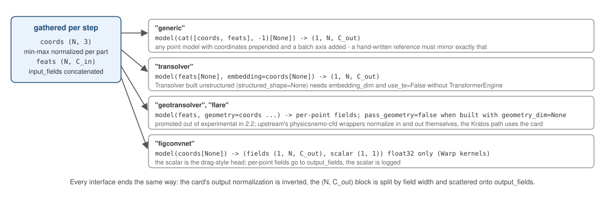
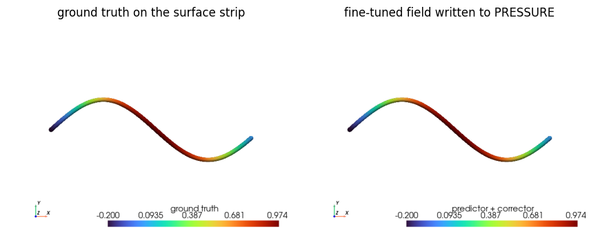

# Point-cloud models on the mesh nodes

Point-cloud transformers consume per-point features plus coordinates as `(1, N, C)` batches — no tessellation, graph or grid required. `PointCloudInferenceProcess` extends `InferenceProcess` (same settings, plus two of its own): it gathers the nodal input fields and the node coordinates, runs one forward pass, and writes the `(1, N, C_out)` prediction back through the usual field-splitting contract.

```json
{
    "python_module" : "point_cloud_inference_process",
    "kratos_module" : "KratosMultiphysics.PhysicsNeMoApplication.processes.inference",
    "Parameters"    : {
        "model_part_name" : "FluidModelPart",
        "model_interface" : "transolver",
        "model_settings"  : { "checkpoint_file" : "transolver.mdlus", "checkpoint_type" : "physicsnemo" },
        "input_fields"    : [ { "variable_name" : "VELOCITY", "data_location" : "node_historical" } ],
        "output_fields"   : [ { "variable_name" : "PRESSURE", "data_location" : "node_non_historical" } ]
    }
}
```

<p align="center">
    
</p>
<p align="center">Figure 1: The interfaces. They differ only in how the tensors are handed to the model; the write-back is the same for all.</p>

## Model interfaces

| `model_interface` | Call | For |
|---|---|---|
| `"generic"` (default) | `model(x)` with `x = (1, N, 3 + C_in)`, coordinates prepended to the features | MLPs, scripted custom trunks |
| `"transolver"` | `model(fx, embedding)` with `fx = (1, N, C_in)`, `embedding = (1, N, 3)` | `physicsnemo.models.transolver.Transolver` (construct with `embedding_dim=3`; `use_te=False` without TransformerEngine) |
| `"flare"` | `model(fx, embedding)` — same call contract as `"transolver"` | `physicsnemo.experimental.models.flare.FLARE` (experimental namespace: no API-stability guarantee) |
| `"geotransolver"` | `model(local_embedding, local_positions=..., geometry=...)` with `local_embedding = (1, N, C_in)` and both position arguments `(1, N, 3)`; set `"pass_geometry": false` to forward `geometry=None` for models built with `geometry_dim=None` | `physicsnemo.experimental.models.geotransolver.GeoTransolver` (construct with `geometry_dim=3` when passing geometry; `use_te=False` without TransformerEngine; experimental namespace) |
| `"figconvnet"` | `model(vertices, features)` with `vertices = (1, N, 3)`, `features = (1, N, C_in)`; returns a **tuple** (point features, drag-style scalar) — the scalar is stashed as `process.last_scalar_prediction` and logged | `physicsnemo.models.figconvnet.FIGConvUNet` (construct with `has_input_features=True` and `in_channels` = total gathered width; warp backend is float32-only; default aabb (0,0,0)–(1,1,1) matches `normalize_coordinates`) |

| `"deeponet"` | `model(x_branch, x_trunk)` with `x_branch = (1, D)` case parameters and `x_trunk = (N, d)` query coordinates | `physicsnemo.experimental.models.xdeeponet.DeepONet` in core mode (`auto_pad=False`) with an MLP branch |
| `"globe"` | `model(prediction_points, boundary_meshes, reference_lengths)` with `boundary_meshes` a dict of named surfaces | `physicsnemo.experimental.models.globe.GLOBE` |

`"normalize_coordinates"` (default `true`) min–max normalizes the coordinates to `[0, 1]` per axis (degenerate axes left at 0) — matching how such models are usually trained.

**Two of these are not pointwise.** Every other interface maps a node's own features to that node's output. `"deeponet"` and `"globe"` are OPERATORS: they map something about the whole case to a field, and the per-node input fields play no part.

## Token budgets

A transformer's cost grows with the number of tokens, and a refined Kratos mesh routinely has more nodes than the model was trained to attend over. The DoMINO datapipe subsamples; this process used to feed every node. A `"subsampling"` block gives it a budget:

```json
"subsampling" : {
    "method"           : "farthest_point",
    "num_points"       : 20000,
    "bounding_box_min" : [],
    "bounding_box_max" : [],
    "seed"             : 0
}
```

The bounding box is a filter and is applied first, in the model part's **own** coordinates (not the normalized ones); `method` then reduces whatever survived to `num_points`. Prefer `"farthest_point"` (`physicsnemo.nn.functional.farthest_point_sampling`) over `"uniform"`: a uniform draw of a mesh refined in one corner spends its whole budget there, while farthest-point sampling spreads over the geometry. The tests measure exactly that, as the minimum pairwise distance of the chosen points.

Every node still gets a value: an unselected node takes its nearest selected node's prediction, so the field a solver reads afterwards is complete and a downstream process cannot tell a budget was used. Uncertainty fields are expanded the same way.

## Operators: parameters in, a field out

`"deeponet"` learns a map from a **case** to a field evaluated at arbitrary points — what `RomSurrogateProcess` does through a POD basis, without the basis. The branch takes the case parameters and the trunk the query coordinates, so a `"branch_input"` block names where the parameters live rather than listing per-node fields:

```json
"model_interface" : "deeponet",
"trunk_dimension" : 0,
"branch_input"    : {
    "process_info_variables" : [ "TIME" ],
    "properties_variables"   : [ "CONDUCTIVITY" ],
    "constants"              : [ 1.5 ]
}
```

Values are concatenated in that order. `"trunk_dimension"` cuts the coordinates to the trunk's own width; `0` follows `DOMAIN_SIZE`. Build the branch as `(D_in) -> (width)` and the trunk as `(d) -> (width)` with the same `width`.

**Checkpointing it needs tracing.** An xDeepONet cannot be saved as `.mdlus` — `physicsnemo.Module.save` refuses plain torch submodules, and wrapping them with `Module.from_torch` instead makes the constructor metadata unserializable — and it cannot be scripted, because its forward takes `*args`. `torch.jit.trace` works, and the trace stays valid at any number of query points, which is what a changing mesh needs:

```python
traced = torch.jit.trace(model.eval(), (branch_example, trunk_example))
torch.jit.save(traced, "operator.pt")   # "checkpoint_type" : "torchscript"
```

## GLOBE: the boundaries drive the interior

`"globe"` is the other non-pointwise interface, and a different idea again: an elliptic problem is determined by its boundary conditions, and GLOBE predicts fields at arbitrary points from boundary data through Green's-function-like kernels on a dual-tree cluster hierarchy. The `"globe"` block names the sub-model-parts that carry that data:

```json
"model_interface" : "globe",
"globe" : {
    "boundary_sub_model_parts" : [ "Inlet", "Wall" ],
    "boundary_fields"          : [ { "variable_name" : "TEMPERATURE", "data_location" : "node_historical", "rank" : 0 } ],
    "reference_lengths"        : { "L" : 1.0 },
    "output_names"             : [ "u" ],
    "source_container"         : "Elements"
}
```

`bridges/globe_bridge.py` does the translation: `BuildGlobeBoundaryMeshes` turns the named sub-model-parts into the `{name: Mesh}` dict the forward takes, and `RunGlobeForward` flattens the returned mesh's `point_data` back into the `(N, C_out)` layout every writer here uses. Training goes through `training/globe_training.TrainGlobe`, which exists because `TrainModel`'s DataLoader batches tensors and a collate function cannot stack meshes.

Three things to know. GLOBE runs on **CPU** — its cluster tree, forward and backward all do, with `tree_build_device="cpu"`; this is not a GPU-only capability. A rank-0 boundary field must be shaped `(n_cells,)` and **not** `(n_cells, 1)`, which upstream rejects. And a boundary sub-model-part needs conditions (or elements): one carrying only nodes has no geometry to tessellate, and the bridge says so instead of producing an empty mesh.

## GeoTransolver via physicsnemo-cfd's evaluation wrappers

Beyond in-loop deployment, the optional `nvidia-physicsnemo-cfd` package ships checkpoint/NGC-config driven **evaluation wrappers** for GeoTransolver (`physicsnemo.cfd.evaluation.models.wrappers.geotransolver`, `..._gp`, `..._drivaerstar`) used in NVIDIA's external-aero benchmarking recipes. `cfd_bridge._TryImportCfdEvaluationWrappers(name)` resolves them, and Kratos data reaches them as pyvista objects through `cfd_bridge.ModelPartToPolyData` / `NodesToPolyData`. The wrappers are driven by their own configs and pretrained checkpoints (external), and `physicsnemo-cfd` is alpha — for surrogates trained on Kratos data, prefer the `"geotransolver"` interface above.


### Deploying a *pretrained* point-cloud checkpoint

`physicsnemo-cfd`'s evaluation wrappers for Transolver, FLARE and GeoTransolver normalize their inputs **and** call `unscale_model_targets` on the way out. `PointCloudInferenceProcess` does neither on its own, so a pretrained checkpoint dropped into the in-loop path is mismatched at both ends and still returns finite, plausible-looking numbers.

- **Outputs**: express the checkpoint's target scaling in the model card's `"output_normalization"` key — see [Inference](../Inference/Inference.html). The process then de-normalizes before writing.
- **Inputs, fields**: express the checkpoint's feature scaling in the card's `"input_normalization"` key; the process standardizes the gathered fields before the forward pass.
- **Inputs, coordinates**: check the convention. `GatherPointCloudCoordinates` min-max normalizes per model part into `[0, 1]`, while those upstream datapipes centre on the STL centre of mass and divide by a fixed reference scale. `normalize_coordinates: false` plus a pre-scaled feed is the way to match a checkpoint that expects the latter — the card key scales fields, never coordinates.

## DoMINO / FIGConvNet

Both heavy aerodynamic families are now covered: **FIGConvNet deploys in-loop** through the `"figconvnet"` interface above (per-point fields plus the drag-style scalar head), and DoMINO's (and Transolver's) config-driven datapipes are a supported training path — `CaeDatasetExportProcess` writes per-case `.npz` files in the exact layout `physicsnemo.datapipes.cae` consumes, with `CreateDoMINODataPipe` / `CreateTransolverDataPipe` factories; see the [CAE Datapipes](../CAE_Datapipes/CAE_Datapipes.html) page.

### Fine-tuning a pretrained DoMINO

`domino_finetune` ships two recipes for adapting a frozen pretrained checkpoint rather than training one from scratch. Both start from a checkpoint that emits **dimensionless** fields, so both inherit the de-normalization requirement described above — a fine-tuned model still lives in the pretrained model's normalized output space.

**Predictor-corrector** is NVIDIA's own recipe, `Y_finetuned = Y_predictor + Y_corrector`: the pretrained checkpoint is the frozen predictor and a trainable network learns its error. It is worth being precise about what this is upstream and what it is here. Upstream's corrector is *a second full DoMINO* (~10 M parameters) trained on `ground_truth - base_prediction`; its lightness is in how fast it converges, not in its size, and at full mesh resolution it needs far more memory than a single consumer GPU has. What ships here is the same decomposition with a small residual head.

```python
from KratosMultiphysics.PhysicsNeMoApplication.training import domino_finetune
cached = domino_finetune.CacheBasePredictions(predictor, batches, device)
corrector = domino_finetune.CreateCorrector(n_features, n_outputs)
history = domino_finetune.TrainCorrector(corrector, features, residuals)
combined = domino_finetune.ApplyCorrector(corrector, base_prediction, features)
```

Two properties are deliberate. `CacheBasePredictions` runs the predictor **once per case**, exactly as upstream does in its first two stages, so the predictor never runs inside the training loop and the corrector's cost is independent of the predictor's size. And `CreateCorrector` zero-initializes its last layer, so an *untrained* corrector is exactly the identity on the predictor — fine-tuning starts from the pretrained model's own answer and can only improve on it.

Form residuals in one space consistently. `CacheBasePredictions` returns raw normalized output for that reason: build `ground_truth - base_prediction` against normalized targets, not against physical Kratos values.

**LoRA** puts low-rank adapters on the pretrained weights themselves, via `physicsnemo.experimental.peft`. Roughly 1–2 % of the parameters become trainable, and `MergeAndSave` folds the adapters back into an ordinary `.mdlus`:

```python
model, wrapped, trainable = domino_finetune.ApplyLora(model, rank=4)
domino_finetune.MergeAndSave(model, "finetuned.mdlus")
```

The merged file is a plain checkpoint — `model_registry` loads it and `DominoInferenceProcess` deploys it with no change to the **model** settings, though `scaling_factors_file`/`normalization`/`redimensionalize` remain as required as they were for the checkpoint it was adapted from. This is usually the better of the two options; the predictor-corrector path exists because it is the recipe the literature and NVIDIA's documentation describe.

Accuracy claims for either recipe belong to NVIDIA, who describe their own fine-tuning results as preliminary and report them on 18 training samples. Nothing here reproduces or endorses a number.

A worked example is in [`examples/notebooks/18_domino_finetuning.ipynb`](https://github.com/KratosMultiphysics/Kratos/blob/master/applications/PhysicsNeMoApplication/examples/notebooks/18_domino_finetuning.ipynb).

<p align="center">
    
</p>
<p align="center">Figure 2: Notebook 18 - the stand-in surface strip with the ground truth and the fine-tuned field written back onto PRESSURE.</p>
