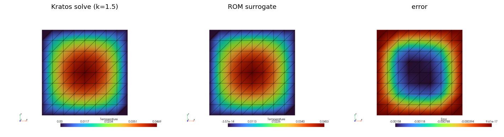

# Neural-augmented reduced bases (RomApplication interop)

RomApplication's `CalculateRomBasisOutputProcess` computes a POD basis from solve snapshots; this application consumes its **numpy output format** and puts torch/physicsnemo models on top: a surrogate maps case parameters to the reduced coordinates `q`, and the full-order field is reconstructed as `u = Φ q` — a full-field prediction at the cost of an `n_modes`-sized network. Only the *file format* is consumed: `rom_bridge` needs numpy and the core, never the compiled RomApplication (which is only required to produce a basis).

## The basis format and its row-order contract

Numpy format = `RightBasisMatrix.npy` (Φ, `(n_nodes·n_unknowns, n_modes)`) + `NodeIds.npy` + optional `SingularValuesVector.npy` + `RomParameters.json` (`rom_settings.nodal_unknowns` — **already alphabetically sorted** by the producer — and `number_of_rom_dofs`).

> Row `r` of Φ ↔ node `r // n_unknowns` in `NodeIds.npy` order, unknown `r % n_unknowns` in the stored `nodal_unknowns` order (node-major, unknown-minor).

`rom_bridge` mirrors the producer's own `VariableUtils.Get/SetSolutionStepValuesVector` calls, so orderings match by construction — scalars (`TEMPERATURE`) and components (`DISPLACEMENT_X`) alike:

```python
from KratosMultiphysics.PhysicsNeMoApplication import rom_bridge

basis = rom_bridge.LoadRomBasis("rom_data")            # RomBasis dataclass
u = rom_bridge.GatherUnknownsVector(model_part, basis) # (n_dofs,) in basis row order
q = rom_bridge.ProjectToReducedSpace(basis, u)         # Φᵀ u  (accepts (n_dofs, T) series too)
u = rom_bridge.ReconstructFromReducedSpace(basis, q)   # Φ q
rom_bridge.ScatterUnknownsVector(model_part, basis, u) # write back onto the nodes
```

The json-format variant (`nodal_modes` inside the json) is not consumed — regenerate with `"rom_basis_output_format": "numpy"`.

## In-loop deployment: RomSurrogateProcess

```json
{
    "python_module" : "rom_surrogate_process",
    "kratos_module" : "KratosMultiphysics.PhysicsNeMoApplication",
    "Parameters"    : {
        "model_part_name"  : "ThermalModelPart",
        "rom_basis_folder" : "rom_data",
        "model_settings"   : { "checkpoint_file" : "k_to_q.pt" },
        "input_fields"     : [ { "variable_name" : "PROJECTED_SCALAR1", "data_location" : "node_historical" } ]
    }
}
```

The parameters travel as ordinary input fields (any constant nodal carrier), MEAN-reduced to one `(1, C_in)` vector; the model returns `(1, n_modes)`. `output_fields` is **derived from the basis's `nodal_unknowns`** (setting it is rejected), so the advisory/strict model-card check validates the ROM contract automatically. Training the parameter → q map is plain `TrainModel` on `(parameters, ProjectToReducedSpace(basis, snapshots).T)` pairs.

`RomSurrogateProcess` reconstructs the full-order field in place, so the real solve must be captured into a separate field before deployment overwrites it — rendered here with the core `KratosMultiphysics.pyvista_utilities` bridge:



## Temporal attention in ROM space

`rom_temporal` pairs the POD reduction with physicsnemo's decoder-only temporal transformer (`Sequence_Model` from `physicsnemo.models.mesh_reduced`): the basis is the encoder, attention learns the dynamics of `q(t)`:

```python
from KratosMultiphysics.PhysicsNeMoApplication import rom_temporal

model = rom_temporal.CreateSequenceModel(Kratos.Parameters("""{ "input_dim": 8 }"""))  # n_modes
dataset = rom_temporal.CreateRomTrajectoryDataset(q_trajectories, contexts)   # (S, T, M) [+ (S, C)]
rom_temporal.TrainRomTemporalModel(model, dataset, Kratos.Parameters("""{ "epochs": 500 }"""))
trajectory = rom_temporal.PredictRomTrajectory(model, q0, steps=50)           # autoregressive
fields = rom_bridge.ReconstructFromReducedSpace(basis, trajectory.T)          # (n_dofs, T)
```

Notes:

- **A context token is always fed** (zeros when there are no case parameters): without one the model's output slice silently drops the first-step prediction. Training is teacher-forced (`mse(model(z[:, :-1], ctx), z[:, 1:])`); rollout uses the model's own `sample`.
- `Sequence_Model` is a plain torch module — neither TorchScript-scriptable nor a physicsnemo `Module` — so the generic checkpoint paths do not apply: use `SaveRomTemporalModel` / `LoadRomTemporalModel` (state_dict + settings).
- When physicsnemo's `DistributedManager` is initialized (see the Distributed page), `CreateSequenceModel` uses it as the model's device handle; otherwise a minimal device-only shim is used.
