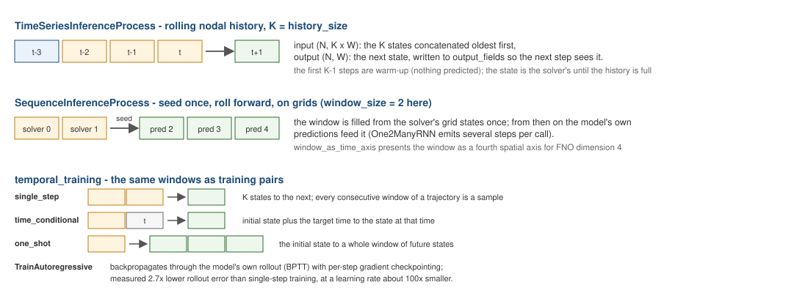

# RNN surrogates over grid time series

physicsnemo's RNN pattern (`One2ManyRNN` / `Seq2SeqRNN`, the 2D Navier–Stokes and Gray–Scott examples) predicts a whole trajectory from one state: `(N, C, 1, *spatial) → (N, C, T, *spatial)`. This application closes the loop around it with a grid-series exporter, a sequence dataset, and a deployment process.

<p align="center">
    
</p>
<p align="center">Figure 1: Every time-dependent process and training scheme shares one convention: windows are oldest first, and the model's own output feeds the next window.</p>

## Exporting a grid series

`GridDatasetExportProcess` is the grid counterpart of `DatasetExportProcess`: per interval it samples the configured nodal fields onto a regular `(C, D, H, W)` grid (`grid_bridge`) and writes `<output_path>/<file_prefix>_<step>.npz` with keys `grid` (float32), `TIME`, `STEP` and `bounding_box`. The bounding box is resolved once and frozen, so every grid of a series lives on the same lattice:

```json
{
    "python_module" : "grid_dataset_export_process",
    "kratos_module" : "KratosMultiphysics.PhysicsNeMoApplication.processes.export",
    "Parameters"    : {
        "model_part_name" : "FluidModelPart",
        "list_of_fields"  : [ { "variable_name" : "VELOCITY", "data_location" : "node_historical" } ],
        "grid_shape"      : [32, 32, 2],
        "output_interval" : 5
    }
}
```

## Training

`CreateGridSequenceDataset(directory, nr_tsteps, squeeze_axis=None)` pairs the state at step *i* with the `nr_tsteps` following states — items are `(x0 (C, 1, *spatial), y (C, T, *spatial))`, exactly the RNN contract, so `TrainModel` works unchanged:

```python
from physicsnemo.models.rnn.rnn_one2many import One2ManyRNN
from KratosMultiphysics.PhysicsNeMoApplication.training.torch_dataset import CreateGridSequenceDataset
from KratosMultiphysics.PhysicsNeMoApplication.training import training_utils
dataset = CreateGridSequenceDataset("grid_series", nr_tsteps=8, squeeze_axis=2)
model = One2ManyRNN(input_channels=2, dimension=2, nr_tsteps=8)
training_utils.TrainModel(model, dataset, Kratos.Parameters("""{ "epochs": 200 }"""))
training_utils.SaveTrainedModel(model, "rnn_surrogate.mdlus")
```

## Deployment

`SequenceInferenceProcess` seeds the model **once** — at its first due execution it samples the current state and runs one forward pass — then each subsequent due execution pops the next predicted state from the buffer and scatters it onto the output fields. When the `T` predicted steps are exhausted it warns once and goes quiet.

**Model cards.** A card's `"output_normalization"` is applied to every buffered state on its way out — the whole rollout, not only the seeding step — per channel along axis 0 (see the [Inference](../Inference/Inference.html) page).

## The thin-axis idiom for planar cases

`grid_bridge` grids are 3D; planar 2D cases use a thin axis of size 2 with a bounding box slightly padded across the mesh plane (e.g. `grid_shape [32, 32, 2]`, box `z ∈ [-0.05, 0.05]`). `squeeze_axis` (dataset and process) collapses that axis by its mean before the forward pass — matching `dimension=2` models — and duplicates predictions across it on the way back.

## Spatiotemporal block operators (FNO dimension=4)

`"window_as_time_axis": true` targets operators that treat time as a fourth grid axis — `FNO(dimension=4)` and seq2seq RNNs: the process accumulates the sampled grid at each due step into a rolling window of `"window_size"` states (warm-up steps are logged, nothing written) and, once full, feeds the model the whole `(1, C, K, *spatial)` block; the returned `(C, T, *spatial)` block is buffered and written one state per subsequent step, as usual. `FNO(dimension=4)` preserves the block shape (`T == K`) — the standard FNO time-block surrogate predicting the next K states; use per-axis modes (e.g. `num_fno_modes=[1, 2, 2, 2]`) so the temporal modes fit the window.
