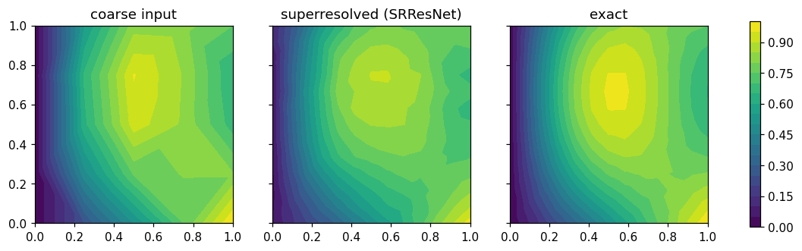

# Superresolution: coarse solves, fine fields

Superresolution enhances a low-resolution solution to high fidelity — the pattern of PhysicsNeMo's turbulent super-resolution example, whose model (`physicsnemo.models.srrn.SRResNet`) ships with core physicsnemo: a 3D convolutional network mapping a `(B, C, D, H, W)` voxel grid to `(B, C', s·D, s·H, s·W)` with `scaling_factor` `s ∈ {2, 4, 8}`.

Kratos fields live on unstructured meshes, so the application provides a **grid bridge** plus a deployment process.

## The grid bridge (`grid_bridge.py`)

- `SampleFieldsOnGrid(model_part, field_specs, grid_shape, bounding_box=None, fill_value=0.0)` samples nodal fields onto a regular lattice using Kratos's `BinBasedFastPointLocator3D` — FE shape-function interpolation, vectorized for tetrahedral meshes (per-point fallback for general geometries). Exact wherever the elements interpolate the field exactly (e.g. linear fields on simplex meshes); points outside the mesh receive `fill_value`.
- `InterpolateGridAtPoints` / `ScatterGridToNodes` evaluate a `(C, D, H, W)` grid trilinearly at arbitrary points / at a model part's nodes (exact for linear fields) and write the result back through the tensor adaptors.

Channel convention: fields are flattened per node and concatenated — the same layout `InferenceProcess` uses.

## SuperResolutionProcess

```json
{
    "python_module" : "superresolution_process",
    "kratos_module" : "KratosMultiphysics.PhysicsNeMoApplication.processes.inference",
    "Parameters"    : {
        "coarse_model_part_name" : "CoarseFluid",
        "fine_model_part_name"   : "FineFluid",
        "model_settings"         : {
            "checkpoint_file" : "srresnet.mdlus",
            "checkpoint_type" : "physicsnemo",
            "device"          : "auto"
        },
        "input_fields"           : [ { "variable_name" : "VELOCITY", "data_location" : "node_historical" } ],
        "output_fields"          : [ { "variable_name" : "VELOCITY", "data_location" : "node_historical" } ],
        "coarse_grid_shape"      : [16, 16, 16],
        "output_interval"        : 1
    }
}
```

Per execution: coarse fields → coarse grid → model → fine grid → fine-mesh nodes. The bounding box defaults to the **fine** model part's node extents so both grids span the same domain; input batches are cast to the model's parameter dtype automatically. Any model mapping `(B, C, D, H, W)` to a larger grid works — an untrained-from-checkpoint `SRResNet`, a trained one, or even a plain `torch.nn.Upsample` saved as TorchScript.



**Model cards.** A card's `"output_normalization"` (see the [Inference](../Inference/Inference.html) page) is applied to the predicted grid before it is scattered, per channel along axis 0 — the grid layout puts channels first, where the row-ordered writers put them last. `GridInferenceProcess` inherits the same path.

## Accuracy notes

- Mesh→grid sampling and grid→mesh scatter are both **exact for linear fields**; the test suite asserts a full coarse-mesh → grid → trilinear-upsample → fine-mesh chain reproduces a linear field to ~1e-8.
- The learned quality on real data is entirely the model's; use `ValidationMetricsProcess` (see [Inference](../Inference/Inference.html)) against a reference fine solve to quantify it.

## 2D operators and the grid-operator zoo

Planar cases use the thin-axis idiom: `"squeeze_axis"` collapses the thin spatial axis by its mean before the forward pass — the model then sees `(B, C, A, B')` 2D grids, the layout of physicsnemo's 2D operators — and the prediction is duplicated across the thin axis on the way back (grids need ≥ 2 points per axis, so a planar domain exports as e.g. `[H, W, 2]` + `"squeeze_axis": 2`). Verified through `GridInferenceProcess`: `FNO(dimension=2)`, `AFNO` (make `inp_shape` match the squeezed grid), and any user-supplied 2D UNet (physicsnemo's own `UNet` is 3D-only — `MaxPool3d` — and takes the `(C, D, H, W)` path); `DLWP` is mechanically a grid-to-grid model too, and is test-pinned on the 3D path with a `[6, H, H]` grid — its five-dimensional `(B, C, faces, H, W)` cubed-sphere layout maps onto `(C, D, H, W)` with `D` as the six-face axis (it insists on `H == W`), while its physics semantics (cubed-sphere padding) remain weather-specific.

Time-modulated operators deploy through `"model_interface": "modafno"`, which passes the model part's `TIME` as the second (timestep) input — matching `ModAFNO.forward(x, mod)`, whose embedded `ModEmbedNet` consumes raw timesteps in `[0, max_time]`.

**Nested / multi-resolution FNO** is a composition pattern, not a model class: deploy the outer coarse model with one `GridInferenceProcess` and the inner fine model with a `SuperResolutionProcess` whose input fields are the outer prediction's output fields — the processes chain through the shared Kratos variables, no extra code needed.
