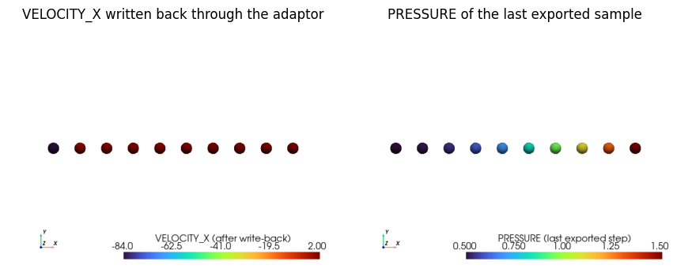

# Tensor bridge

The tensor bridge connects `ModelPart` data with `torch.Tensor`s, built on the core `Kratos.TensorAdaptors` (which expose zero-copy NumPy views of Kratos data).

<p align="center">
    
</p>
<p align="center">Figure 1: From entity data to the tensor a model sees, and back. The (n_entities, width) layout is the one contract every exporter, dataset and inference process shares.</p>

## ModelPart data as torch tensors

```python
import KratosMultiphysics as Kratos
from KratosMultiphysics.PhysicsNeMoApplication.bridges import torch_bridge
ta = Kratos.TensorAdaptors.HistoricalVariableTensorAdaptor(model_part.Nodes, Kratos.VELOCITY)
ta.CollectData()
tensor = torch_bridge.KratosTensorToTorch(ta)   # zero-copy view of the staging buffer
tensor *= 2.0                                    # modifies the buffer in place
torch_bridge.TorchToKratosTensor(tensor, ta)     # StoreData() writes back to the nodes
```

`KratosTensorToTorch` is zero-copy with respect to the adaptor's staging buffer, not the Kratos entity storage itself (entity storage is not contiguous); `CollectData()`/`StoreData()` move data across that last hop.

The `GetTensorAdaptor` factory (`utilities/tensor_adaptor_dataset_utils.py`) builds the right adaptor from a data-location string: `node_historical`, `node_non_historical`, `element`, `condition`, `element_gauss_point`, `condition_gauss_point`. Gauss-point locations are read-only (a Kratos core restriction).


<p align="center">
    
</p>
<p align="center">Figure 2: What the bridge moved in notebook 01, rendered on the nodes themselves (pyvista through the core bridge).</p>

## Exporting training datasets

`DatasetExportProcess` writes one `.npz` file per sampled step, with one array per requested field (keys `<VARIABLE>__<location>`) plus `TIME`/`STEP`:

```json
{
    "python_module" : "dataset_export_process",
    "kratos_module" : "KratosMultiphysics.PhysicsNeMoApplication.processes.export",
    "Parameters"    : {
        "model_part_name" : "FluidModelPart",
        "list_of_fields"  : [
            { "variable_name" : "VELOCITY", "data_location" : "node_historical" },
            { "variable_name" : "PRESSURE", "data_location" : "node_historical" }
        ],
        "output_path"     : "training_data",
        "output_interval" : 10
    }
}
```

The export has no ML dependency at all — it runs on any Kratos installation.

## Training on exported data

`CreateNpzDataset` wraps an export directory as a `torch.utils.data.Dataset`, using the same per-entity `(n, width)` concatenated layout that `InferenceProcess` feeds to models:

```python
from KratosMultiphysics.PhysicsNeMoApplication.training.torch_dataset import CreateNpzDataset

dataset = CreateNpzDataset("training_data",
                           input_keys=["VELOCITY__node_historical"],
                           output_keys=["PRESSURE__node_historical"])
loader = torch.utils.data.DataLoader(dataset, batch_size=4)
```
