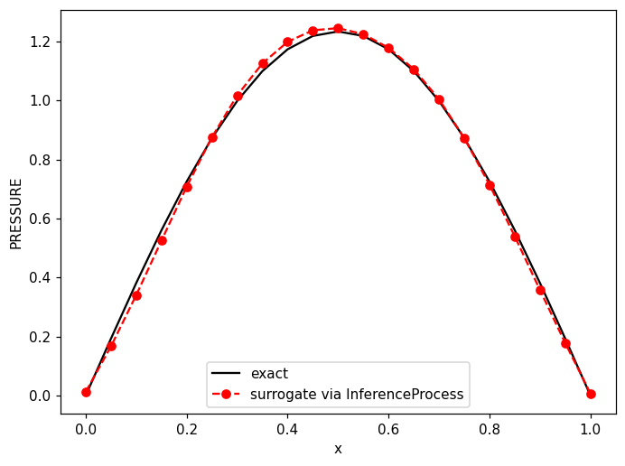
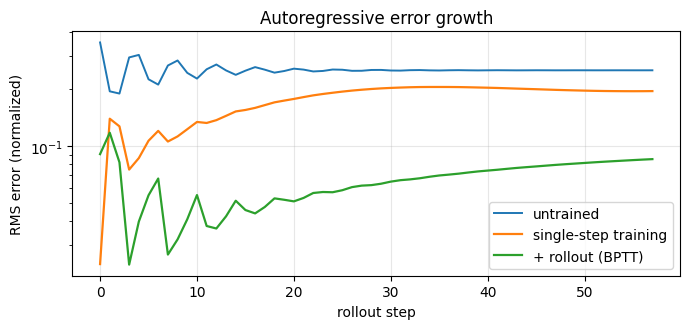

# Training utilities

## TrainModel

`training_utils.TrainModel(model, dataset, settings)` runs the standard supervised
loop over any `(inputs, targets)` dataset (`CreateNpzDataset` output, a
`TensorDataset`, ...), configured through `Kratos.Parameters`, and returns the
per-epoch loss history:

| setting | default | meaning |
|---|---|---|
| `epochs` | 100 | training epochs |
| `batch_size` | 32 | DataLoader batch size |
| `learning_rate` | 1e-3 | optimizer learning rate |
| `optimizer` | `"adam"` | `"adam"` or `"sgd"` |
| `loss` | `"mse"` | `"mse"` or `"l1"` |
| `device` | `"auto"` | `"auto"` (CUDA when available), `"cpu"`, `"cuda"` |
| `shuffle` | `true` | shuffle each epoch |
| `echo_interval` | 0 | `KRATOS_INFO` every N epochs (0 = silent) |
| `seed` | -1 | `torch.manual_seed` when >= 0 |

```python
from KratosMultiphysics.PhysicsNeMoApplication.training_utils import TrainModel, SaveTrainedModel
from KratosMultiphysics.PhysicsNeMoApplication.torch_dataset import CreateNpzDataset

dataset = CreateNpzDataset("training_data", input_keys=[...], output_keys=[...])
history = TrainModel(model, dataset, Kratos.Parameters('{"epochs": 300, "seed": 0}'))
SaveTrainedModel(model, "surrogate.mdlus", card={
    "input_fields":  [{"variable_name": "VELOCITY", "data_location": "node_historical"}],
    "output_fields": [{"variable_name": "PRESSURE", "data_location": "node_historical"}],
})
```



## Saving checkpoints

`SaveTrainedModel(model, checkpoint_file, card=None)` writes the checkpoint in
whichever of the two `model_registry.LoadModel` formats fits: physicsnemo `Module`s
save natively (the file **must** end in `.mdlus`; checkpoint type `"physicsnemo"`),
anything else is scripted to TorchScript (checkpoint type `"torchscript"`, the
return value tells you which). An optional `card` dict writes the model card
alongside.

## Physics-informed residual monitoring

`TrainModel(..., epoch_callbacks=[...])` invokes plain-Python callables `cb(epoch, model, history)` after every epoch, with the model in eval mode inside `no_grad`. The canonical use is the **solver-residual monitor**: run the model on a held-out case, write the prediction into the case's model part, and log the real PDE residual:

```python
from KratosMultiphysics.PhysicsNeMoApplication import solver_residuals

evaluator = solver_residuals.BuildResidualEvaluator(held_out_model_part)

def residual_monitor(epoch, model, history):
    prediction = model(held_out_inputs).cpu().numpy()
    write_prediction_into(held_out_model_part, prediction)   # your gather/scatter
    Kratos.Logger.PrintInfo("Training", f"epoch {epoch}: PDE residual = {evaluator.ComputeResidualNorm():.3e}")

training_utils.TrainModel(model, dataset, settings, epoch_callbacks=[residual_monitor])
```

The residual is assembled in C++ outside the autodiff graph: **it is not differentiable** — use it for logging, early stopping and model selection (and for the residual-based query strategy of the Active Learning page), never as a gradient-carrying loss term.

## Model cards

A model card is a JSON sidecar (`<checkpoint>.card.json`) describing what a
checkpoint was trained for. Recommended keys: `input_fields`/`output_fields` as
`[{"variable_name", "data_location"}]`; anything else (grid shapes, history sizes,
training provenance) travels along untouched. `model_registry` provides
`SaveModelCard` / `LoadModelCard` / `ValidateFieldsAgainstCard`.

All deployment processes (`InferenceProcess`, `SuperResolutionProcess`/
`GridInferenceProcess`, `GraphInferenceProcess`, `TimeSeriesInferenceProcess`) check
their configured fields against the card when one exists, through the shared
`model_registry.LoadModelWithCardCheck` entry point. The `"model_card_policy"`
key of the process's `model_settings` selects how a mismatch is treated:

- `"advisory"` (default): one detailed warning — the card may be stale, or the
  remapping may be deliberate — and execution continues.
- `"strict"`: the mismatch raises, refusing to deploy a checkpoint whose card
  disagrees with the configured fields.
- `"ignore"`: no check at all.

No card, no check (in every policy).

## Rollout evaluation

A next-state surrogate that is accurate one step ahead can still drift or blow up
when fed its own predictions. `rollout_utils.EvaluateRollout(model, states,
history_size)` runs the genuine autoregressive rollout (the exact
`TimeSeriesInferenceProcess` window contract, history seeded with true states, then
fed its own predictions) against a ground-truth trajectory `(T, N, W)` and returns
the per-step predictions and the RMS error-growth curve — plot it before trusting a
time-stepper in production.

## Augmentation and dataset mixing

`torch_dataset` curates the `.pmsh` mesh series `MeshExportProcess` writes:

- `MakeMeshAugmentations(rotation=..., scale=..., translation=..., vector_fields=[...], tensor_fields=[...])`
  builds physicsnemo's `RandomRotateMesh`/`RandomScaleMesh`/`RandomTranslateMesh`
  **coherently**: the listed vector `(N, 3)` and rank-2 tensor `(N, 3, 3)` point
  fields are rotated/scaled with the coordinates. This matters — upstream's
  `transform_point_data` defaults to `False`, which silently leaves `VELOCITY`
  in the old frame while the mesh turns, and its bare `True` form *raises* on any
  non-spatial feature block; the factory always passes the per-field dict form,
  so unlisted fields simply pass through. Translation never touches field values
  (correctly). The first transform in the returned list is a dtype cast: the
  upstream augmentations build their rotation/scale factors in torch's global
  default dtype, so float64 Kratos meshes must be cast to match (`dtype=`
  overrides the target).
- `CreateAugmentedMeshDataset(directory, ..., seed=)` wires them into
  `CreateMeshDataset`. Randomness is redrawn on every `__getitem__` (each epoch
  sees fresh augmentations); `seed >= 0` makes the draw sequence reproducible and
  `dataset.set_epoch(e)` reseeds deterministically per epoch. Note physicsnemo's
  `Compose` **rejects** mesh transforms — the dataset's transform list *is* the
  composition mechanism, and `MeshToTensorDict()` bridges into the TensorDict
  transforms (`Normalize`, `NormalizeMeshFields`) via `extra_transforms`.
- `CreateMultiMeshDataset([dir_a, dir_b, ready_dataset], ...)` mixes several
  series through physicsnemo's `MultiDataset`: one concatenated index space, each
  item's metadata extended by `"dataset_index"`. Two upstream behaviours to know:
  `output_strict=True` (the default) eagerly loads sample 0 of every sub-dataset
  at construction to check stackability, and shuffling does **not** balance
  sub-datasets — a larger series dominates proportionally.
- `MeshExportProcess` gained `"zero_pad_steps"`: `MeshReader` sorts its glob
  lexicographically, so an unpadded series reads back as 1, 10, 11, 2, … — set it
  (e.g. `5`) whenever the item order must be the time order.

## Temporal training schemes

`temporal_training` learns time-dependent fields from `(T, N, W)` trajectories —
the crash/deformation surrogate setting, and any transient rollout. All four
schemes share **one window convention** with `EvaluateRollout` and
`TimeSeriesInferenceProcess` (K states concatenated per node, oldest first, into
`(N, K·W)`), so a model trained here deploys with no adapter:

| scheme | sample | use |
|---|---|---|
| `single_step` | window → next state | the workhorse; feed to `TrainModel` |
| `time_conditional` | initial window + normalized time → state at t | no error accumulation, no dynamics |
| `one_shot` | initial window → final state | crash-outcome framing |
| autoregressive | rollout of R self-fed steps | what actually stabilizes long rollouts |

`CreateTrajectoryWindowDataset(states, settings)` builds the first three as
row-batched torch datasets. The autoregressive scheme needs its own loop —
`TrainModel`'s epoch callbacks run under `eval()` + `no_grad` and cannot train —
so `TrainAutoregressive(model, states, settings)` seeds the model with K true
states, feeds it its own predictions for `rollout_steps`, and backpropagates
through the whole rollout (BPTT). Set `"gradient_checkpointing": true` to
recompute each step's activations in backward (`torch.utils.checkpoint`,
`use_reentrant=False`) — memory for compute on long rollouts, with gradients
pinned identical to the uncheckpointed path by test. Do **not** combine it with
physicsnemo's `StaticCaptureTraining` (CUDA graphs fight checkpointing).



Rolling a one-step-trained model forward accumulates error quickly; continuing with
`TrainAutoregressive` on the same model cuts the mean rollout error by ~2.7x on the
transient cantilever of notebook 16.

Trajectories come from the in-memory transient cases:
`tests/kratos_solver_cases/transient_harness.RunTransientAnalysis(analysis, collect=...)`
runs `AnalysisStage`'s own solution loop opened up so a state is collected per
converged step, with `CreateTransientThermalAnalysis` and
`CreateTransientStructuralAnalysis` (implicit dynamic, Bossak) as the two cases.

## Training from a running solve (streaming)

Training data normally takes a detour through disk: `DatasetExportProcess`
writes one `.npz` per step and `CreateNpzDataset` reads them back. That is the
right default — samples are reusable, shuffleable and inspectable — but it
forces the solve to finish before training starts and leaves files nobody
keeps. `streaming_dataset` removes the detour:

```
solve ──StreamingDatasetExportProcess──▶ LiveSampleQueue
                                              │
                          CreateStreamingDataset ──▶ TrainModel(streaming)
```

The streamed items are **byte-identical** to what the file path produces — same
per-entity flattening, same concatenation order, same float32 — and a test
asserts exactly that by running one case both ways and comparing every sample.
Matching the `"<VARIABLE>__<location>"` key convention also means a live stream
feeds active learning, which consumes the same keys.

```json
{
    "python_module" : "streaming_dataset",
    "kratos_module" : "KratosMultiphysics.PhysicsNeMoApplication",
    "Parameters"    : {
        "model_part_name" : "FluidModelPart",
        "list_of_fields"  : [ { "variable_name" : "VELOCITY", "data_location" : "node_historical" } ],
        "max_queue_size"  : 64
    }
}
```

Then `TrainModel(model, dataset, {"streaming": true, "epochs": 1, "shuffle": false})`.

Four upstream contracts are handled for you, each of which bites silently
otherwise:

- physicsnemo's `IterableDatasetBase` is an ABC, **not** a
  `torch.utils.data.IterableDataset`, so a bare subclass is rejected by torch's
  DataLoader for having no `len()`. The shipped dataset inherits **both**.
- physicsnemo's own DataLoader unpacks each yielded item as
  `(data, metadata)` — an `(inputs, targets)` tuple would have its **targets
  silently discarded**. `yields_batches = True` bypasses collation, which is
  correct anyway since a solver step already produces a whole batch.
- `num_workers > 0` replays the entire stream in every worker, training on each
  sample once per worker. The dataset refuses it rather than quietly doing that.
- Output buffers must not be reused across yields (the loader may still be
  reading the previous one), so every emission allocates fresh tensors.

A stream is **single-pass**, so `"streaming"` pins `epochs` to 1 and rejects
`shuffle` — a second epoch would drain an exhausted queue and record a
false zero-loss epoch, and shuffling an iterable dataset needs a sampler that
cannot exist. `Close()` is one-way and explicit: without it a consumer cannot
tell "no sample yet" from "the solve ended", which is what would hang a
streaming epoch. If you use the OOD guard while streaming, pass an explicit
`buffer_size` — there is no `len()` to infer it from.

## Warm restarts (shrink and perturb)

When Kratos data drifts to a new geometry family, retraining a converged
surrogate on the shifted distribution tends to go badly. A warm restart moves
the weights part-way back toward initialization — `θ ← shrink·θ + perturb·ε` —
keeping what was learned while restoring plasticity:

```json
"warm_restart" : { "shrink" : 0.5, "perturb" : 0.1, "noise" : "scaled_normal" }
```

It is applied after the model reaches its device and **before the optimizer is
built**, so the optimizer's moment estimates are never stale with respect to
perturbed weights.

Two defaults differ deliberately from upstream. `perturb` is **relative** under
`"scaled_normal"` (the noise is scaled by each tensor's own standard deviation)
and **absolute** under `"normal"`, where 0.1 is enormous for typical weights.
And only float parameters with more than one dimension are touched by default:
upstream applies itself to everything, which crashes on integer parameters and
halves LayerNorm/BatchNorm gains toward zero. Set
`"include_all_parameters": true` for upstream's behaviour. A `shrink` above 1
is rejected here — upstream accepts it and silently amplifies every weight.
