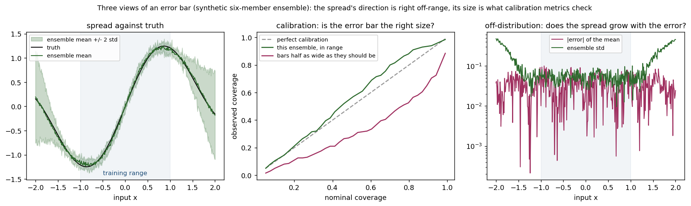
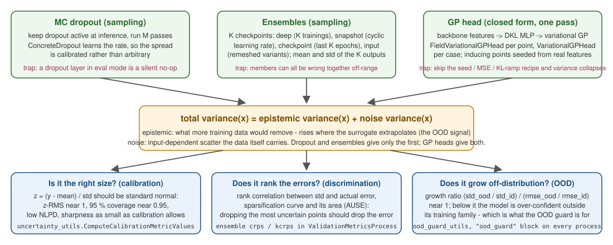

# Uncertainty quantification and deployment governance

Three layers complement the advisory [model cards](../Training/Training.html): out-of-distribution guardrails on the inputs, predictive uncertainty on the outputs, and probabilistic validation metrics.

<p align="center">
    
</p>
<p align="center">Figure 1: Three views of an error bar on a synthetic ensemble (generated by the figure script): the spread's direction is right off-range, its size is what the calibration metrics check.</p>

<p align="center">
    
</p>
<p align="center">Figure 2: Where each method's uncertainty comes from; see Uncertainty and guardrails under PhysicsNeMo Basics for the methods themselves.</p>

## Out-of-distribution guardrails

`ood_guard_utils` bridges `physicsnemo.experimental.guardrails.embedded.OODGuard` — per-channel global bounds plus a geometry-latent kNN distance check, state held in torch buffers (experimental namespace: no API-stability guarantee). For a `(N, C)` feature tensor the global bounds see one `(1, N, C)` embedding and the kNN check sees the entity-mean `(1, C)` vector.

**Calibration** happens during training — `TrainModel`'s optional block collects the training inputs on the first epoch and saves a guard sidecar:

```json
"ood_guard" : { "guard_file" : "surrogate.mdlus.ood_guard.pt", "buffer_size" : 0, "knn_k" : 10, "sensitivity" : 1.5 }
```

(`buffer_size` 0 = the dataset size; `CalibrateGuardFromTensors`/`SaveGuard` serve manual pipelines.)

**Deployment**: every deployment process (`InferenceProcess` and subclasses, `GraphInferenceProcess`, `TimeSeriesInferenceProcess`, `SuperResolutionProcess`/`GridInferenceProcess` on the sampled grid, `DiffusionInferenceProcess` on the conditioning grid) accepts

```json
"ood_guard" : { "guard_file" : "surrogate.mdlus.ood_guard.pt", "policy" : "advisory" }
```

Upstream's `check()` only logs, so the check is captured and translated: `"advisory"` emits one Kratos warning per flagged inference (and sets the guard's `last_flagged`), `"strict"` raises, `"ignore"` disables the check. GeoTransolver models can instead carry the guard **embedded** (its `guard_config` constructor argument — collect in train mode, check in eval mode); leave the process-level guard off then.

## Predictive uncertainty on any deployed model

`InferenceProcess` and `PointCloudInferenceProcess` accept an `"uncertainty"` block generalizing the diffusion bridge's ensemble-mean + per-node uncertainty outputs:

```json
"uncertainty" : {
    "method"             : "mc_dropout",
    "num_samples"        : 16,
    "seed"               : 0,
    "uncertainty_fields" : [ { "variable_name" : "NODAL_PAUX", "data_location" : "node_non_historical" } ]
}
```

- `"mc_dropout"`: `num_samples` stochastic forward passes with only the dropout-like layers (torch `Dropout*`, `physicsnemo.nn.ConcreteDropout`) in train mode — `uncertainty_utils.MonteCarloPredict`. The mean goes to `output_fields`, the per-entity standard deviation to `uncertainty_fields` (same splitting contract).
- `"ensemble"`: `model_settings` names `"checkpoint_files"` (string array, ≥ 2); every member runs the process's own forward (interface dispatch included) and mean/std are written as above.

**Learnable dropout rates**: `physicsnemo.nn.ConcreteDropout` layers become trainable when `TrainModel`'s `"concrete_dropout_reg_weight"` is positive (adds that multiple of `collect_concrete_dropout_losses`); inspect the learned rates with `uncertainty_utils.GetConcreteDropoutRates`.

### Calibrated variance from a GP head

`"method": "gp"` attaches a Gaussian-process head (`physicsnemo.experimental.uq.FieldVariationalGPHead`) to a trained surrogate. Unlike MC dropout or a checkpoint ensemble, which report the *spread of a stochastic predictor*, the GP head reports a posterior variance that separates what the model genuinely does not know (`epistemic_variance`, excluding the likelihood noise floor) from the noise it has learned to expect. That epistemic term is what rises where the surrogate is extrapolating — the shipped test pins it as larger away from the training features than inside them.

```json
"uncertainty" : {
    "method"             : "gp",
    "gp_head_file"       : "surrogate.pt.gp_head.pt",
    "gp_feature_fields"  : [ ],
    "uncertainty_fields" : [ { "variable_name" : "NODAL_ERROR",
                               "data_location" : "node_non_historical" } ]
}
```

Adding it to the shared `"uncertainty"` block means it works in every deployment process that inherits `InferenceProcess`, writing per-node standard deviation exactly like the other methods. `"gp_feature_fields"` names the backbone features the head consumes and defaults to the process' own input fields.

Fitting is a separate, post-training step, because the head sits on a *trained* backbone's features:

```python
head, history = uncertainty_utils.FitGpHead(features, targets, settings)
uncertainty_utils.SaveGpHead(head, "surrogate.pt.gp_head.pt", config={...})
```

`FitGpHead` implements the training loop physicsnemo does not ship, and the recipe is not optional: upstream is explicit that skipping it collapses the variance rather than merely costing accuracy. It seeds inducing points from **real** features (the random default "sits nowhere near the backbone's feature distribution"), adds an auxiliary MSE on the posterior mean (the ELBO alone can buy likelihood by inflating variance), and ramps the KL term. Two contract details worth knowing: `n_train` normalizes the ELBO and counts **points**, not geometries; and features are cast to float32 because the head's feature MLP stays float32 even when its GP internals run in float64.

The head is saved as a sidecar next to the checkpoint rather than through `SaveTrainedModel`, since gpytorch modules are not TorchScript-scriptable.

**Optional dependency**: gpytorch (`pip install gpytorch`, or `pip install nvidia-physicsnemo[uq-extras]`). It lives in `physicsnemo.experimental`, which carries no API-stability guarantee — pin a version if a deployment depends on it.

### Is the uncertainty honest? Calibration metrics

An error metric cannot tell you whether a model's error bars are trustworthy: a surrogate can have an excellent RMSE and still be badly calibrated, which makes its uncertainty useless for decisions. `ValidationMetricsProcess` gained an `"uncertainty_comparisons"` block that gathers a `(mean, std, reference)` triple and scores it:

```json
"uncertainty_comparisons" : [ {
    "mean_variable"      : "TEMPERATURE",
    "std_variable"       : "NODAL_ERROR",
    "std_location"       : "node_non_historical",
    "reference_variable" : "TEMPERATURE_REFERENCE",
    "confidence_z"       : 1.96,
    "metrics"            : ["coverage", "nll", "sharpness", "calibration_error"]
} ]
```

`coverage` is the fraction of references inside `mean ± z·std` (~0.95 at z = 1.96 for a well-calibrated Gaussian); `calibration_error` is its absolute miss from that nominal; `nll` punishes over- and under-confidence continuously; `sharpness` is the mean predicted std and is only meaningful read next to coverage — a model can be arbitrarily sharp by being wrong, or trivially well-covered by being vague. The metrics are pinned against their closed forms on synthetic Gaussian data.

## Probabilistic metrics and rollout UQ

`ValidationMetricsProcess` gains `"relative_l2"` (`‖e‖/‖ref‖`, implemented locally — `physicsnemo.metrics` has none) and `"weighted_mse"`/`"weighted_rmse"` (per-entity squared error weighted by a nodal field, e.g. `NODAL_AREA` — set `"weight_variable"`/`"weight_location"` in the comparison). For ensembles, `ComputeEnsembleMetricValues(ensemble, reference, ["crps", "kcrps"])` exposes `physicsnemo.metrics.general.crps`.

`EvaluateRollout` accepts `metric_names` (per-rollout-step metric curves in `extras["per_step_metrics"]`) and `mc_samples` (MC dropout at every rollout step: the mean is fed back autoregressively, `extras["std"]` gives the multi-step uncertainty growth alongside the error curve).

### Scoring a whole ensemble (CRPS)

Coverage and NLL score a *(mean, std)* pair, but a proper scoring rule needs every member: CRPS cannot be recovered from a reduction. The `"ensemble_comparisons"` block therefore names the members explicitly:

```json
"ensemble_comparisons" : [ {
    "member_variables"   : ["PREDICTION_A", "PREDICTION_B", "PREDICTION_C"],
    "member_location"    : "node_non_historical",
    "reference_variable" : "TEMPERATURE",
    "metrics"            : ["crps", "kcrps"]
} ]
```

At least two members are required — an ensemble metric is undefined for one, and upstream's unbiased estimator returns all-NaN there. Note `crps()` upstream ignores its own `biased` argument; use `kcrps` when you want the fair estimator. A perfect ensemble scores ~0 and can land marginally negative on float64 round-off, so treat tiny negatives as zero.

Where do the members come from? An inference process using `"method": "ensemble"` already builds the `(M, ...)` stack and then reduces it to mean and std one line later. Setting `"retain_ensemble": true` in the `"uncertainty"` block keeps it as a public `last_ensemble` attribute instead of discarding it, so the members are available to whatever wants to score them.
